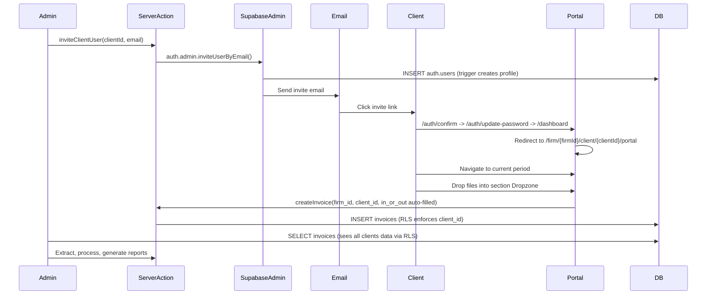

# Client Portal Feature - Technical Design

## 1. Architecture Overview

The client portal extends the existing multi-tenant architecture by adding a `client` role with scoped access. Clients are invited by firm admins (via Supabase `inviteUserByEmail`), and their portal lives under `/firm/[firmId]/client/[clientId]/portal/...`.

The portal mirrors the admin's period-based workflow: clients see their tax periods on the dashboard and drill into a period to upload invoices, allowances, and manage ranges. The URL structure under `/client/[clientId]/` is consistent with existing admin routes and supports future multi-client-per-user scenarios.

```mermaid
flowchart LR
    subgraph adminFlow [Admin Flow]
        A1[Admin: Client Detail Page] -->|Invite| A2[Server Action: inviteClientUser]
        A2 -->|service_role| A3[Supabase auth.admin.inviteUserByEmail]
        A3 -->|Trigger: handle_new_user| A4["Profile created (role=client, firm_id, client_id)"]
        A3 -->|Email sent| A5[Client receives invite]
    end
    subgraph clientFlow [Client Flow]
        A5 -->|Click link| C1[/auth/confirm - verify token]
        C1 --> C2[/auth/update-password - set password]
        C2 --> C3[/dashboard - redirect by role]
        C3 --> C4["/firm/{firmId}/client/{clientId}/portal"]
    end
```


---

## 2. Database Changes

All changes in a single migration file: `supabase/migrations/YYYYMMDD_add_client_portal.sql`

### 2.1 Update `profiles` Table

Add `client_id` column and update the role CHECK constraint:

```sql
-- Add client_id column
ALTER TABLE profiles ADD COLUMN client_id UUID REFERENCES clients(id) ON DELETE SET NULL;
CREATE INDEX idx_profiles_client_id ON profiles(client_id);

-- Update role constraint to include 'client'
ALTER TABLE profiles DROP CONSTRAINT profiles_role_check;
ALTER TABLE profiles ADD CONSTRAINT profiles_role_check 
    CHECK (role IN ('admin', 'staff', 'super_admin', 'client'));
```

### 2.2 Update `handle_new_user` Trigger

The current trigger (`[20251230040837_create_profiles_trigger.sql](supabase/migrations/20251230040837_create_profiles_trigger.sql)`) only inserts `id`, `name`, `role`. Update to also extract `firm_id` and `client_id` from user metadata:

```sql
CREATE OR REPLACE FUNCTION public.handle_new_user()
RETURNS trigger AS $$
BEGIN
  INSERT INTO public.profiles (id, name, role, firm_id, client_id)
  VALUES (
    new.id,
    new.raw_user_meta_data ->> 'name',
    COALESCE(new.raw_user_meta_data ->> 'role', 'admin'),
    (new.raw_user_meta_data ->> 'firm_id')::uuid,
    (new.raw_user_meta_data ->> 'client_id')::uuid
  );
  RETURN new;
END;
$$ LANGUAGE plpgsql SECURITY DEFINER;
```

- For admin sign-ups: `firm_id` and `client_id` are absent in metadata, so they default to NULL (existing onboarding flow links firm_id later).
- For client invites: admin passes `firm_id`, `client_id`, and `role: 'client'` in the invite metadata.

### 2.3 Add `get_auth_user_client_id()` Helper Function

```sql
CREATE OR REPLACE FUNCTION public.get_auth_user_client_id()
RETURNS uuid
LANGUAGE sql STABLE SECURITY DEFINER
SET search_path = public
AS $$
  SELECT client_id FROM public.profiles WHERE id = auth.uid();
$$;
```

### 2.4 Update RLS Policies

The key pattern: for firm users (`admin`/`staff`), `get_auth_user_client_id()` returns NULL, granting full firm-wide access. For `client` users, it returns their `client_id`, restricting access to their own data only.

**Tables with `client_id` column** (invoices, allowances, invoice_ranges, tax_filing_periods):

```sql
-- Example: invoices (same pattern for all four tables)
DROP POLICY "Users can manage invoices in their firm" ON invoices;
CREATE POLICY "Users can manage invoices in their firm" ON invoices
    FOR ALL
    USING (
        (
            firm_id = public.get_auth_user_firm_id()
            AND (
                public.get_auth_user_client_id() IS NULL
                OR client_id = public.get_auth_user_client_id()
            )
        )
        OR (auth.jwt() ->> 'role' = 'super_admin')
    );
```

`**clients` table** (client can only see their own record):

```sql
DROP POLICY "Users can manage clients in their firm" ON clients;
CREATE POLICY "Users can manage clients in their firm" ON clients
    FOR ALL
    USING (
        (
            firm_id = public.get_auth_user_firm_id()
            AND (
                public.get_auth_user_client_id() IS NULL
                OR id = public.get_auth_user_client_id()
            )
        )
        OR (auth.jwt() ->> 'role' = 'super_admin')
    );
```

`**profiles` table** (client can only see their own profile, firm users see all in firm):

```sql
DROP POLICY "Users can view profiles in their firm" ON profiles;
CREATE POLICY "Users can view profiles in their firm" ON profiles
    FOR SELECT
    USING (
        id = auth.uid()
        OR (
            firm_id = public.get_auth_user_firm_id()
            AND public.get_auth_user_client_id() IS NULL
        )
        OR (auth.jwt() ->> 'role' = 'super_admin')
    );
```

`**firms` table** and **storage buckets**: No changes needed. Clients have `firm_id` set, so existing firm-level policies work. Storage access is mediated through signed URLs via server actions.

---

## 3. Auth Infrastructure

### 3.1 Supabase Admin Client

Create `lib/supabase/admin.ts` for service_role operations (invitation, user management):

```typescript
import { createClient } from '@supabase/supabase-js';
import { Database } from '@/supabase/database.types';

export function createAdminClient() {
  return createClient<Database>(
    process.env.NEXT_PUBLIC_SUPABASE_URL!,
    process.env.SUPABASE_SERVICE_ROLE_KEY!,
    { auth: { autoRefreshToken: false, persistSession: false } }
  );
}
```

Requires `SUPABASE_SERVICE_ROLE_KEY` in `.env` (never exposed to client).

### 3.2 Invite Client User Server Action

Create `lib/services/client-user.ts`:

```typescript
'use server';

export async function inviteClientUser(clientId: string, email: string) {
  // 1. Verify caller is admin/staff for this firm
  // 2. Fetch client record to get firm_id, name
  // 3. Call supabaseAdmin.auth.admin.inviteUserByEmail(email, {
  //      data: { name: client.name, role: 'client', firm_id, client_id },
  //      redirectTo: `${origin}/auth/confirm?next=/auth/update-password`
  //    })
  // 4. Return result (success/error)
}

export async function revokeClientUserAccess(userId: string) {
  // Deactivate or delete the user via admin API
}

export async function getClientUsers(clientId: string) {
  // List profiles where client_id = clientId
}
```

### 3.3 Update Dashboard Redirect

In `[app/dashboard/page.tsx](app/dashboard/page.tsx)`, add client role handling:

```typescript
const { data: profile } = await supabase
  .from("profiles")
  .select("firm_id, role, client_id")
  .eq("id", claimsData.claims.sub)
  .single();

if (profile?.role === 'client' && profile.firm_id && profile.client_id) {
  redirect(`/firm/${profile.firm_id}/client/${profile.client_id}/portal`);
} else if (profile?.firm_id) {
  redirect(`/firm/${profile.firm_id}/dashboard`);
}
```

### 3.4 Update Proxy for Route Protection

In `[lib/supabase/proxy.ts](lib/supabase/proxy.ts)`, add client role route restrictions to prevent clients from accessing admin routes:

```typescript
// After getting user claims, fetch role
// If role === 'client' and path does NOT match /firm/[id]/client/[id]/portal
//   → redirect to /firm/[id]/client/[id]/portal
```

---

## 4. Routing & Layout

### 4.1 Role-Aware Firm Layout

Update `[app/firm/[firmId]/layout.tsx](app/firm/[firmId]/layout.tsx)` to render different sidebars based on role:

```typescript
export default async function FirmLayout({ children, params }) {
  const supabase = await createClient();
  const { data: claimsData } = await supabase.auth.getClaims();
  const { data: profile } = await supabase
    .from('profiles')
    .select('role, client_id')
    .eq('id', claimsData?.claims?.sub)
    .single();

  const isClient = profile?.role === 'client';

  return (
    <>
      <Suspense>
        {isClient ? <PortalSidebar /> : <FirmSidebar />}
      </Suspense>
      <SidebarInset>
        <header>...</header>
        {children}
      </SidebarInset>
    </>
  );
}
```

### 4.2 Portal Sidebar Component

Create `components/portal-sidebar.tsx` with client-specific navigation:

- 首頁 → `/firm/{firmId}/client/{clientId}/portal` (LayoutDashboard icon)
- 設定 → (future, placeholder)

The sidebar is minimal since the main workflow is period-based: dashboard (period list) -> period detail (upload & manage).

### 4.3 Portal Route Structure

```
app/firm/[firmId]/client/[clientId]/portal/
  page.tsx                        # Portal dashboard (period cards)
  period/[periodYYYMM]/page.tsx   # Period detail (scrollable sections)
```

This mirrors the existing admin route hierarchy:

```
app/firm/[firmId]/client/[clientId]/
  page.tsx                        # Admin client detail (period cards)
  period/[periodYYYMM]/page.tsx   # Admin period detail (tabs)
```

---

## 5. Admin: Client User Management UI

### 5.1 Client Detail Page Enhancement

Add a "Portal Access" / "入口網站" section to the existing client detail page (`[app/firm/[firmId]/client/[clientId]/page.tsx](app/firm/[firmId]/client/[clientId]/page.tsx)`):

- Show linked portal user (if any) with email and status
- "Invite to Portal" / "邀請登入" button opens an invite dialog
- "Revoke Access" / "撤銷存取" option for existing users

### 5.2 Invite Dialog Component

Create `components/invite-client-dialog.tsx`:

- Email input field
- Name field (pre-filled from client's contact_person)
- Submit calls `inviteClientUser` server action
- Toast notification for success/error

### 5.3 Client List Enhancement

On the client list page (`[app/firm/[firmId]/client/page.tsx](app/firm/[firmId]/client/page.tsx)`), add a badge/indicator for clients with active portal users.

---

## 6. Client Portal Pages

### 6.1 Portal Dashboard (`/firm/{firmId}/client/{clientId}/portal`)

Period-based landing page, mirroring the admin's client detail page:

- **Auto-create current tax period**: If the current period (based on today's date) doesn't exist, create it automatically so the client never interacts with a "New Period" dialog.
- **Current period card** displayed prominently at the top with a clear CTA (e.g., "上傳本期資料").
- **Past period cards** shown below in chronological order.
- Reuses `PeriodCard` component with portal-specific links (pointing to `/portal/period/{YYYMM}`).

### 6.2 Portal Period Detail (`/firm/{firmId}/client/{clientId}/portal/period/{YYYMM}`)

Single scrollable page with **5 sections**. Each document section has an **inline Dropzone** (no upload dialog) that auto-sets the document type and `in_or_out` -- zero decisions for the client.

**Paper uploads only** -- no electronic invoice import (Excel). The admin handles electronic imports on their side.

```
Period 11401-02
────────────────────────────────
[Progress summary]
進項發票: 5 張 | 銷項發票: 3 張 | 進項折讓: 1 張 | 銷項折讓: 0 張

── 進項發票 ──────────────────
[Dropzone: PDF/images → creates invoice with in_or_out='in']
[Table: uploaded input invoices]

── 銷項發票 ──────────────────
[Dropzone: PDF/images → creates invoice with in_or_out='out']
[Table: uploaded output invoices]

── 進項折讓 ──────────────────
[Dropzone: PDF/images → creates allowance with in_or_out='in']
[Table: uploaded input allowances]

── 銷項折讓 ──────────────────
[Dropzone: PDF/images → creates allowance with in_or_out='out']
[Table: uploaded output allowances]

── 字軌管理 ──────────────────
[RangeManagement component: add/view/delete ranges]
```

**Component reuse strategy:**

- `Dropzone` / `useSupabaseUpload` -- reuse existing upload hook with auto-populated `client_id` and `firm_id` from profile
- `InvoiceTable` / `AllowanceTable` -- reuse in read-only or simplified mode (no client column, no AI extraction trigger)
- `RangeManagement` -- reuse directly, data scoped by RLS
- No `InvoiceImportDialog` in portal (electronic import is admin-only)

**Upload flow per section:**

1. Client drops files into the section's Dropzone
2. Files upload to Supabase Storage under `{firm_id}/{YYYmm}/{client_id}/{filename}` (no overwrite on conflict)
3. Server action creates invoice/allowance record with:
  - `firm_id` and `client_id` from user profile (auto-populated)
  - `in_or_out` from the section context
  - `type` (invoice vs allowance) from the section context
  - `status: 'uploaded'`
4. New row appears in the section's table
5. Admin sees the upload on their side (same data, RLS allows firm-wide access)

**Future mobile/PWA considerations (not implemented now):**

- The scrollable layout transitions naturally to a tab-based layout on mobile (bottom tabs for 進項/銷項/進項折讓/銷項折讓/字軌)
- Camera upload button replaces Dropzone on mobile
- Current desktop design avoids patterns that would conflict with a future mobile adaptation

---

## 7. Data Flow




---

## 8. Domain Model Updates

In `[lib/domain/models.ts](lib/domain/models.ts)`, update the profile schema to include `client`:

```typescript
export const profileSchema = z.object({
  id: z.string().uuid(),
  firmId: z.string().uuid().optional(),
  clientId: z.string().uuid().optional(),
  name: z.string(),
  role: z.enum(['admin', 'staff', 'super_admin', 'client']),
});
```

Add invite schema:

```typescript
export const inviteClientUserSchema = z.object({
  clientId: z.string().uuid(),
  email: z.string().email(),
  name: z.string().min(1),
});
```

---

## 9. Security Considerations

- **RLS is the primary isolation layer**: Even if a client navigates to an admin URL, RLS prevents data access.
- **Service role key**: Only used server-side for admin operations. Never exposed to the client.
- **Storage**: Client file uploads go through the same firm-level storage bucket. File access is via signed URLs generated server-side. No storage RLS changes needed for Phase 1.
- **Route protection**: Proxy redirects client users away from admin routes. Sidebar navigation hides admin links.
- **One user per client**: Phase 1 constraint. Each `clients` record can have at most one linked portal user.
- **URL clientId validation**: Portal pages verify that the `clientId` in the URL matches the authenticated user's `profiles.client_id`. Mismatches redirect to the correct portal URL.

---

## 10. Environment Variables

Add to `.env`:

```
SUPABASE_SERVICE_ROLE_KEY=<service_role_key>
```

Ensure SMTP is configured in production for invite emails (Supabase Inbucket works for local dev).

---

## 11. Testing Strategy

### 11.1 Recommended: Seed Script (fastest iteration)

Add a test client user to `supabase/seed.sql` so it's available after every `supabase db reset`:

```sql
-- After existing seed data (firm, clients):
-- Create a test client user via auth.users
-- The handle_new_user trigger auto-creates the profile with role='client', firm_id, client_id
INSERT INTO auth.users (
  id, instance_id, email, encrypted_password,
  email_confirmed_at, raw_user_meta_data,
  created_at, updated_at, role, aud, confirmation_token
) VALUES (
  'cccccccc-cccc-cccc-cccc-cccccccccccc',
  '00000000-0000-0000-0000-000000000000',
  'client@test.com',
  crypt('password123', gen_salt('bf')),
  now(),
  jsonb_build_object(
    'name', 'Test Client User',
    'role', 'client',
    'firm_id', '<your-test-firm-uuid>',
    'client_id', '<your-test-client-uuid>'
  ),
  now(), now(), 'authenticated', 'authenticated', ''
);
```

Log in as `client@test.com` / `password123` in an incognito window while staying logged in as admin in your main browser.

### 11.2 End-to-End: Invite Flow Test

To test the full invite flow:

1. Log in as admin in your main browser
2. Go to a client detail page, invite with a test email (e.g., `client-test@example.com`)
3. Open Supabase **Inbucket** at `http://localhost:54324` to find the invite email
4. Open an **incognito window**, paste the invite link from the email
5. Set a password on the update-password page
6. Verify redirect to `/firm/{firmId}/client/{clientId}/portal`

### 11.3 Two-Browser Verification Checklist

Use admin browser + client incognito window side by side to verify:

- **RLS isolation**: Client can only see their own invoices, allowances, ranges, and periods. Other clients' data is invisible.
- **Upload visibility**: Files uploaded by the client appear on the admin's period detail page for that client.
- **Route protection**: Client navigating to `/firm/{firmId}/dashboard` or `/firm/{firmId}/client` is redirected to their portal.
- **URL clientId mismatch**: Client manually changing `clientId` in URL is redirected to their correct portal URL.
- **Admin data unchanged**: Admin's existing workflows (client list, period detail, reports) continue to work after the migration.

---

## 12. Implementation Phases

Execute in this order. Each phase is independently deployable.