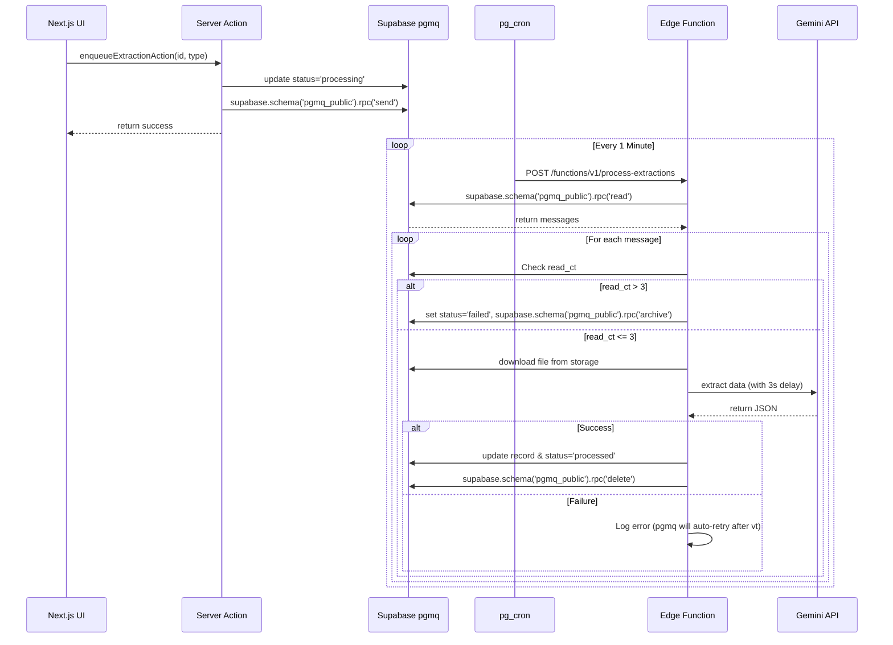

# Design Plan: Scalable Queue System for Data Extraction

This plan outlines the architecture to replace synchronous AI extraction for both **invoices** and **allowances** with a background queue system using Supabase `pgmq`, ensuring rate limiting (to protect Gemini API) and retry capabilities (up to 3 attempts). All background processing will be kept within Supabase using Edge Functions and `pg_cron`.

## 1. Database & Queue Setup (`supabase/migrations/`)

We will create a new Postgres migration to initialize the queue.

- **Enable pgmq**: `CREATE EXTENSION IF NOT EXISTS pgmq;`
- **Create Queue**: `SELECT pgmq.create('document_extraction');`
- **Expose to Data API**: We will grant permissions so that our Next.js backend and Edge Functions can use the `pgmq_public` schema via the standard `supabase.schema('pgmq_public').rpc()` calls, avoiding the need to write custom Postgres wrapper functions for every queue.
  - Grant `USAGE` on schema `pgmq_public` to the `service_role` and `authenticated` roles.
  - Grant `EXECUTE` on functions like `send`, `read`, `archive`, `delete` to these roles.
  - **Enable RLS**: As required by Supabase when exposing queues to the Data API, we will enable Row Level Security on the `pgmq.q_document_extraction` table. However, since all of our interactions (enqueueing and dequeuing) will happen via backend code using the `service_role` client, this RLS is primarily a safeguard against direct client access. We will create policies that explicitly block direct `anon` and `authenticated` operations on the queue table if they somehow bypassed our Server Actions, effectively forcing all interaction through our backend.

## 2. Supabase Admin Client (`lib/supabase/admin.ts`)

Create a new file exporting a `createAdminClient()` function.

- It will use the `SUPABASE_SERVICE_ROLE_KEY` to bypass Row Level Security (RLS) and act as an admin.
- This is required for Next.js server actions and Edge Functions when they need elevated permissions to update statuses or read storage without a user session.

## 3. Refactoring Services (`lib/services/invoice.ts` & `lib/services/allowance.ts`)

- **Extract Core Logic**: Move the actual Gemini extraction code out of `extractInvoiceDataAction` and `extractAllowanceDataAction` into pure functions: `processInvoiceExtractionCore(invoiceId, adminClient)` and `processAllowanceExtractionCore(allowanceId, adminClient)`.
- **New Enqueue Actions**: 
  - Create `enqueueInvoiceExtractionAction(invoiceId)`
  - Create `enqueueAllowanceExtractionAction(allowanceId)`
  - Both actions will:
    1. Validate the user session.
    2. Set the record `status` to `processing`.
    3. Call the `enqueue_extraction` RPC with the respective type.
    4. Return immediately.

## 4. Background Worker (`supabase/functions/process-extractions/index.ts`)

Create a Supabase Edge Function that acts as the queue consumer for both document types.

- **Trigger**: Configure Supabase Cron (`pg_cron`) via a database migration to call this Edge Function every minute using `net.http_post`.
- **Fetch Messages**: Calls `read_extraction_queue` to get a batch of messages (e.g., `limit: 5`, `vt: 120` seconds).
- **Processing Loop**: For each message (`{"id": "...", "type": "..."}`):
  - **Retry Logic**: If `read_ct > 3`, mark the respective record status as `failed`, archive the message via `pgmq.archive()`, and skip.
  - **Routing Execution**: 
    - If `type === 'invoice'`, run invoice extraction logic (`determineAccountForInputElectronicInvoice` & `extractInvoiceData`).
    - If `type === 'allowance'`, run allowance extraction logic (`extractAllowanceData`).
  - **Rate Limiting**: Add a sleep delay (e.g., `await new Promise(r => setTimeout(r, 3000))`) between processing each message to avoid hitting Gemini's RPM limits.
  - **Success**: Call `pgmq.delete()` and update the record status to `processed`.
  - **Failure**: Log the error but *do not* delete the message. The visibility timeout (`vt`) will expire, and `pgmq` will make it available for the next cron run.

## 5. UI Updates

- **Replace Action Calls**: In the UI components (e.g., `app/firm/[firmId]/invoice/page.tsx`, `app/firm/[firmId]/allowance/page.tsx`), replace the synchronous extraction actions with the new enqueue actions.
- **SWR Polling**: Update the `useSWR` configuration to include `refreshInterval: 5000` conditionally, *only* when there is at least one invoice/allowance in the list with `status === "processing"`. This ensures the UI updates automatically once the background worker finishes.

## Architecture Diagram

