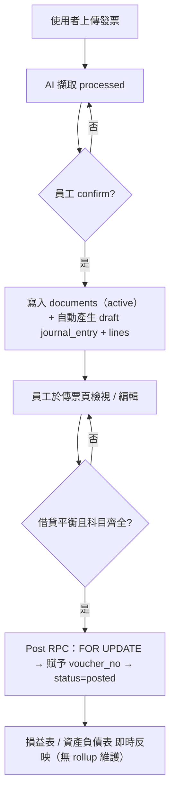
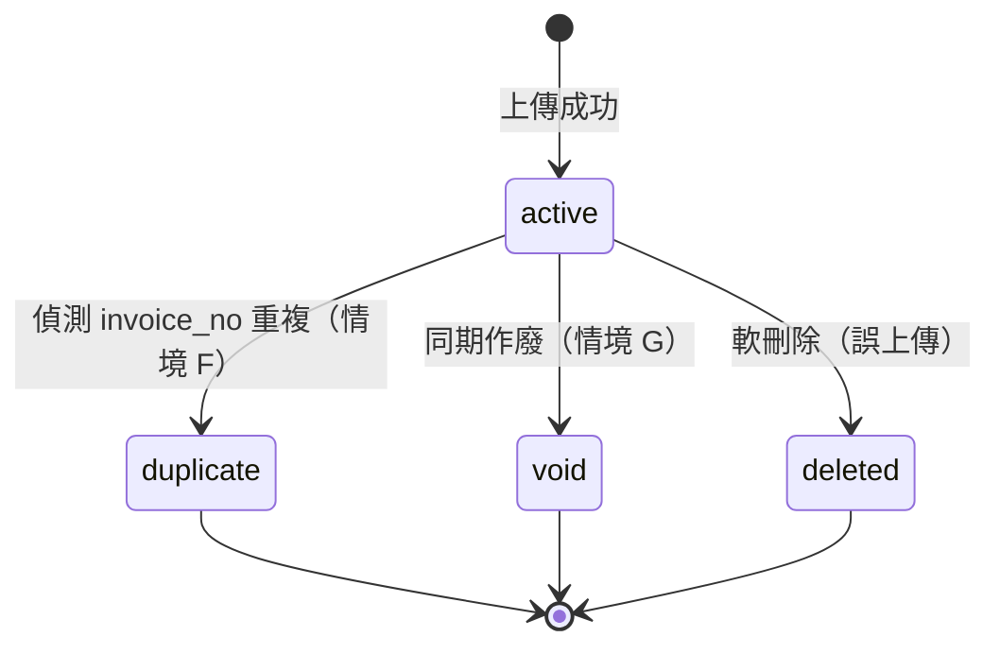
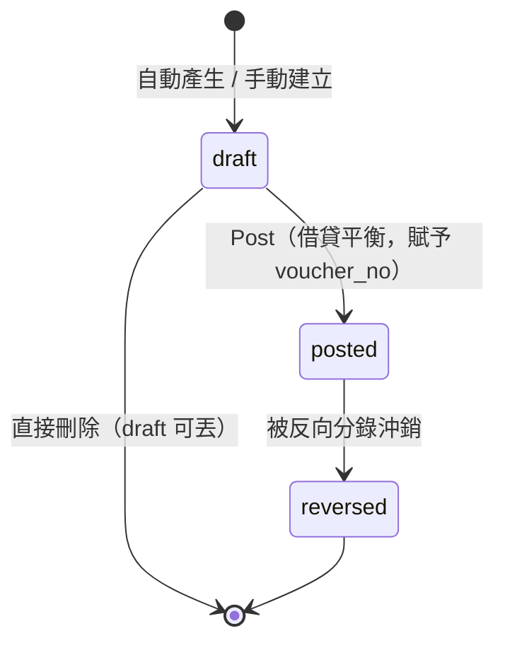
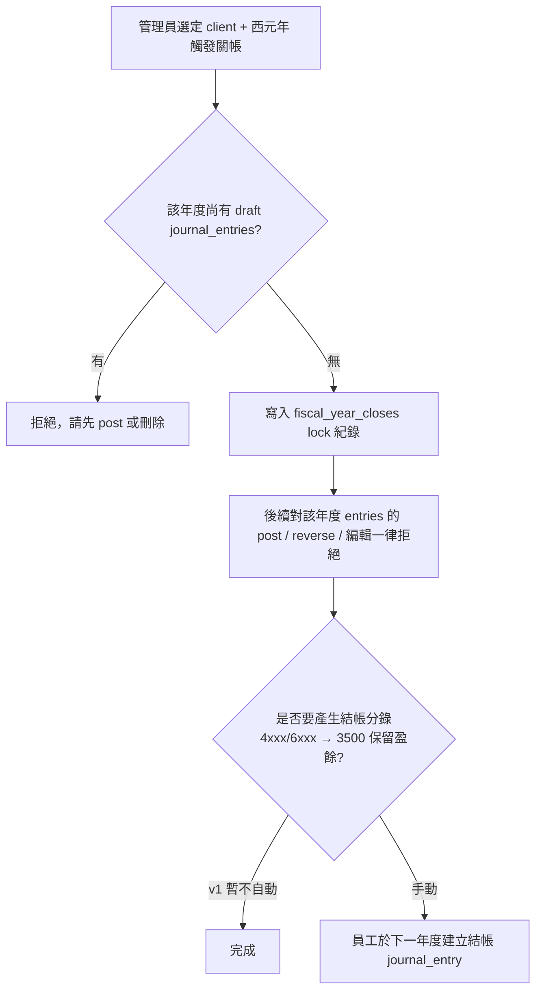
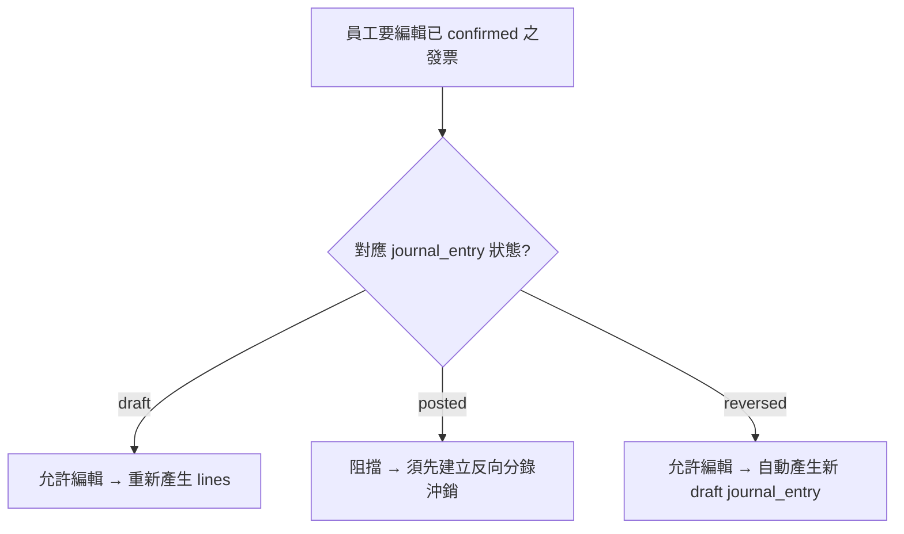

# 憑證（傳票）與分錄系統設計提案

> **文件狀態**：草稿 / 提案
> **目的**：建立基礎以產出客戶的損益表與資產負債表
> **預期**：本文件將經過多輪討論修訂，再進入實作階段

---

## 1. 背景與動機

目前 SnapBooks 已能擷取發票（發票）與折讓證明單（折讓），並可匯出財政部 TET_U / TXT 格式以利申報營業稅，**但尚未維護總帳（general ledger）**，因此無法為客戶產出：

- 損益表（Income Statement, 損益表）
- 資產負債表（Balance Sheet, 資產負債表）
- 其他需建立在分錄之上的報表（試算表、現金流量表等）

本提案在現有的 發票 / 折讓 之下新增資料模型（依 BOOKKEEPING_DATA_MODELING.md 的目標模型）：

```
原始憑證（documents）            ← 發票、折讓、收據、保單、薪資單…
   │ 1:1（document 端可 NULL）
   ▼
傳票（journal_entries）          ← 一筆記帳動作；voucher_no / voucher_type / status 在此
   │ 1:N（≥ 2 行，借貸平衡）
   ▼
分錄明細（journal_entry_lines）  ← 借方或貸方科目
   │
   ▼ 即時 SUM（v1）
損益表 / 資產負債表
```

> v1 不建月度 rollup 表；IS/BS 即時加總（§6）。未來如需加速，介面不變、內部切換為 rollup（§6.3）。

**核心觀念**：

1. **發票只是憑證的一種類型**（屬「營業稅相關」）。其他類型的憑證（保險費單、薪資單、預付費用攤提…）屬「非營業稅相關」，不可扣抵營業稅但仍須入帳。
2. **「傳票」（journal_entries）與「原始憑證」（documents）為兩個獨立 entity**：documents 紀錄文件事實，journal_entries 紀錄記帳動作。沖銷沖的是「帳」（entries），不是「單據」（documents）。
3. **命名澄清**：國際 ERP 慣例下 `voucher` = 傳票（記帳憑證），不是發票/收據。本案 schema 與此一致。詳見 BOOKKEEPING_DATA_MODELING §一。

---

## 2. 已敲定的設計決策

下列決策已於設計討論中拍板，本文後續內容均依此為前提。

| # | 決策項目 | 結論 | 備註 |
|---|---|---|---|
| 1 | 憑證產生時機 | 發票/折讓 `confirmed` 時自動產生 **draft** 憑證；員工檢視編輯後再 **post** | post 為一獨立動作，過帳後才影響財報。要能多選，一次選很多，讓員工可以post很多。 |
| 2 | 會計科目表 | v1 沿用現有靜態 `lib/data/accounts.ts`；`journal_entries` 儲存**純科目代碼**（如 `"5102"`） | 未來改為 DB 表時，因分錄已存純代碼，遷移幾乎為零成本 |
| 3 | 年度關帳 | 以**西元年**為單位的年度硬關帳；無月度軟關帳 | 對應台灣營利事業所得稅申報採曆年制 |
| 4 | 預付費用 / 批次入帳 / 固定資產 | 需要設計額外「固定資產模組」和「預付費用模組」。產生「攤銷科目」憑證的當下就設定「攤提週期」之後系統自動生成全部分錄！ | 應該是要多一個固定資產目錄。金額超過8萬，性質是固定資產的，可以跑到固定資產。這種性質的，年度就需要有自動依照月份產生分錄的功能了 |
| 5 | 結構模型 | CTI：`documents`（父，事實層）+ `invoices`/`allowances`（子，CTI children，反向 FK 至 documents）；`journal_entries`（傳票 header）+ `journal_entry_lines`（借/貸明細） | 命名遵循國際 ERP 慣例：voucher = 傳票（記帳憑證），不是原始發票/收據 |
| 6 | `voucher_no` | 格式 `YYYYMMDD-NNNNN`（5 位序號）；**強制 no-gap**；以 `voucher_sequences` 表 + `FOR UPDATE` 序列化賦號 | 跳號違反會計原則；draft 丟棄不會佔號（draft 階段 voucher_no 為 NULL，post 時才賦） |
| 7 | IS / BS 計算 | v1 **不建** `account_period_balances` rollup 表，IS/BS 即時 SUM `journal_entry_lines`；單客戶單年估計 < 15K rows，預計 < 100ms | 介面（`getIncomeStatement` / `getBalanceSheet`）以服務層封裝，未來如需加速可內部切換為 rollup + backfill 而不影響呼叫方 |
| 8 | Post 操作實作 | 一支 ~30 行 PL/pgSQL function `post_journal_entry(entry_id, user_id)`：`SELECT ... FOR UPDATE` 取 entry → 校驗借貸平衡 → atomic UPSERT 取 next seq → flip status；批次版本同邏輯 + 陣列入參 | 因 supabase.js SDK 無法跨 statement 開 transaction，no-gap 賦號 + status flip 必須在同一 RPC 內。其餘 CRUD 仍走純 SDK |
| 9 | 沖銷模型 | `journal_entries.reverses_entry_id` self-FK；原分錄 `status` 變 `reversed` 但**不自 IS/BS 扣回**，沖銷效果完全來自新插入的反向分錄（借貸對調） | 符合「沖銷沖的是帳，不是單據」的會計原則；保留完整可追溯性 |
| 10 | 資料存取架構 | **Supabase.js SDK 為主，少量 PL/pgSQL RPC 為輔**：純讀、單表 CRUD、status 翻轉走 SDK；跨表原子操作（`confirm_invoice` / `regenerate_draft_entry` / `post_journal_entries`）走 RPC | SDK + RPC 是當前唯一一致的 client；ORM 混合架構（Drizzle）為未來選項，見 §12 |

---

## 3. 資料模型

所有新增資料表沿用既有的 `get_auth_user_firm_id()` RLS 慣例（事務所層級隔離）。金額一律以 `BIGINT` 儲存整數新台幣，與現行 `extractedInvoiceDataSchema.totalSales/tax` 的 `.int()` 驗證一致。

### 3.1 `documents` — 原始憑證主檔

紀錄客戶上傳之原始文件（發票、折讓單、收據、保單…）的事實層欄位。**不**含任何記帳動作概念（voucher_no、posted_at、reverses 都不在這裡）。

| 欄位 | 型別 | 說明 |
|---|---|---|
| `id` | UUID PK | `gen_random_uuid()` |
| `firm_id` | UUID NOT NULL | FK → `firms` ON DELETE CASCADE |
| `client_id` | UUID NOT NULL | FK → `clients` ON DELETE CASCADE |
| `doc_date` | DATE NOT NULL | 文件日期（發票/收據/保單上的日期） |
| `type` | TEXT NOT NULL | `VAT`（營業稅相關）/ `NON_VAT`（非營業稅相關） |
| `doc_type` | TEXT NOT NULL | `invoice` / `allowance` / `receipt` / `payroll` / `insurance` / `manual`（無實體憑證的手動建單） |
| `file_url` | TEXT NULL | 來源檔案路徑（Supabase Storage） |
| `ocr_status` | TEXT NULL | `pending` / `done` / `failed`；非掃描類為 NULL |
| `amount` | BIGINT NULL | 共通金額（便於列表查詢；正負號規則待 §10 Q11 決議） |
| `duplicate_of` | UUID NULL | FK → `documents`（self-FK）；標為重複時指向原始那張 |
| `status` | TEXT NOT NULL | `active` / `duplicate` / `void` / `deleted`，預設 `active` |
| `void_reason` | TEXT NULL | `status='void'`（同期作廢，情境 G）填入原因（語意欄位，非單純時間戳） |
| `created_by` | UUID NOT NULL | FK → `profiles` |
| `created_at` / `updated_at` | TIMESTAMPTZ | `updated_at` 隱式記錄「最後狀態變動時間」 |

> **無 `voided_at/by`、`marked_duplicate_at/by`、`deleted_at/by`**：v1 刻意不加這些 audit metadata 欄位。理由：
> - 80%+ 的 row 為 `active`，這些欄位常駐 NULL，污染 schema
> - documents 是「事實層」，「誰於何時做了狀態翻轉」屬 audit 軌跡，本來就應該由 v1.5 的 `audit_trails` 表統一處理
> - 過渡期想知道「最後變動時間」可看 `updated_at` 配合當前 `status` 粗推；想知道作廢原因看 `void_reason`

**索引與限制**

- `INDEX (client_id, doc_date)` — IS/BS 與列表查詢主路徑
- `INDEX (client_id, status)`
- `INDEX (duplicate_of) WHERE duplicate_of IS NOT NULL`

> **`status` 語意**（依 BOOKKEEPING §二決策 7）：
> - `active`：正常有效，會列入申報與記帳
> - `duplicate`：偵測到重複上傳，不該記帳；設 `duplicate_of` 指回原始（情境 F）
> - `void`：發票同期內作廢（情境 G），視同未開立
> - `deleted`：軟刪除（誤上傳）
>
> **跨期錯誤一律走折讓**（§5.6），不走 `void`。

> **`duplicate` vs `deleted` 為何兩者都需要**：
> - `duplicate` 由系統偵測（OCR 完成後比對 `invoice_no`），含義為「另有一張原始」，故配合 `duplicate_of` 指標；可用於統計「客戶重複上傳率」與「原始 void 後是否要將 duplicate 升回 active」之復原邏輯
> - `deleted` 由使用者手動觸發，含義為「不該存在」，不需指回任何 row
> - 合併兩者會使 `duplicate_of` 失去掛載點，且喪失「系統偵測 vs 人為操作」之區分

> **為何 soft delete 而非 hard delete**：
> - 稅務合規：台灣稅法要求發票/憑證保存 5–10 年，即使使用者視為刪除，系統仍應可調閱
> - 誤刪復原：accounting 操作失誤代價高，row 仍在可救回
> - 參照完整性：可能仍有 reversed 之 journal_entry 指向；hard delete 會 orphan/cascade
> - 例外：admin-only 之 GDPR right-to-erasure；含 PII 之誤上傳可保留 row 但清空 `file_url`
>
> 注意：「誰刪、何時刪」這類 audit metadata 不在 documents 內記錄（見上方 note），由 v1.5 `audit_trails` 補齊；soft delete 在 v1 提供的是「row 與 status='deleted' 仍可查」，足以滿足合規與 recovery 基本需求。

> **CTI 完整性**：PostgreSQL 無內建 CTI 支援。「一個 documents 對應恰一個子表 row」由 application layer 確保，schema 不強制（避免 trigger 偵錯困難）。

---

### 3.2 `invoices` / `allowances` — 子表變更（CTI）

採 Class Table Inheritance：通用欄位上移至 `documents`，型別專屬欄位保留在子表。**子表新增 `document_id` 反向指回父表**。

**現有 `invoices` / `allowances` 表變更**：

| 變更 | 說明 |
|---|---|
| 新增 `document_id UUID UNIQUE NOT NULL FK → documents` | CTI 反向指標；UNIQUE 強制 1:1 |
| 保留型別專屬欄位 | invoices: `extracted_data`、`invoice_serial_code`、`in_or_out`、`tax_filing_period_id`；allowances: `original_invoice_id`、`original_invoice_serial_code` 等 |
| 抽至 documents 之概念性欄位 | `doc_date`（= `extracted_data.date`）、`amount`（= `extracted_data.totalAmount`）、`file_url`（= `storage_path`） |

> **冗餘期**：backfill 後到後續 phase 清理之間，`storage_path` 同時存於 invoices 與 documents.file_url。讀取以 documents.file_url 為準。

**Backfill 移轉策略**（單一交易完成；目前單一事務所、資料量可控）：

1. 建立 `documents` 表
2. 為每張既有 `invoice` INSERT 對應 documents row：`doc_type='invoice'`、`type='VAT'`、`doc_date = extracted_data.date`（缺漏退回 `created_at::date`）、`amount = extracted_data.totalAmount`、`file_url = storage_path`、`status = 'active'`
3. `invoices` 加 `document_id`（先 NULL）→ 回填 → 加 `NOT NULL` + `UNIQUE`
4. `allowances` 同理（`doc_type='allowance'`，`amount = extracted_data.amount + taxAmount`）
5. 既有 `invoices.status` 之 AI 流程狀態（uploaded/processing/processed/confirmed/failed）**保留不動**——它表達 OCR/擷取生命週期，與 documents.status（文件法律狀態）正交

---

### 3.3 `journal_entries` — 傳票（記帳憑證 header）

整合「傳票」與「分錄 header」於單一表（依 BOOKKEEPING §二決策 1，因規則上 1 傳票 ↔ 1 分錄 header）。UI 仍以「傳票」呈現此表。

| 欄位 | 型別 | 說明 |
|---|---|---|
| `id` | UUID PK | |
| `firm_id` | UUID NOT NULL | FK → `firms` ON DELETE CASCADE |
| `client_id` | UUID NOT NULL | FK → `clients` ON DELETE CASCADE |
| `document_id` | UUID UNIQUE NULL | FK → `documents`；系統分錄（折舊、攤提、純沖銷）為 NULL |
| `voucher_no` | TEXT NULL | 傳票編號；`draft` 時 NULL，`draft → posted` 時賦號（見 §3.5、§5.4） |
| `voucher_type` | TEXT NOT NULL | `收入` / `支出` / `轉帳` |
| `entry_date` | DATE NOT NULL | 記帳日期；用於餘額月份歸戶與年度關帳判定 |
| `description` | TEXT NULL | 摘要 |
| `status` | TEXT NOT NULL | `draft` / `posted` / `reversed`，預設 `draft` |
| `reverses_entry_id` | UUID NULL | FK → `journal_entries`（self-FK）；沖銷分錄指回被沖銷之原始分錄 |
| `reversal_reason` | TEXT NULL | 沖銷原因（reverses_entry_id 同有同無） |
| `posted_at` / `posted_by` | TIMESTAMPTZ / UUID NULL | `draft → posted` 時填入；FK → `profiles`。會計責任歸屬欄位，UI 經常顯示「由 X 於 Y 過帳」 |
| `created_by` | UUID NULL | FK → `profiles`；NULL 表示系統自動產生（折舊、攤提工作） |
| `created_at` / `updated_at` | TIMESTAMPTZ | |

> **無 `reversed_at` / `reversed_by`**：被沖銷時不在原分錄上記錄；改由「沖銷 entry 的 `created_at` / `created_by`」反查，連結為 `WHERE reverses_entry_id = <原 entry id>`。資訊完全等價但不重複儲存，一致來源即沖銷 entry 本身。

**索引與限制**

- `UNIQUE (client_id, voucher_no) WHERE voucher_no IS NOT NULL`
- `CHECK (status = 'draft' OR voucher_no IS NOT NULL)` — posted/reversed 必須有 voucher_no
- `CHECK ((reverses_entry_id IS NULL) = (reversal_reason IS NULL))` — 兩者同有同無
- `INDEX (client_id, entry_date)` — IS/BS 主查詢路徑
- `INDEX (client_id, status)`
- `INDEX (document_id) WHERE document_id IS NOT NULL`
- `INDEX (reverses_entry_id) WHERE reverses_entry_id IS NOT NULL`

> **`pending_review` 預留**：未來開放客戶自編傳票時加入此 status，配合審核流程。本案不實作。

> **系統分錄無 created_by**：折舊／攤提 worker 產生之分錄 `created_by = NULL`。查詢介面以「系統」標示之。

> **Post 操作不在 SDK 端做**：因需要 `FOR UPDATE` + 序號賦予 + status flip 同一 transaction（達成 no-gap 與 idempotency），實作為 PL/pgSQL function `post_journal_entry`（單筆）/ `post_journal_entries`（批次），由服務層 `lib/services/journal-entry.ts` 透過 `supabase.rpc()` 呼叫。詳見 §5.4。

---

### 3.4 `journal_entry_lines` — 分錄明細（借/貸）

| 欄位 | 型別 | 說明 |
|---|---|---|
| `id` | UUID PK | |
| `journal_entry_id` | UUID NOT NULL | FK → `journal_entries` ON DELETE CASCADE |
| `line_number` | SMALLINT NOT NULL | 1, 2, 3… 顯示順序 |
| `account_code` | TEXT NOT NULL | **純代碼**（如 `"5102"`）；應用層對照 `lib/data/accounts.ts` 驗證 |
| `debit` | BIGINT NOT NULL DEFAULT 0 | 借方金額（NTD 整數，≥ 0） |
| `credit` | BIGINT NOT NULL DEFAULT 0 | 貸方金額（NTD 整數，≥ 0） |
| `description` | TEXT NULL | 行內備註 |

**索引與限制**

- `UNIQUE (journal_entry_id, line_number)`
- `CHECK (debit >= 0 AND credit >= 0 AND (debit > 0) <> (credit > 0))` — 借貸只能擇一為正
- `INDEX (account_code, journal_entry_id)` — 總帳查詢用

**借貸平衡強制**

於 `journal_entries.status` 由 `draft → posted` 時，由服務層在交易內 `SELECT SUM(debit), SUM(credit) FROM journal_entry_lines WHERE journal_entry_id = ?` 驗證相等；不平衡則 post 失敗。（依 Q5：純應用層，不走 trigger）

---

### 3.5 `voucher_sequences` — 傳票編號序列（per client per day）

支援 §5.4 批次過帳所需之連號賦號。

| 欄位 | 型別 | 說明 |
|---|---|---|
| `client_id` | UUID NOT NULL | FK → `clients` |
| `seq_date` | DATE NOT NULL | 序號的日期，與 `voucher_no` 之 `YYYYMMDD` 對應 |
| `next_seq` | INTEGER NOT NULL DEFAULT 1 | 下一個可用序號 |

- PK: `(client_id, seq_date)`
- 賦號流程：在 `post_journal_entry` RPC 內以 `INSERT ... ON CONFLICT DO UPDATE SET next_seq = next_seq + 1 RETURNING next_seq - 1` 一句 atomic 取 seq → 組合 `voucher_no = TO_CHAR(entry_date, 'YYYYMMDD') || '-' || LPAD(seq::text, 5, '0')`
- 範例：`20260423-00001`
- 並發：同一 client+date 之賦號因 row lock 排隊；不同 client 並行不互相阻塞
- **No-gap 保證**：因賦號與 status flip 在同一 transaction 內完成；不會發生「seq 已遞增但 entry 沒 post」的中間態

---

### 3.6 `fiscal_year_closes` — 年度關帳紀錄

| 欄位 | 型別 | 說明 |
|---|---|---|
| `id` | UUID PK | |
| `firm_id` | UUID NOT NULL | |
| `client_id` | UUID NOT NULL | FK → `clients` |
| `gregorian_year` | SMALLINT NOT NULL | 例：2024 |
| `closed_at` | TIMESTAMPTZ NOT NULL | |
| `closed_by` | UUID NOT NULL | FK → `profiles` |
| `notes` | TEXT NULL | |

- `UNIQUE (client_id, gregorian_year)`

**效果**

- 該年度的**已 posted 之 journal_entries 不可編輯或建立反向分錄**
- 該年度不可新增 `entry_date` 落在該年之 journal_entries
- 重啟年度需「刪除該筆紀錄」這個明確的管理動作

> **無 balance snapshot**：v1 IS/BS 即時由 `journal_entry_lines` 加總，無 rollup 表，故關帳僅寫入 lock 紀錄。歷史財報的「不可變」由 entries 不可改 + RPC `post_journal_entry` 對年度的 guard 共同保證。
>
> 跨年錯誤修正一律走「前期損益調整」（科目 `3530`）於當年度認列，不回頭改動歷史。詳見 §5.6。

---

### 3.7 `fixed_assets` — 固定資產主檔（佔位，待後續 session 詳設計）

> **觸發來源**：Decision 4 — 取得成本 ≥ 8 萬且性質為固定資產者，記入固定資產主檔，年度依月份自動產生折舊分錄。
>
> 完整 schema、折舊方法（直線/年數合計/雙倍餘額遞減）、耐用年數對照、處分流程、稅會差異等留待後續 session（建議拆出 `FIXED_ASSETS_PLAN.md`）。

最小欄位草稿（僅供討論起點，非定案）：

| 欄位 | 型別 | 說明 |
|---|---|---|
| `id` | UUID PK | |
| `client_id` | UUID FK | |
| `name` | TEXT | 資產名稱 |
| `acquisition_date` | DATE | 取得日 |
| `cost` | BIGINT | 取得成本（含稅，金額 ≥ 80,000） |
| `salvage_value` | BIGINT | 殘值 |
| `useful_life_months` | SMALLINT | 耐用年數（月） |
| `depreciation_method` | TEXT | v1 僅支援 `straight_line` |
| `asset_account_code` / `accum_depr_account_code` | TEXT | 對應科目 |
| `acquisition_document_id` | UUID NULL FK | 取得時對應的 documents |
| `status` | TEXT | `active` / `disposed` |

---

### 3.8 `amortization_schedules` — 預付/攤提排程（佔位，待後續 session 詳設計）

> **觸發來源**：Decision 4 — 員工於建立攤銷科目憑證時設定攤提週期，系統自動依月份產生分錄。
>
> 完整生成排程、提前終止、修改排程等流程留待後續 session（可與 §3.7 共用一份模組計畫）。

最小欄位草稿（僅供討論起點，非定案）：

| 欄位 | 型別 | 說明 |
|---|---|---|
| `id` | UUID PK | |
| `client_id` | UUID FK | |
| `source_document_id` | UUID FK | 原始預付憑證 |
| `expense_account_code` | TEXT | 每期認列的費用科目 |
| `prepaid_account_code` | TEXT | 預付資產科目（如 1410 預付費用） |
| `total_amount` | BIGINT | |
| `start_period` | DATE | 起始月份 |
| `total_periods` | SMALLINT | 攤提期數（月） |
| `realized_periods` | SMALLINT DEFAULT 0 | 已認列期數 |
| `status` | TEXT | `active` / `completed` / `cancelled` |

> **排程驅動方式**：建議沿用既有 `pgmq + pg_cron` 基礎設施（參考 `extraction-worker`）。每月初的工作會掃描所有 `active` 排程並補產應認列分錄；以 (schedule_id, period) 唯一鍵保證冪等。

---

## 4. 流程圖

### 4.1 發票 → 文件 + 傳票 → 過帳 → 財報



### 4.2 documents 狀態機（文件事實層）



> 跨期錯誤一律走折讓（另開 allowance documents），**不**用 `void`。

### 4.3 journal_entries 狀態機（記帳動作層）



> v2：客戶自編傳票時將加入 `pending_review`，串入審核流程。

### 4.4 年度關帳



### 4.5 發票更動 vs 記帳生命週期



> **「posted 不可直接編輯」是會計設計的核心承諾**（§5.8）。如要避免 staff 過度頻繁觸發反向分錄流程，UI 須在 post 動作前明確提示其不可逆性。常見錯誤情境：
> - OCR 誤讀金額（如 1,500 → 15,000）
> - Gemini 指派科目錯誤（如旅費 → 文具用品費）
> - 發票日期跨期歸屬誤判
> - 應稅 / 零稅率 / 免稅 分類錯誤
> - 進 / 銷項方向誤判
> - 統一編號擷取錯誤
>
> 多源於 staff 趕工確認時未細看；§5.8 列出 UX 對策。

---

## 5. 自動產生規則（發票/折讓 → 傳票）

當發票/折讓由 `processed` 進入 `confirmed` 時，於同一交易內：
1. 寫入或更新對應的 `documents` row（`status='active'`）
2. 呼叫 `journal-entry-generation` 服務 **upsert** 對應的 draft `journal_entry`（`voucher_type='收入'` 或 `'支出'`）+ replace `journal_entry_lines`
3. `journal_entry.document_id` 指回該 documents row

> **重生策略：upsert，不是 delete + insert**：當員工編輯已 confirmed 之發票（且對應 entry 仍是 draft）時，必須**保留** `journal_entry.id`，僅更新 header 欄位 + 整批替換 `journal_entry_lines`。不可 DELETE 整個 entry 再 INSERT 新的，原因：
>
> - 換掉 `journal_entry.id` 會讓 UI 書籤、URL、外部引用失效
> - `document_id UNIQUE` 約束下需先 DELETE 才能 INSERT，中間有空窗
> - 同一張發票對應到多個已刪除的 entries 會混亂審計軌跡
>
> 服務層流程：
>
> ```ts
> async function regenerateDraftEntry(invoiceId) {
>   const doc = await getDocument(invoice.document_id);
>   const je = await getJournalEntryByDocument(doc.id);
>
>   if (je && je.status !== 'draft') {
>     throw new Error('cannot regenerate; entry already posted, must reverse first');
>   }
>
>   const computed = computeEntryFromInvoice(invoice);  // 含 voucher_type, entry_date, lines[]
>
>   await db.transaction(async (tx) => {
>     if (je) {
>       // Header in-place update（保留 id）
>       await tx.from('journal_entries').update({
>         voucher_type: computed.voucher_type,
>         entry_date: computed.entry_date,
>         description: computed.description,
>       }).eq('id', je.id);
>       // Lines wholesale 替換
>       await tx.from('journal_entry_lines').delete().eq('journal_entry_id', je.id);
>     } else {
>       je = await tx.from('journal_entries').insert({...}).select().single();
>     }
>     await tx.from('journal_entry_lines').insert(
>       computed.lines.map((l, i) => ({ ...l, journal_entry_id: je.id, line_number: i + 1 }))
>     );
>   });
> }
> ```
>
> Lines 採整批替換（DELETE all + INSERT new）而非逐行 diff，理由：邏輯簡單可預期；不需追蹤舊 lines id；line-level 註解未要求永續。

### 5.1 科目對照原則

| 科目角色 | 來源 | 預設值 |
|---|---|---|
| 銷項收入科目 | 固定 | `4101 營業收入` |
| 進項費用/成本科目 | 從 `extracted_data.account` 取出（剝去後綴名稱） | 由 Gemini 擷取時決定 |
| 進項稅額 | 固定 | `1147 進項稅額` |
| 銷項稅額 | 固定 | `2271 銷項稅額` |
| **結算科目（cash / AR / AP）** | 依總額金額門檻自動選擇 | 總額 ≤ 10,000 → `1111 現金`；> 10,000 → `1112 銀行存款`。員工於 draft 階段可改為 `1113 應收帳款` 或 `2151 應付帳款` |

> **結算科目（cash / AR / AP 類）**：每張發票都需要一個「另一邊」用以平衡借貸——代表這筆款項是現金結清還是賒帳。發票本身只有總額資訊，無法判斷已付或未付，故 v1 採金額門檻啟發式（小額視為現金、大額視為銀行轉帳），並由員工視情況調整。日後可加入「客戶預設值」設定（如某客戶恆為應付帳款）。
>
> **依賴**：`lib/data/accounts.ts` 須能查出 `1111 現金` 與 `1112 銀行存款` 兩個常數代碼（已存在）。

### 5.2 分錄樣板

| 來源類型 | 借方 (Dr.) | 貸方 (Cr.) |
|---|---|---|
| **進項發票（可扣抵）** | 費用科目（銷售額），`1147 進項稅額`（稅額） | `1112 銀行存款`（總額） |
| **進項發票（不可扣抵）** | 費用科目（總額，含稅） | `1112 銀行存款`（總額） |
| **銷項發票** | `1112 銀行存款`（總額） | `4101 營業收入`（銷售額），`2271 銷項稅額`（稅額） |
| **進項折讓** | `1112 銀行存款`（總額） | 費用科目（折讓額），`1147 進項稅額`（折讓稅額） |
| **銷項折讓** | `4101 營業收入`（折讓額），`2271 銷項稅額`（折讓稅額） | `1112 銀行存款`（總額） |

**特例：`extracted_data.account` 缺漏**
若進項發票尚無對應科目（Gemini 未填或員工修正），憑證仍會產生但該行於 UI 標記為待補；缺科目則不允許 post。

### 5.3 範例

**範例 A：進項電子發票（可扣抵）** — 銷售額 10,000、稅額 500、總額 10,500，Gemini 指派 `5102 旅費`：

| Line | Account | Debit | Credit |
|---|---|---|---|
| 1 | 5102 旅費 | 10,000 | 0 |
| 2 | 1147 進項稅額 | 500 | 0 |
| 3 | 1112 銀行存款 | 0 | 10,500 |

員工若知此筆為賒購，於 draft 階段將第 3 行 `1112` 改為 `2151 應付帳款`，再 post。

**範例 B：進項發票（不可扣抵）** — 進貨 200，稅額 10，總額 210（依 Q3 預設方向，稅額併入費用）：

| Line | Account | Debit | Credit |
|---|---|---|---|
| 1 | 費用科目（含稅後） | 210 | 0 |
| 2 | 1111 現金 | 0 | 210 |

> 第 2 行因總額 ≤ 10,000，採「現金」結算（依 §5.1 門檻規則）。

---

### 5.4 過帳（Post）— 統一批次 RPC

對應 Decision 1：員工於分錄列表多選後一次過帳多筆。**v1 只實作一支批次 RPC**；單筆過帳即「長度為 1 的陣列」呼叫，不另開單筆函式。

| 議題 | v1 預設方向 |
|---|---|
| 失敗策略 | **逐筆獨立成功/失敗**（部分成功）— 一筆不平衡或缺科目不會拖累其他筆；UI 用回傳結果逐筆顯示。比「全有或全無」實用 |
| 序號連號 | `voucher_no` 在交易內以 `voucher_sequences(client_id, seq_date)` row lock 依 `entry_date, created_at` 順序遞增賦號（確保 no-gap） |
| Idempotency | 重試已 posted 之 entry 直接回傳既有 `voucher_no`（`SELECT ... FOR UPDATE` + `status='draft'` 檢查），不會 double 賦號 |
| 並發 | 同 client+date 之賦號因 row lock 排隊；不同 client 並行不互相阻塞 |
| UI | 分錄列表加勾選欄與「批次過帳」按鈕；按鈕僅對至少選取一筆 `draft` 狀態時啟用 |

**實作：PL/pgSQL RPC（單一批次版本）**

因 supabase.js SDK 無法跨 statement 開 transaction（PostgREST 為 stateless），而 no-gap 賦號 + status flip 需在同一 transaction 內，故將整個 post 操作壓進一支 PL/pgSQL function：

```sql
CREATE OR REPLACE FUNCTION post_journal_entries(
  p_entry_ids uuid[],
  p_user_id uuid
)
RETURNS TABLE(entry_id uuid, voucher_no text, error text)
LANGUAGE plpgsql AS $$
DECLARE e RECORD; d BIGINT; c BIGINT; seq INT; vno TEXT;
BEGIN
  FOR e IN
    SELECT * FROM journal_entries
    WHERE id = ANY(p_entry_ids)
    ORDER BY entry_date, created_at  -- 穩定的賦號順序
    FOR UPDATE
  LOOP
    -- Idempotent: 已 posted 直接回傳
    IF e.status <> 'draft' THEN
      entry_id := e.id; voucher_no := e.voucher_no; error := NULL;
      RETURN NEXT;
      CONTINUE;
    END IF;

    -- 借貸平衡校驗
    SELECT COALESCE(SUM(debit), 0), COALESCE(SUM(credit), 0)
    INTO d, c
    FROM journal_entry_lines WHERE journal_entry_id = e.id;
    IF d <> c OR d = 0 THEN
      entry_id := e.id; voucher_no := NULL; error := 'unbalanced';
      RETURN NEXT;
      CONTINUE;
    END IF;

    -- TODO: 加上 fiscal_year_closes guard（拒絕 entry_date 落在已關帳年度）

    -- 賦序號（atomic UPSERT increment）
    INSERT INTO voucher_sequences (client_id, seq_date, next_seq)
      VALUES (e.client_id, e.entry_date, 2)
      ON CONFLICT (client_id, seq_date)
        DO UPDATE SET next_seq = voucher_sequences.next_seq + 1
      RETURNING next_seq - 1 INTO seq;

    vno := TO_CHAR(e.entry_date, 'YYYYMMDD') || '-' || LPAD(seq::text, 5, '0');

    UPDATE journal_entries
      SET status = 'posted', voucher_no = vno, posted_at = NOW(), posted_by = p_user_id
      WHERE id = e.id;

    entry_id := e.id; voucher_no := vno; error := NULL;
    RETURN NEXT;
  END LOOP;
END $$;
```

> **部分成功的取捨**：每筆獨立 success/error 比 all-or-nothing 對員工更友善 — 50 張選取中只要有 1 張不平衡，不會擋掉其他 49 張。代價是員工需逐筆檢查 UI 回傳結果。如未來真的需要 atomic batch，可加參數 `p_atomic boolean DEFAULT false`，true 時遇錯 RAISE EXCEPTION 觸發整批 ROLLBACK。

**JS 端呼叫**（單筆即長度 1 陣列）：

```ts
// 單筆
const { data } = await supabase.rpc('post_journal_entries', {
  p_entry_ids: [entryId],
  p_user_id: userId,
});
// data: [{entry_id, voucher_no, error}]

// 批次
const { data } = await supabase.rpc('post_journal_entries', {
  p_entry_ids: selectedIds,
  p_user_id: userId,
});
// data: [{entry_id, voucher_no, error}, ...]
// UI 對每筆顯示結果（成功的標✓+顯示 voucher_no，失敗的紅字顯示 error）
```

**測試策略**：1 個整合測試檔（`tests/integration/post-journal-entries.test.ts`），case 涵蓋 happy / 已 posted（idempotent）/ 不平衡 / 並發兩次同 entry / 批次連號正確 / 部分成功（混合可成功與失敗的多筆 → 序號仍連續）；其餘服務層代碼走純 TS 單元測試。

**No-gap 紀律（維護此 RPC 時的不變式）**

部分成功 + no-gap 兩者要同時成立，全靠以下紀律：

1. **`voucher_sequences` 必須是 table，不可改用 PostgreSQL `SEQUENCE`**
   - PG SEQUENCE 是非交易性的：`nextval()` 即使後續 ROLLBACK 也不會回退 → 必跳號
   - Table-based + UPSERT 是交易性的：rollback 會還原 `next_seq` 值

2. **所有失敗檢查必須在 sequence 消耗（INSERT INTO `voucher_sequences`）之前**
   - 順序：`FOR UPDATE` → 已 posted? → 借貸不平衡? → fiscal_year_closes guard? → ...其他 → **然後**才 UPSERT seq → UPDATE entry status
   - 任何 `CONTINUE` 都必須發生在 seq INSERT 之前
   - 未來新增 guard（如 doc_type 限制、權限檢查），必須插在 seq INSERT 之前

3. **不使用 SAVEPOINT 切割每筆**
   - SAVEPOINT-per-entry 模式會讓失敗的 sub-transaction 回滾，**但** PG SEQUENCE 增量不退（同 #1）；即使用 table-based seq，SAVEPOINT 與 ROLLBACK TO 的互動也容易出錯
   - 改用 RETURN NEXT 回報失敗（不 RAISE EXCEPTION）即可避免

4. **(5) 的 `UPDATE journal_entries` 不可能失敗**
   - row 已被 `FOR UPDATE` 持有
   - 所有 CHECK 約束已在前述步驟通過（balance、status）
   - 若日後加新 CHECK 約束依賴 lines aggregate 等，須重新審視這個假設

如果這些紀律未來被破壞 → integration test 應該抓得到（其中一個 case 是「混合成功與失敗 → assert 成功者的 voucher_no 連續無 gap」）。

---

### 5.5 業務關聯 vs 會計關聯（兩條獨立路徑）

依 BOOKKEEPING §二決策 5，兩條關聯不重疊、不混用：

| 關聯 | 表達 | 出現於 |
|---|---|---|
| **業務關聯** | 文件之間的引用（折讓單指向被折讓的發票） | `allowances.original_invoice_id → invoices.id` |
| **會計關聯** | 分錄之間的沖銷（新分錄撤銷舊分錄） | `journal_entries.reverses_entry_id → journal_entries.id` |

**舉例**（情境 D：部分折讓）：

- D10（原銷售發票）→ JE10（原銷貨分錄，posted）
- D11（折讓單，`original_invoice_id` 指向 D10 對應的 invoices row）→ JE11（折讓沖銷分錄，`reverses_entry_id` 指向 JE10）

JE10 的 status 維持 `posted`（部分退貨不是整筆作廢）。完整情境見 BOOKKEEPING §五。

---

### 5.6 同期作廢（void）vs 跨期折讓（allowance）

**重要區別**——選錯會造成申報錯誤：

| 處理方式 | 法律意義 | documents 狀態 | journal_entries 動作 |
|---|---|---|---|
| **發票作廢**（同期內） | 該發票從未發生，視同未開立 | 原 invoice document → `status='void'` | 若已 post 則加沖銷分錄（reverses_entry_id 指原分錄）；若還未 post 則直接刪除 draft |
| **開立折讓**（跨期錯誤） | 原發票仍有效，另開折讓單沖抵 | 原 invoice document `active`、折讓 document `active` | 折讓自身產生新分錄（含 reverses_entry_id 視全額/部分而定） |

**規則**：
- `void` **只用於同一申報期內**的發票作廢
- 跨期錯誤一律走折讓（不允許跨期 void）
- 服務層檢查：`voidDocument(documentId)` 拒絕 `documents.doc_date` 已超過當前申報期之請求

---

### 5.6.1 三層 lock：編輯既有發票 / 已 post 分錄之決策表

實際處理「想改某張發票」時，須依三個 lock 層級決定走哪條路徑：

| 情境 | journal_entry | tax_filing_period | fiscal_year | 處理方式 |
|---|---|---|---|---|
| **A. 當期內 draft** | draft | open | open | 直接編輯發票 → 重新產生 lines |
| **B. 當期已 posted、申報期未鎖** | posted | open | open | 系統建反向分錄沖銷 → 編輯發票 → 產新 draft；同期內全部完成 |
| **C. 上一期已 locked / filed** | posted | locked / filed | open | **不能改動已申報之數字**。需在當期開立折讓單沖抵差額（`doc_type='allowance'`），對應產生本期沖銷分錄。原 entry 狀態不動 |
| **D. 去年已關帳** | posted | (irrelevant) | **closed** | 不可在去年動帳。當期建立「前期損益調整」分錄（科目 `3530`）；歷史 IS/BS 凍結不變，調整反映在當年度 |

**對應的服務層 guard**：
- `editInvoice(id)`：依關聯 entry 之 status 決定允許/阻擋（情境 A 允許、B 提示、C/D 引導改流程）
- `voidDocument(id)`：拒絕跨期（同期才可 void）
- `reverseEntry(entryId)`：拒絕 `entry_date` 落於已關帳年度
- `createEntry({ entry_date })`：拒絕 `entry_date` 落於已關帳年度

---

### 5.7 完整工作情境

以下七個情境之具體 documents/journal_entries 內容詳見 **BOOKKEEPING_DATA_MODELING.md §五**：

| 情境 | 說明 |
|---|---|
| A | 買文具 3,300（一般採購） |
| B | 月底折舊（系統分錄，無 document） |
| C | 員工交回多張計程車發票（一張一筆，不合併） |
| D | 銷貨退回部分折讓（原分錄維持 posted） |
| E | 廠商開錯發票全額折讓（原分錄變 reversed） |
| F | 同一張發票誤上傳兩次（duplicate + 沖銷） |
| G | 自開銷項發票同期作廢（void） |

---

### 5.8 Posting 為會計承諾點 — UX 原則

Post 操作賦予 `voucher_no` 並使分錄進入帳本，**事後僅能透過反向分錄調整，不可直接編輯**。這不是 bug 而是設計上刻意的痛 — 對應會計上「寫進帳簿就不能用立可白塗掉」的核心承諾：

| 為什麼必須這樣 | |
|---|---|
| 不可跳號 | 跳號代表有筆帳被偷偷拔掉；稽查時會被質疑 |
| 不可改既有 entries | 已 posted 進了試算表、月報、年報；事後改數字 = 偽造帳本 |
| 沖銷必須留痕 | `reverses_entry_id` + 反向分錄讓「曾經發生但作廢」的事實永久保留 |

但若 UX 不夠謹慎，員工會在不知道嚴重性的情況下亂按 post，事後才發現要做反向分錄就崩潰。為此 UI/流程須遵循以下原則：

**1. Post 前的 friction**

| 動作 | 設計 |
|---|---|
| 單筆 post | Confirmation dialog：「過帳後將賦予傳票號 `20260427-00012`，無法直接編輯，僅能透過建立反向分錄調整。確定？」 |
| 批次 post | 額外要求勾選「我已逐筆檢查過所有選取的傳票」checkbox 才能 enable 按鈕；按鈕用主色（紅或品牌主色），不要藍灰 |
| 不要自動進下一筆 | 與發票確認流程不同 — 不要 auto-advance；強迫 staff 主動切換，避免「按 enter 一直按下去」的肌肉記憶 |

**2. 視覺區隔**

| 狀態 | 視覺 |
|---|---|
| Draft | 虛線框、淡灰背景、顯示「草稿（無傳票號）」 |
| Posted | 實線框、白底、傳票號粗體大字、加上「✓ 已過帳」標記 |
| Reversed | 灰背景 + 刪除線、加 `reverses_entry_id` 連結指回沖銷它的傳票 |

**3. 流程切分**

把「確認發票」與「過帳傳票」明確切成兩個階段，不要混在同一頁完成：

```
階段 1：發票區
  上傳 → AI 擷取 → 員工 review → confirm
  （此階段產生 documents row + draft journal_entry，但不過帳）

階段 2：傳票區（獨立分頁 / 獨立 tab）
  draft journal_entries 列表 → 再次 review 借貸 lines、結算科目、日期
  → 多選 → 批次 post
  （此階段才賦號、進帳）
```

強迫一個「冷卻期」 — 員工不會在 OCR 剛擷取完興奮的當下就 post，而是回頭以「過帳檢查」的心態再看一次。

**4. 期初軟性提醒**

新進員工 / 新客戶上線時，UI 第一次按 post 跳教學提示：「過帳後不可直接編輯，請務必確認...」配合範例連結到「如何沖銷」說明。

**5. 不強制每日 post**

設計上鼓勵：
- 每月一次或申報期前批次 post（給足時間發現錯誤）
- Draft entries 列表加上「最舊 draft 已超過 X 天」提醒，但**不**強制 post

---

## 6. 損益表 / 資產負債表

### 6.1 查詢介面（服務層）

| 函式 | 輸入 | 邏輯 |
|---|---|---|
| `getIncomeStatement(clientId, fromDate, toDate)` | 期間 | 即時 SUM `journal_entry_lines`（透過 `journal_entries` join，篩 `status='posted'` 且 `entry_date` 在期間內），分**收入（4xxx）/ 成本（5xxx）/ 費用（6xxx, 8xxx）/ 業外收入（7xxx）/ 所得稅（9xxx）**，得淨利 |
| `getBalanceSheet(clientId, asOfDate)` | 截止日 | 即時 SUM 自 inception 累加至 `asOfDate`，分**資產（1xxx）/ 負債（2xxx）/ 權益（3xxx）** |

**SQL 概念**：

```sql
SELECT jel.account_code, SUM(jel.debit) AS d, SUM(jel.credit) AS c
FROM journal_entry_lines jel
JOIN journal_entries je ON je.id = jel.journal_entry_id
WHERE je.client_id = ?
  AND je.status = 'posted'
  AND je.entry_date BETWEEN ? AND ?   -- BS 為 entry_date <= asOfDate
GROUP BY jel.account_code;
```

**關鍵索引**：
- `journal_entries (client_id, entry_date, status)` — 查詢主路徑
- `journal_entry_lines (journal_entry_id)` — JOIN 用（PK 已含）
- `journal_entry_lines (account_code)` — 跨 entry 之科目聚合

### 6.2 科目分類（依首位數字，遵循台灣 COA 慣例）

| 首碼 | 類別 | IS 或 BS |
|---|---|---|
| 1xxx | 資產 | BS |
| 2xxx | 負債 | BS |
| 3xxx | 業主權益 | BS |
| 4xxx | 營業收入 | IS |
| 5xxx | 銷貨成本 | IS |
| 6xxx | 營業費用 | IS |
| 7xxx | 營業外收入 | IS |
| 8xxx | 營業外費用 | IS |
| 9xxx | 所得稅 | IS |

### 6.3 效能與未來優化路徑

**v1 即時加總可承受**：估計單客戶單年 < 15K `journal_entry_lines`，加上前述索引預期 < 100ms。多年累計的 BS 查詢亦線性，索引下仍可接受。

**未來如需加速**（v1.5+ 候選 — 觸發條件：實測單次查詢 > 1s，或客戶數量擴張至需常駐財報儀表板）：

1. 建 `account_period_balances` 表（schema 同此前版本草稿：每月每科目 debit/credit total + is_locked）
2. 一次 backfill：`SELECT ... GROUP BY` 寫入歷史每月每科目總額
3. 改 `post_journal_entry` RPC：post 時於同一 transaction 內 atomic UPSERT 增量
4. 改沖銷邏輯：原分錄 `reversed` **不**扣回，反向分錄正常增量
5. 改 IS/BS 查詢：已關帳年度走 rollup（`is_locked=true`），開放年度仍可走即時 SUM 或 rollup
6. 年度關帳：寫入該年所有 (account, month) 對應 row 並 `is_locked=true`

**設計原則**：本案的 `getIncomeStatement` / `getBalanceSheet` 函式介面不變，呼叫端不知道內部從即時加總切換為 rollup，遷移風險極低。

---

## 7. 各層改動清單（粗略）

> 本節僅為確認影響範圍，**詳細實作將於後續 session 處理**。

**新增**

- `supabase/migrations/<ts>_create_documents.sql`（含 backfill from invoices/allowances，§3.2）
- `supabase/migrations/<ts>_create_journal_entries_and_lines.sql`（含 `voucher_sequences`、`fiscal_year_closes`）
- `supabase/migrations/<ts>_create_post_journal_entry_rpc.sql`（PL/pgSQL function，§5.4）
- `supabase/migrations/<ts>_create_fixed_assets_and_amortization.sql`（對應 §3.7、§3.8）
- `lib/services/document.ts`（CRUD + status transitions）
- `lib/services/journal-entry.ts`（CRUD + 即時 IS/BS query + 透過 `supabase.rpc()` 呼叫 post RPC）
- `lib/services/journal-entry-generation.ts`（confirm 時自動從 invoice/allowance 產生 draft entry + lines）
- `lib/services/financial-statements.ts`（`getIncomeStatement` / `getBalanceSheet` — 即時 SUM）
- `lib/services/fiscal-year-close.ts`
- `lib/services/fixed-asset.ts`、`amortization.ts`（含每月自動產生分錄之 worker logic）
- `lib/domain/document.ts`、`journal-entry.ts`、`fixed-asset.ts`（Zod schema、enum）
- `app/firm/[firmId]/client/[clientId]/voucher/`（傳票列表 / 詳情 / 編輯，UI 用「傳票」一詞，支援批次過帳 §5.4）
- `app/firm/[firmId]/client/[clientId]/fixed-asset/`、`prepayment/`（資產與預付排程管理）
- `app/firm/[firmId]/client/[clientId]/reports/income-statement/`
- `app/firm/[firmId]/client/[clientId]/reports/balance-sheet/`
- `supabase/functions/amortization-worker/`（pgmq + pg_cron 月初批次產生分錄）

**修改**

- `lib/services/invoice.ts` / `allowance.ts` — confirm 時呼叫 `journal-entry-generation`；對應 journal_entry 已 posted 時阻擋編輯
- 既有 `invoices` / `allowances` 表 — 加 `document_id UNIQUE NOT NULL FK → documents`（backfill 流程見 §3.2）
- `lib/domain/models.ts` — 新增 schema 與 enum
- `app/firm/[firmId]/client/[clientId]/period/[periodYYYMM]/page.tsx` — 已 confirm 行旁顯示對應傳票連結
- `components/firm-sidebar.tsx` — 新增「傳票」「損益表」「資產負債表」入口
- 重新產生 `supabase/database.types.ts`

---

## 8. 假設

| # | 假設 | 影響 |
|---|---|---|
| A1 | 所有金額為新台幣整數，不需小數位 | 沿用現行 `BIGINT` 設計 |
| A2 | 客戶採曆年制（1/1–12/31） | 關帳以西元年為單位 |
| A3 | 一張原始憑證對應最多一張傳票（document 端可 NULL 表示系統分錄） | 由 `journal_entries.document_id UNIQUE` 強制；CTI 子表側由 `document_id UNIQUE` 強制 |
| A4 | 結算科目預設「現金 ≤ 1 萬、銀存 > 1 萬」之啟發式對多數中小企業可接受 | 否則需在客戶設定中加入預設值 |
| A5 | Gemini 指派的 `extracted_data.account` 多數情況可用 | 缺漏時阻擋 post，由員工補正 |
| A6 | 發票編輯需先建立反向分錄沖銷已 posted 之傳票 | 員工流程上可接受（非自動沖銷） |
| A7 | 同一客戶同一日 voucher_no 不會超出 NNNN（9999）容量 | 若超出則改採 NNNNN（5 位）；序號連號由 `voucher_sequences` 表鎖確保 |
| A8 | 既有單一事務所、資料量可控；invoices/allowances 之 backfill 可單一交易完成 | 無需停機 / 分批；多事務所擴展時須重新評估 |
| A9 | CTI 完整性（一個 documents 對應一個子表 row）由 application layer 確保 | 可避免複雜 trigger；接受極小機率不一致風險，由整合測試守護 |
| A10 | 單客戶單年 < 15K `journal_entry_lines`；即時 SUM IS/BS 預期 < 100ms | 不建 rollup 表；實測超過閾值再走 §6.3 升級路徑 |
| A11 | 內部「傳票編號」no-gap 為自訂業務規則（非統一發票字軌規範） | 賦號與 status flip 同一 transaction；draft 階段 voucher_no 為 NULL，不會佔號 |

---

## 9. v1 範圍外

- 每事務所 / 每客戶自訂科目表（COA 維持靜態）
- 客戶自行編輯憑證的 portal 流程（`pending_review` enum 已預留，UI 與權限留待 v2）
- 月度軟關帳（v1 僅年度硬關帳）
- 多幣別
- 現金流量表
- 沖銷憑證一鍵生成
- **`account_period_balances` 月度 rollup 表與其增量維護**（v1 即時加總，視效能再決定何時建；升級路徑見 §6.3）
- Audit trail 抽取為獨立 `audit_trails` 表（v1.5 候選）

---

## 10. 待討論問題（Open Questions）

| # | 問題 | 預設方向 |
|---|---|---|
| ~~Q1~~ | ~~憑證序號格式~~ | **已敲定**：`YYYYMMDD-NNNNN`（5 位、每客戶每日重置、no-gap）；見 Decision #6、§3.5、§5.4 |
| ~~Q2~~ | ~~結算科目預設~~ | **已敲定**：≤ 10,000 → `1111 現金`；> 10,000 → `1112 銀行存款`；見 Decision #11、§5.1 |
| ~~Q3~~ | ~~進項不可扣抵稅額處理~~ | **已敲定**：併入費用（Dr 費用 含稅 / Cr 現金 含稅）；見 Decision #12、§5.2、§5.3 範例 B |
| Q4 | 是否要將「審核者」「審核時間」加到 invoices/allowances（補審計軌跡）？ | 與本案解耦，可獨立提案 |
| ~~Q5~~ | ~~account_period_balances 的維護要走 trigger 還是純應用層？~~ | **已敲定**：v1 不建 rollup 表（§6.3）；未來若加，採 PL/pgSQL RPC 內 atomic UPSERT，仍不走 trigger |
| ~~Q6~~ | ~~已 post 憑證的「沖銷」是直接 void，還是另開一張反向分錄憑證？~~ | **已敲定**：另開反向分錄憑證（`journal_entries.reverses_entry_id` self-FK）。Idempotency 來自 `post_journal_entry` RPC 內的 `SELECT ... FOR UPDATE` + status WHERE 子句（非 balance row 上的 optimistic lock；balance v1 也沒有）。已寫入 §3.3、§5.4 |
| Q7 | 結算（closing entry）要不要 v1 自動產生？目前列為「v1 範圍外、留 enum 值」 | 待確認業務流程偏好 |
| Q8 | 損益表 / 資產負債表的查詢期間單位 — 任意西元月份？或限制 ROC 申報期？ | 建議任意 Gregorian 月份；ROC 申報期作為快捷選項 |
| ~~Q9~~ | ~~三層鎖如何協調？~~ | **已敲定**：三者正交；具體編輯路徑見 §5.6.1 三層決策表（A/B/C/D 四種情境） |
| Q10 | 是否要紀錄憑證的附件（PDF、收據掃描）以利非發票類憑證？ | 建議 v1 重用 Supabase Storage；§3.1 已加 `documents.file_url`，是否需要多附件 (1:N) 待後續討論 |
| Q11 | `documents.amount` 的正負號規則 — 折讓是負數還是恆為正數搭配 `doc_type` 判讀？ | 待決議；影響列表查詢與對帳報表 |
| ~~Q12~~ | ~~invoices/allowances backfill 時間點~~ | **已敲定**：與 documents migration 同次處理（單一交易內完成 backfill + 加 NOT NULL UNIQUE）；見 §3.2、A8 |
| Q13 | UI 是否要曝露「documents」一詞給員工？或全部以「傳票」呈現，documents 純後端概念？ | 建議列表頁仍以「傳票」為主入口；「文件管理」可作為次要分頁讓員工看 duplicate / void 等狀態 |
| Q14 | 重複偵測時機 — 上傳時即比對 invoice_no 阻擋？還是 OCR 完才偵測？ | 建議 OCR 完才偵測（`status='duplicate'`）；上傳時無 invoice_no 可比對 |
| ~~Q15~~ | ~~`voucher_no` 達 99999 之後（單日）如何處理？~~ | **已敲定**：5 位（NNNNN，上限 99999）；超出觸發 RPC 錯誤要求人工分批處理（極不可能達成） |
| ~~Q16~~ | ~~何時觸發 v1.5 加 `account_period_balances`？~~ | **已移至 §6.3「效能與未來優化路徑」**作為計畫；觸發指標：單次 IS/BS query > 1s 或 UI 出現高頻財報儀表板 |

---

## 11. 後續步驟

1. 與會計顧問 / 領域專家 review 第 5 章的分錄樣板與第 10 章的 Open Questions
2. 收斂 Open Questions 至明確結論後更新本文件
3. 拆出 phased delivery（資料模型 → 自動產生 → 手動憑證 → 報表 → 關帳）
4. 開新 session 進入實作

---

*本文件為設計提案草稿，預期經多輪修訂後再進入實作階段。*

---

## 12. 未來架構演進選項（informational）

**v1 採 Decision #10 的純 Supabase.js + 少量 RPC 路徑**。本節記錄一個經評估後**暫不採用、但未來值得回顧的替代架構**。

### Option C：Supabase.js + Drizzle 混合架構

**動機**：用 Drizzle（或同類 ORM）直連 PG，原子操作完全在 TypeScript 內表達，避免 PL/pgSQL 寫作。

**架構分工**：

| 操作類型 | Client |
|---|---|
| Auth、Storage、Realtime | Supabase.js（不可繞過） |
| 純讀、單表 CRUD | Supabase.js（保留 RLS 自動套用） |
| 跨表原子寫入（confirm / post / regenerate） | Drizzle（`db.transaction()` + `for('update')`）|

**Drizzle 範例**（取代 `post_journal_entries` RPC）：

```ts
async function postJournalEntries(entryIds: string[], userId: string) {
  return await db.transaction(async (tx) => {
    const entries = await tx.select().from(journalEntries)
      .where(inArray(journalEntries.id, entryIds))
      .for('update');     // 真正的 row lock（PostgREST 做不到）
    
    // ... 借貸校驗、UPSERT seq、flip status — 全 TS
  });
}
```

### 評估摘要

**好處**：
- 原子操作 type-safe、可 refactor、TS 單元測試直接寫
- 無 PL/pgSQL 學習門檻 / 維護腐化風險
- Stack trace 與 debugger 體驗較佳

**代價**：
- **RLS 不再自動**：需在每個 transaction 內 `SET LOCAL request.jwt.claims = ...`，或改採 application-layer 手動 firm_id 篩選；錯一次就資料外洩
- **Connection pool 多一份 ops 責任**：需配 Supabase Transaction Pooler（port 6543）+ `prepare: false` 設定
- **兩個 client 並存**：service layer 每個函式須自覺選擇用哪一個，加 cognitive overhead
- **Schema 雙重維護**：`drizzle-kit pull`（給 Drizzle）+ `supabase gen types`（給 SDK）兩條 codegen pipeline
- **Edge Functions（Deno）難以共用**：`extraction-worker` 仍須 Supabase.js + service role；Drizzle 範圍限於 Next.js 服端

### 何時可考慮切換

當以下任一觸發時值得重新評估：

1. **第二位以上工程師加入且明顯偏好 TS-first**，PL/pgSQL 變成 review 與維護瓶頸
2. **RPC 數量成長至 ~10 支以上**：當前只需 3 支（confirm / regenerate / post），可控；若日後業務複雜化迫使更多原子操作，TS 版維護優勢顯著
3. **PL/pgSQL 出現偵錯或行為理解難題**，反覆造成 incidents
4. **整體棄用 Supabase 平台**（極遠期，與本案無關）

### 遷移路徑（若未來決定採 C）

A → C 不需 big-bang，可逐步：

1. 新增 `lib/db/drizzle.ts` connection、`lib/db/schema.ts`（drizzle-kit pull 自動產生）、`lib/db/rls.ts` helper
2. 設定 Supabase Transaction Pooler 連線（新環境變數 `DATABASE_URL`）
3. 把現有 RPC 一個個用 Drizzle service function 替換（service 介面不變，內部實作改）
4. 對應 integration test 驗證行為一致
5. 移除對應的 PL/pgSQL function（migration drop）

每個 RPC 可獨立遷移，**選 A 不會綁死未來路徑**。

### 不採 C 的關鍵理由（給未來的讀者）

當前團隊規模（單一工程師）+ 原子操作數量（3 支）+ RLS 是會計資料隔離的最後防線（不該手動處理） → A 的 100 行 PL/pgSQL 比 C 的雙 client + 手動 RLS + connection pool 設定划算。決策時點：2026-04-27。
