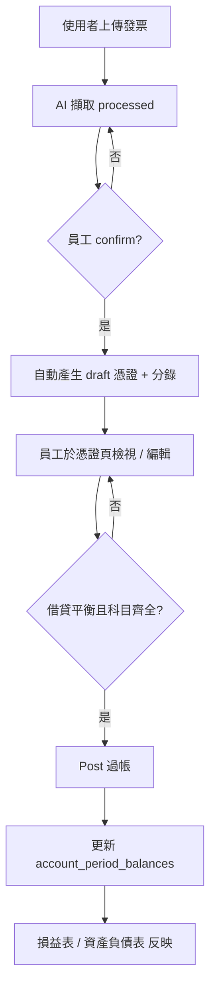
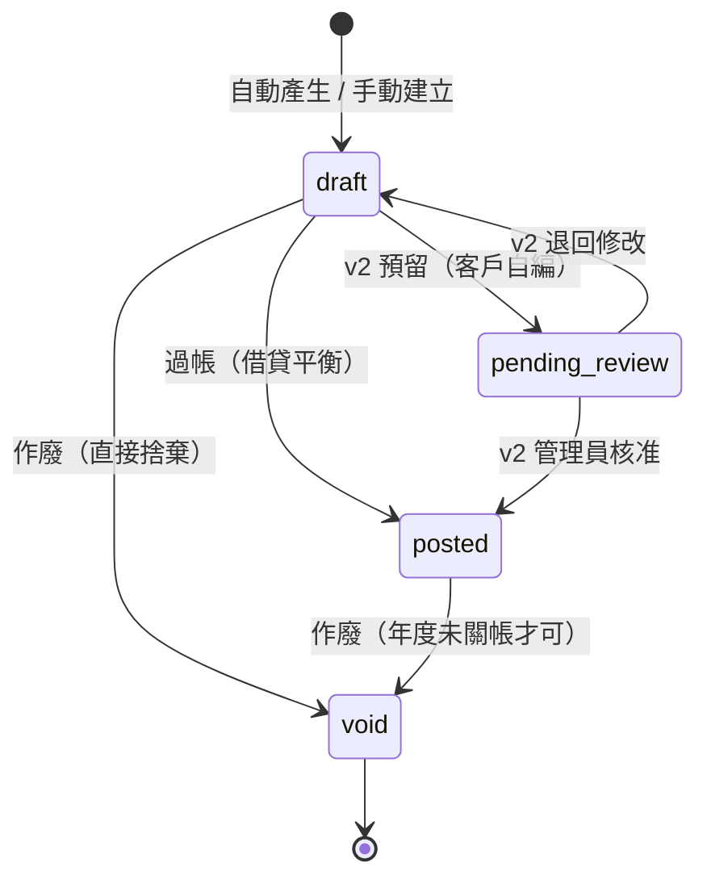
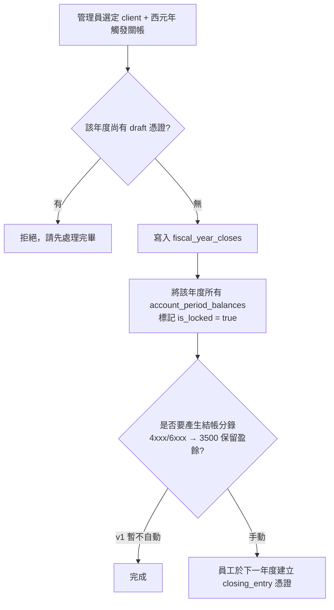
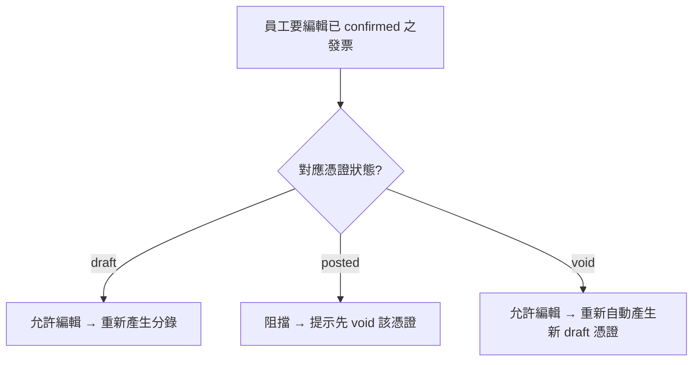

# 憑證（傳票）與分錄系統設計提案

> **文件狀態**：草稿 / 提案
> **目的**：建立基礎以產出客戶的損益表與資產負債表
> **預期**：本文件將經過多輪討論修訂，再進入實作階段

---

## 1. 背景與動機

目前 SnapBooks 已能擷取發票（發票）與折讓證明單（折讓），並可匯出財政部 TET_U / TXT 格式以利申報營業稅，**但尚未維護總帳（general ledger）**，因此無法為客戶產出：

- 損益表（Income Statement, 損益表）
- 資產負債表（Balance Sheet, 資產負債表）
- 其他需建立在分錄之上的報表（試算表、現金流量表等）

本提案在現有的 發票 / 折讓 之下新增三層資料模型：

```
發票 / 折讓 / 其他來源憑證（薪資、保險、預付費用攤提…）
        │
        ▼
   憑證（documents）
        │ 1 : N
        ▼
   分錄（journal_entries）   ← 強制 Σ借方 = Σ貸方
        │
        ▼
   account_period_balances（每月每科目彙總）
        │
        ▼
   損益表 / 資產負債表
```

**核心觀念**：發票只是憑證的一種類型（屬「營業稅相關」）。其他類型的憑證（保險費單、薪資單、預付費用攤提…）屬「非營業稅相關」，不可扣抵營業稅但仍須入帳。

---

## 2. 已敲定的設計決策

下列決策已於設計討論中拍板，本文後續內容均依此為前提。

| # | 決策項目 | 結論 | 備註 |
|---|---|---|---|
| 1 | 憑證產生時機 | 發票/折讓 `confirmed` 時自動產生 **draft** 憑證；員工檢視編輯後再 **post** | post 為一獨立動作，過帳後才影響財報。要能多選，一次選很多，讓員工可以post很多。 |
| 2 | 會計科目表 | v1 沿用現有靜態 `lib/data/accounts.ts`；`journal_entries` 儲存**純科目代碼**（如 `"5102"`） | 未來改為 DB 表時，因分錄已存純代碼，遷移幾乎為零成本 |
| 3 | 年度關帳 | 以**西元年**為單位的年度硬關帳；無月度軟關帳 | 對應台灣營利事業所得稅申報採曆年制 |
| 4 | 預付費用 / 批次入帳 / 固定資產 | 需要設計額外「固定資產模組」和「預付費用模組」。產生「攤銷科目」憑證的當下就設定「攤提週期」之後系統自動生成全部分錄！ | 應該是要多一個固定資產目錄。金額超過8萬，性質是固定資產的，可以跑到固定資產。這種性質的，年度就需要有自動依照月份產生分錄的功能了 |

---

## 3. 資料模型

所有新增資料表沿用既有的 `get_auth_user_firm_id()` RLS 慣例（事務所層級隔離）。金額一律以 `BIGINT` 儲存整數新台幣，與現行 `extractedInvoiceDataSchema.totalSales/tax` 的 `.int()` 驗證一致。

### 3.1 `documents` — 憑證主檔

| 欄位 | 型別 | 說明 |
|---|---|---|
| `id` | UUID PK | `gen_random_uuid()` |
| `firm_id` | UUID NOT NULL | FK → `firms` ON DELETE CASCADE |
| `client_id` | UUID NOT NULL | FK → `clients` ON DELETE CASCADE |
| `date` | DATE NOT NULL | 用於決定所屬會計年度與月份 |
| `type` | TEXT NOT NULL | (營業稅) `VAT` (非營業稅) `NON_VAT` |
| `doc_type` | TEXT NULL | `invoice` / `allowance` / 未來：`receipt` / `payroll` / `insurance` / NULL（純手動憑證/系統分錄） |
| `source_id` | UUID NULL | 對應發票/折讓等子表的 id（手動憑證為 NULL） |
| `file_url` | TEXT NULL | 來源檔案路徑（Supabase Storage）；非營業稅憑證亦使用 |
| `ocr_status` | TEXT NULL | `pending` / `done` / `failed`；非掃描類憑證為 NULL |
| `amount` | BIGINT NULL | 共通金額（便於列表查詢；正負號規則待 §10 Q11 決議） |
| `duplicate_of` | UUID NULL | FK → `documents`（self-FK）；標為重複時指向原始那張 |
| `description` | TEXT | 摘要 |
| `status` | TEXT NOT NULL | `draft` / `posted` / `void`，預設 `draft` |
| `posted_at` | TIMESTAMPTZ NULL | |
| `posted_by` | UUID NULL | FK → `profiles` |
| `voided_at` | TIMESTAMPTZ NULL | |
| `voided_by` | UUID NULL | FK → `profiles` |
| `void_reverses_document_id` | UUID NULL | FK → `documents`（self-FK），紀錄沖銷哪一張；待 A4 後移至 journal_entries 層 |
| `created_by` | UUID NOT NULL | FK → `profiles` |
| `created_at` / `updated_at` | TIMESTAMPTZ | |

**索引與限制**

- `UNIQUE (doc_type, source_id) WHERE source_id IS NOT NULL` — 一張發票/折讓僅對應一張 documents row
- `INDEX (client_id, date)` — IS/BS 查詢主路徑
- `INDEX (client_id, status)`
- `INDEX (duplicate_of) WHERE duplicate_of IS NOT NULL`

> **`pending_review` 已自 documents.status 移除**：客戶自編憑證的 review 流程屬於分錄（記帳動作）層級，不屬於文件（事實）層級。v2 新增該值時將加在 `journal_entries.status` 上（待 A2 拆出 header 後一併設計），無需在 documents 預留。
>
> **`void_reverses_document_id` 為過渡欄位**：依 BOOKKEEPING_DATA_MODELING §四的目標模型，沖銷關聯應在 `journal_entries.reverses_entry_id`。本欄保留只為過渡，A4 結構拆分完成後即移除。

---

### 3.2 `journal_entries` — 分錄明細

| 欄位 | 型別 | 說明 |
|---|---|---|
| `id` | UUID PK | |
| `document_id` | UUID NOT NULL | FK → `documents` ON DELETE CASCADE |
| `line_number` | SMALLINT NOT NULL | 1, 2, 3… 顯示順序 |
| `account_code` | TEXT NOT NULL | **純代碼**，如 `"5102"`；應用層對照 `ACCOUNTS` 驗證 |
| `debit` | BIGINT NOT NULL DEFAULT 0 | 借方金額（NTD 整數，≥ 0） |
| `credit` | BIGINT NOT NULL DEFAULT 0 | 貸方金額（NTD 整數，≥ 0） |
| `description` | TEXT NULL | 行內備註 |

**索引與限制**

- `UNIQUE (document_id, line_number)`
- `CHECK (debit >= 0 AND credit >= 0 AND (debit > 0) <> (credit > 0))` — 同一行借貸**只能擇一**為正
- `INDEX (account_code, document_id)` — 總帳查詢用

**借貸平衡強制**

採延遲約束（deferred constraint）或 trigger，於 documents 狀態切換到 `posted` 時驗證 `Σdebit = Σcredit`；不平衡則 post 失敗。

---

### 3.3 `fiscal_year_closes` — 年度關帳紀錄

| 欄位 | 型別 | 說明 |
|---|---|---|
| `id` | UUID PK | |
| `firm_id` | UUID NOT NULL | |
| `client_id` | UUID NOT NULL | FK → `clients` |
| `gregorian_year` | SMALLINT NOT NULL | 例：2024 |
| `closed_at` | TIMESTAMPTZ NOT NULL | |
| `closed_by` | UUID NOT NULL | FK → `profiles` |
| `notes` | TEXT NULL | |

- `UNIQUE (client_id, gregorian_year)`

**效果**

- 該年度的**已過帳憑證不可編輯或作廢**
- 該年度不可新增憑證（`voucher_date` 落在該年的）
- 重啟年度需「刪除該筆紀錄」這個明確的管理動作

---

### 3.4 `account_period_balances` — 每月科目餘額（rollup）

供 IS/BS 快速查詢，並作為已關帳年度的快照憑據。

| 欄位 | 型別 | 說明 |
|---|---|---|
| `id` | UUID PK | |
| `firm_id` | UUID NOT NULL | |
| `client_id` | UUID NOT NULL | FK → `clients` |
| `account_code` | TEXT NOT NULL | |
| `period_year` | SMALLINT NOT NULL | 西元年 |
| `period_month` | SMALLINT NOT NULL | 1–12 |
| `debit_total` | BIGINT NOT NULL DEFAULT 0 | |
| `credit_total` | BIGINT NOT NULL DEFAULT 0 | |
| `is_locked` | BOOLEAN NOT NULL DEFAULT false | 該月所屬年度已關帳則為 true |
| `updated_at` | TIMESTAMPTZ DEFAULT now() | |

- `UNIQUE (client_id, account_code, period_year, period_month)`
- `INDEX (client_id, period_year, period_month)`

**維護策略**

- documents `post` / `void` 時，於同一交易中由服務層函式做**增量更新**
- 年度關帳時，將該年所有 row 標記 `is_locked = true`；之後永不重算
- 提供 `recomputeBalances(clientId, year, month)` 修復函式（非熱路徑）

**沖銷對餘額的處理（待 A4 結構拆分後正式生效）**

依目標模型「沖銷沖的是帳，不是單據」，原始 posted 分錄之 `status` 切換為 `reversed` 時，**不**自 `account_period_balances` 扣除其貢獻；沖銷效果完全來自新插入之反向分錄（借貸對調）。這保證原帳目仍可追溯，且不會發生「先扣再加」的競態問題。

---

### 3.5 `fixed_assets` — 固定資產主檔（佔位，待後續 session 詳設計）

> **觸發來源**：Decision 4 — 取得成本 ≥ 8 萬且性質為固定資產者，記入固定資產主檔，年度依月份自動產生折舊分錄。
>
> 完整 schema、折舊方法（直線/年數合計/雙倍餘額遞減）、耐用年數對照、處分流程、稅會差異等留待後續 session（建議拆出 `FIXED_ASSETS_PLAN.md`）。

最小欄位草稿（僅供討論起點，非定案）：

| 欄位 | 型別 | 說明 |
|---|---|---|
| `id` | UUID PK | |
| `client_id` | UUID FK | |
| `name` | TEXT | 資產名稱 |
| `acquisition_date` | DATE | 取得日 |
| `cost` | BIGINT | 取得成本（含稅，金額 ≥ 80,000） |
| `salvage_value` | BIGINT | 殘值 |
| `useful_life_months` | SMALLINT | 耐用年數（月） |
| `depreciation_method` | TEXT | v1 僅支援 `straight_line` |
| `asset_account_code` / `accum_depr_account_code` | TEXT | 對應科目 |
| `acquisition_document_id` | UUID NULL FK | 取得時對應的 documents |
| `status` | TEXT | `active` / `disposed` |

---

### 3.6 `amortization_schedules` — 預付/攤提排程（佔位，待後續 session 詳設計）

> **觸發來源**：Decision 4 — 員工於建立攤銷科目憑證時設定攤提週期，系統自動依月份產生分錄。
>
> 完整生成排程、提前終止、修改排程等流程留待後續 session（可與 §3.5 共用一份模組計畫）。

最小欄位草稿（僅供討論起點，非定案）：

| 欄位 | 型別 | 說明 |
|---|---|---|
| `id` | UUID PK | |
| `client_id` | UUID FK | |
| `source_document_id` | UUID FK | 原始預付憑證 |
| `expense_account_code` | TEXT | 每期認列的費用科目 |
| `prepaid_account_code` | TEXT | 預付資產科目（如 1410 預付費用） |
| `total_amount` | BIGINT | |
| `start_period` | DATE | 起始月份 |
| `total_periods` | SMALLINT | 攤提期數（月） |
| `realized_periods` | SMALLINT DEFAULT 0 | 已認列期數 |
| `status` | TEXT | `active` / `completed` / `cancelled` |

> **排程驅動方式**：建議沿用既有 `pgmq + pg_cron` 基礎設施（參考 `extraction-worker`）。每月初的工作會掃描所有 `active` 排程並補產應認列分錄；以 (schedule_id, period) 唯一鍵保證冪等。

---

## 4. 流程圖

### 4.1 發票 → 憑證 → 過帳 → 財報



### 4.2 憑證狀態機



### 4.3 年度關帳



### 4.4 發票更動 vs 憑證生命週期



---

## 5. 憑證自動產生規則

當發票/折讓由 `processed` 進入 `confirmed` 時，於同一交易內呼叫 `voucher-generation` 服務產生 draft 憑證。

### 5.1 科目對照原則

| 科目角色 | 來源 | 預設值 |
|---|---|---|
| 銷項收入科目 | 固定 | `4101 營業收入` |
| 進項費用/成本科目 | 從 `extracted_data.account` 取出（剝去後綴名稱） | 由 Gemini 擷取時決定 |
| 進項稅額 | 固定 | `1147 進項稅額` |
| 銷項稅額 | 固定 | `2271 銷項稅額` |
| **結算科目（cash / AR / AP）** | 依總額金額門檻自動選擇 | 總額 ≤ 10,000 → `1111 現金`；> 10,000 → `1112 銀行存款`。員工於 draft 階段可改為 `1113 應收帳款` 或 `2151 應付帳款` |

> **結算科目（cash / AR / AP 類）**：每張發票都需要一個「另一邊」用以平衡借貸——代表這筆款項是現金結清還是賒帳。發票本身只有總額資訊，無法判斷已付或未付，故 v1 採金額門檻啟發式（小額視為現金、大額視為銀行轉帳），並由員工視情況調整。日後可加入「客戶預設值」設定（如某客戶恆為應付帳款）。
>
> **依賴**：`lib/data/accounts.ts` 須能查出 `1111 現金` 與 `1112 銀行存款` 兩個常數代碼（已存在）。

### 5.2 分錄樣板

| 來源類型 | 借方 (Dr.) | 貸方 (Cr.) |
|---|---|---|
| **進項發票（可扣抵）** | 費用科目（銷售額），`1147 進項稅額`（稅額） | `1112 銀行存款`（總額） |
| **進項發票（不可扣抵）** | 費用科目（總額，含稅） | `1112 銀行存款`（總額） |
| **銷項發票** | `1112 銀行存款`（總額） | `4101 營業收入`（銷售額），`2271 銷項稅額`（稅額） |
| **進項折讓** | `1112 銀行存款`（總額） | 費用科目（折讓額），`1147 進項稅額`（折讓稅額） |
| **銷項折讓** | `4101 營業收入`（折讓額），`2271 銷項稅額`（折讓稅額） | `1112 銀行存款`（總額） |

**特例：`extracted_data.account` 缺漏**
若進項發票尚無對應科目（Gemini 未填或員工修正），憑證仍會產生但該行於 UI 標記為待補；缺科目則不允許 post。

### 5.3 範例

**範例 A：進項電子發票（可扣抵）** — 銷售額 10,000、稅額 500、總額 10,500，Gemini 指派 `5102 旅費`：

| Line | Account | Debit | Credit |
|---|---|---|---|
| 1 | 5102 旅費 | 10,000 | 0 |
| 2 | 1147 進項稅額 | 500 | 0 |
| 3 | 1112 銀行存款 | 0 | 10,500 |

員工若知此筆為賒購，於 draft 階段將第 3 行 `1112` 改為 `2151 應付帳款`，再 post。

**範例 B：進項發票（不可扣抵）** — 進貨 200，稅額 10，總額 210（依 Q3 預設方向，稅額併入費用）：

| Line | Account | Debit | Credit |
|---|---|---|---|
| 1 | 費用科目（含稅後） | 210 | 0 |
| 2 | 1111 現金 | 0 | 210 |

> 第 2 行因總額 ≤ 10,000，採「現金」結算（依 §5.1 門檻規則）。

---

### 5.4 批次過帳（Bulk Post）

對應 Decision 1 補充：員工於分錄列表多選後可一次過帳多筆。

| 議題 | v1 預設方向 |
|---|---|
| 原子性 | 全有或全無（一筆失敗 → 整批 rollback），降低殘留半截狀態之困擾 |
| 失敗訊息 | 服務層回傳每筆的失敗原因（借貸不平衡、缺科目、年度已關帳…），UI 一次列出讓員工修正後重試 |
| 序號連號 | `voucher_no` 在交易內以表鎖（`SELECT ... FOR UPDATE` on `voucher_sequences(client_id, date)`）依選取順序遞增賦號，確保連號 |
| 並發 | 同一客戶同時批次 post 走表鎖排隊；不同客戶並行不互相阻塞 |
| UI | 分錄列表加入勾選欄與「批次過帳」按鈕；按鈕僅對 `draft` 狀態啟用 |

> 詳細 UI 與 service 介面待 phase 2 實作時再敲定，但資料模型上 `voucher_sequences` 序號表須一併建立以支援表鎖賦號。

---

## 6. 損益表 / 資產負債表

### 6.1 查詢介面（服務層）

| 函式 | 輸入 | 邏輯 |
|---|---|---|
| `getIncomeStatement(clientId, fromDate, toDate)` | 期間 | 自 `account_period_balances` 加總**收入（4xxx）/ 成本（5xxx）/ 費用（6xxx, 8xxx）/ 業外收入（7xxx）**，得淨利 |
| `getBalanceSheet(clientId, asOfDate)` | 截止日 | 自 inception 累加至 `asOfDate`，分**資產（1xxx）/ 負債（2xxx）/ 權益（3xxx）**。已關帳年度直接讀 locked snapshot；當年度從分錄即時推算 |

### 6.2 科目分類（依首位數字，遵循台灣 COA 慣例）

| 首碼 | 類別 | IS 或 BS |
|---|---|---|
| 1xxx | 資產 | BS |
| 2xxx | 負債 | BS |
| 3xxx | 業主權益 | BS |
| 4xxx | 營業收入 | IS |
| 5xxx | 銷貨成本 | IS |
| 6xxx | 營業費用 | IS |
| 7xxx | 營業外收入 | IS |
| 8xxx | 營業外費用 | IS |
| 9xxx | 所得稅 | IS |

### 6.3 已關帳年度的「儲存」策略

- `account_period_balances` 表本身即為 rollup，月度粒度
- 年度關帳後 `is_locked = true`，未來查詢時不會重算，效能與審計可信度兼具
- 若發現歷史錯誤需修正，必須先「重啟年度」（刪除 `fiscal_year_closes` 該筆紀錄），且全程留痕

---

## 7. 各層改動清單（粗略）

> 本節僅為確認影響範圍，**詳細實作將於後續 session 處理**。

**新增**

- `supabase/migrations/<ts>_create_documents_and_journal_entries.sql`
- `supabase/migrations/<ts>_create_fixed_assets_and_amortization.sql`（對應 §3.5、§3.6）
- `lib/services/document.ts`、`voucher-generation.ts`、`financial-statements.ts`、`fiscal-year-close.ts`
- `lib/services/fixed-asset.ts`、`amortization.ts`（含每月折舊/攤提自動產生分錄之 worker）
- `lib/domain/document.ts`、`fixed-asset.ts`（Zod schema、enum）
- `app/firm/[firmId]/client/[clientId]/voucher/`（列表 / 詳情 / 編輯，支援批次過帳 §5.4）
- `app/firm/[firmId]/client/[clientId]/fixed-asset/`、`prepayment/`（資產與預付排程管理）
- `app/firm/[firmId]/client/[clientId]/reports/income-statement/`
- `app/firm/[firmId]/client/[clientId]/reports/balance-sheet/`
- `supabase/functions/amortization-worker/`（pgmq + pg_cron 月初批次產生分錄）

**修改**

- `lib/services/invoice.ts` / `allowance.ts` — confirm 時呼叫憑證產生；憑證已 post 時阻擋編輯
- `lib/domain/models.ts` — 新增 schema 與 enum
- `app/firm/[firmId]/client/[clientId]/period/[periodYYYMM]/page.tsx` — 已 confirm 行旁顯示對應憑證連結
- `components/firm-sidebar.tsx` — 新增「憑證」「損益表」「資產負債表」入口
- 重新產生 `supabase/database.types.ts`

---

## 8. 假設

| # | 假設 | 影響 |
|---|---|---|
| A1 | 所有金額為新台幣整數，不需小數位 | 沿用現行 `BIGINT` 設計 |
| A2 | 客戶採曆年制（1/1–12/31） | 關帳以西元年為單位 |
| A3 | 一張發票/折讓對應一張憑證 | 由 `UNIQUE (source_kind, source_id)` 強制 |
| A4 | 結算科目預設「銀行存款」對多數中小企業可接受 | 否則需在客戶設定中加入預設值 |
| A5 | Gemini 指派的 `extracted_data.account` 多數情況可用 | 缺漏時阻擋 post，由員工補正 |
| A6 | 發票編輯需先 void 對應已過帳憑證 | 員工流程上可接受（非自動沖銷） |
| A7 | 同一客戶同一年度 voucher_number 不會極高頻產生 | 序號生成採表鎖或 UNIQUE 衝突重試即可 |

---

## 9. v1 範圍外

- 每事務所 / 每客戶自訂科目表（COA 維持靜態）
- 客戶自行編輯憑證的 portal 流程（`pending_review` enum 已預留，UI 與權限留待 v2）
- 月度軟關帳（v1 僅年度硬關帳）
- 多幣別
- 現金流量表
- 沖銷憑證一鍵生成

---

## 10. 待討論問題（Open Questions）

| # | 問題 | 預設方向 |
|---|---|---|
| Q1 | 憑證序號格式 — `"2024-0001"`？要不要前綴 voucher_type？要不要 ROC 年（`"113-0001"`）？ | 暫定 `YYYYMMDD-NNNN`（西元年），NNNN 每客戶每日重置；批次過帳時以 `voucher_sequences(client_id, date)` 表鎖確保連號（見 §5.4） |
| Q2 | 結算科目預設應為「銀行存款」、「應收/付帳款」還是「現金」？是否需「客戶預設值」？ | 預設1萬以下入現金，1萬以上入銀行存款 |
| Q3 | 進項不可扣抵發票的稅額是要併入費用？還是另外列「進項稅額—不可扣抵」？ | 暫定併入費用（最常見作法）舉例：費用，如果當初進項不可扣抵。舉例來說，進貨200，稅額10 -> 借方：費用210元，貸方：銀存210元，所以一開始就是當該科目的費用 |
| Q4 | 是否要將「審核者」「審核時間」加到 invoices/allowances（補審計軌跡）？ | 與本案解耦，可獨立提案 |
| Q5 | account_period_balances 的維護要走 trigger 還是純應用層？ | 建議純應用層，於同一 transaction 內處理；trigger 偵錯困難 |
| Q6 | 已 post 憑證的「沖銷」是直接 void，還是另開一張 `void_reverses_voucher_id` 指向原憑證的反向分錄憑證？ | 建議「反向分錄憑證」較符合會計慣例，原憑證不可消失 |
| Q7 | 結算（closing entry）要不要 v1 自動產生？目前列為「v1 範圍外、留 enum 值」 | 待確認業務流程偏好 |
| Q8 | 損益表 / 資產負債表的查詢期間單位 — 任意西元月份？或限制 ROC 申報期？ | 建議任意 Gregorian 月份；ROC 申報期作為快捷選項 |
| Q9 | 現有 `tax_filing_periods.status (open/locked/filed)` 與本案 `fiscal_year_closes` 是兩套鎖？兩者語意是否需對齊或合併？ | 本案僅鎖會計年度；申報期續鎖申報資料，互不衝突 |
| Q10 | 是否要紀錄憑證的附件（PDF、收據掃描）以利非發票類憑證？ | 建議 v1 重用 Supabase Storage；§3.1 已加 `documents.file_url`，是否需要多附件 (1:N) 待後續討論 |
| Q11 | `documents.amount` 的正負號規則 — 折讓是負數還是恆為正數搭配 `doc_type` 判讀？ | 待決議；影響列表查詢與對帳報表 |

---

## 11. 後續步驟

1. 與會計顧問 / 領域專家 review 第 5 章的分錄樣板與第 10 章的 Open Questions
2. 收斂 Open Questions 至明確結論後更新本文件
3. 拆出 phased delivery（資料模型 → 自動產生 → 手動憑證 → 報表 → 關帳）
4. 開新 session 進入實作

---

*本文件為設計提案草稿，預期經多輪修訂後再進入實作階段。*
