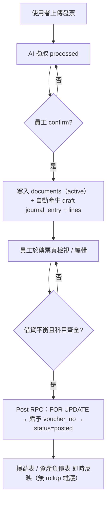
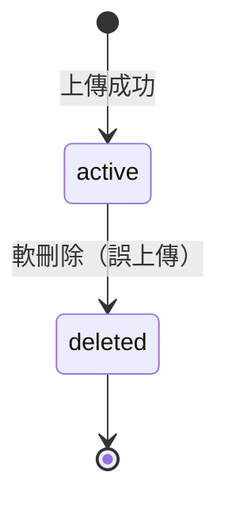
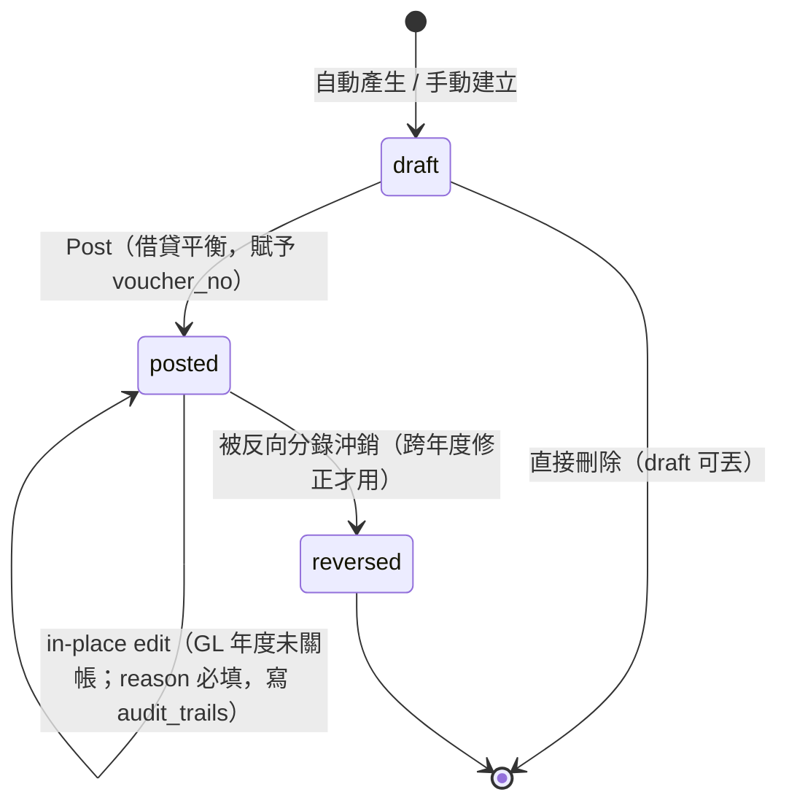
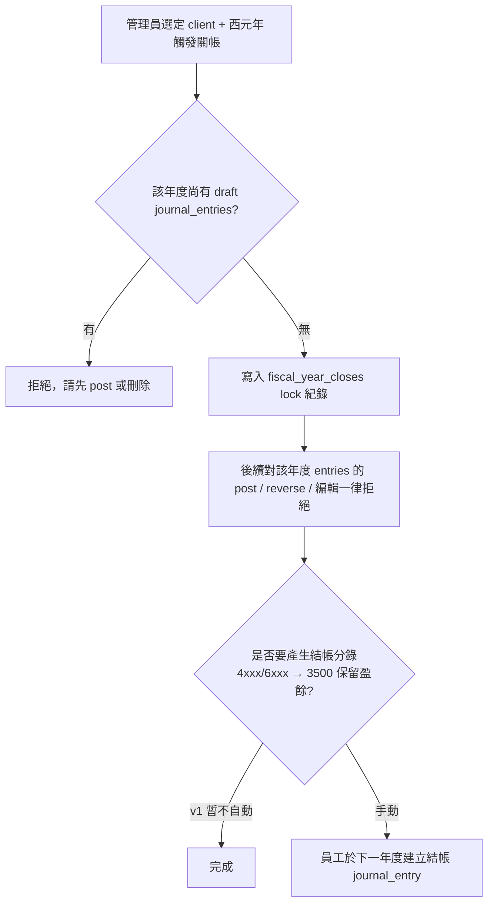
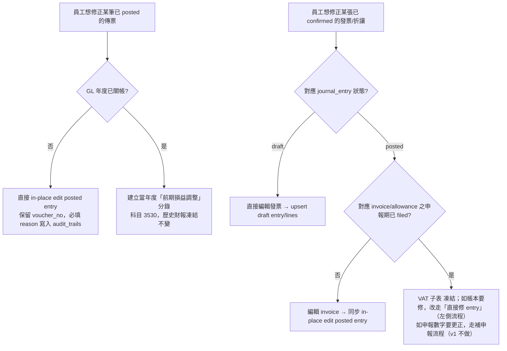

# 憑證（傳票）與分錄系統設計提案

> **文件狀態**：草稿 / 提案
> **目的**：建立基礎以產出客戶的損益表與資產負債表
> **預期**：本文件將經過多輪討論修訂，再進入實作階段

---

## 1. 背景與動機

目前 SnapBooks 已能擷取發票（發票）與折讓證明單（折讓），並可匯出財政部 TET_U / TXT 格式以利申報營業稅，**但尚未維護總帳（general ledger）**，因此無法為客戶產出：

- 損益表（Income Statement, 損益表）
- 資產負債表（Balance Sheet, 資產負債表）
- 其他需建立在分錄之上的報表（試算表、現金流量表等）

本提案在現有的 發票 / 折讓 之下新增資料模型（依 BOOKKEEPING_DATA_MODELING.md 的目標模型）：

```
原始憑證（documents）            ← 發票、折讓、收據、保單、薪資單…
   │ 1:1（document 端可 NULL）
   ▼
傳票（journal_entries）          ← 一筆記帳動作；voucher_no / voucher_type / status 在此
   │ 1:N（≥ 2 行，借貸平衡）
   ▼
分錄明細（journal_entry_lines）  ← 借方或貸方科目
   │
   ▼ 即時 SUM（v1）
損益表 / 資產負債表
```

> v1 不建月度 rollup 表；IS/BS 即時加總（§6）。未來如需加速，介面不變、內部切換為 rollup（§6.3）。

**核心觀念**：

1. **發票只是憑證的一種類型**（屬「營業稅相關」）。其他類型的憑證（保險費單、薪資單、預付費用攤提…）屬「非營業稅相關」，不可扣抵營業稅但仍須入帳。
2. **「傳票」（journal_entries）與「原始憑證」（documents）為兩個獨立 entity**：documents 紀錄文件事實，journal_entries 紀錄記帳動作。沖銷沖的是「帳」（entries），不是「單據」（documents）。
3. **命名澄清**：國際 ERP 慣例下 `voucher` = 傳票（記帳憑證），不是發票/收據。本案 schema 與此一致。詳見 BOOKKEEPING_DATA_MODELING §一。
4. **VAT 模組與 GL 模組正交**（與主流 ERP 一致）：
   - **VAT 模組（營業稅）**：`invoices`、`allowances`、`tax_filing_periods` — 服務 401/403 申報。鎖點為 `tax_filing_period.status='filed'`，凍結「對國稅局講過什麼」。
   - **GL 模組（總帳）**：`documents`（含未來非 VAT 子表如 insurance、payroll）、`journal_entries`、`journal_entry_lines`、`fiscal_year_closes`、`audit_trails` — 服務帳本與 IS/BS。鎖點為 `fiscal_year_closes`，凍結「歷史帳本」。
   - **Post 是模組間的單向轉送**：發票/折讓 confirm 後產生 draft entry，post 之後 entry 進入 GL 自己的生命週期，**與原 document 解耦**。Posted entry 在當年度未關帳前可 in-place edit（見 §5.6.1），跨年度錯誤才走反向分錄。
   - **「帳本與申報不一致」是 feature 不是 bug**：申報數字 = 送出當下的 snapshot，永久凍結；帳本數字 = 我們現在認為對的數字。差額本身有意義（後續發現的 OCR 錯誤、key-in 錯、會計判斷修正）。

---

## 2. 已敲定的設計決策

下列決策已於設計討論中拍板，本文後續內容均依此為前提。

| # | 決策項目 | 結論 | 備註 |
|---|---|---|---|
| 1 | 憑證產生時機 | 發票/折讓 `confirmed` 時自動產生 **draft** 憑證；員工檢視編輯後再 **post** | post 為一獨立動作，過帳後才影響財報。要能多選，一次選很多，讓員工可以post很多。 |
| 2 | 會計科目表 | v1 沿用現有靜態 `lib/data/accounts.ts`；`journal_entries` 儲存**純科目代碼**（如 `"5102"`） | 未來改為 DB 表時，因分錄已存純代碼，遷移幾乎為零成本 |
| 3 | 年度關帳 | 以**西元年**為單位的年度硬關帳；無月度軟關帳 | 對應台灣營利事業所得稅申報採曆年制 |
| 4 | 預付費用 / 批次入帳 / 固定資產 | 需要設計額外「固定資產模組」和「預付費用模組」。產生「攤銷科目」憑證的當下就設定「攤提週期」之後系統自動生成全部分錄！ | 應該是要多一個固定資產目錄。金額超過8萬，性質是固定資產的，可以跑到固定資產。這種性質的，年度就需要有自動依照月份產生分錄的功能了 |
| 5 | 結構模型 | CTI：`documents`（父，事實層）+ `invoices`/`allowances`（子，CTI children，反向 FK 至 documents）；`journal_entries`（傳票 header）+ `journal_entry_lines`（借/貸明細） | 命名遵循國際 ERP 慣例：voucher = 傳票（記帳憑證），不是原始發票/收據 |
| 6 | `voucher_no` | 格式 `YYYYMMDD-NNNNN`（5 位序號）；**強制 no-gap**；以 `voucher_sequences` 表 + `FOR UPDATE` 序列化賦號 | 跳號違反會計原則；draft 丟棄不會佔號（draft 階段 voucher_no 為 NULL，post 時才賦） |
| 7 | IS / BS 計算 | v1 **不建** `account_period_balances` rollup 表，IS/BS 即時 SUM `journal_entry_lines`；單客戶單年估計 < 15K rows，預計 < 100ms | 介面（`getIncomeStatement` / `getBalanceSheet`）以服務層封裝，未來如需加速可內部切換為 rollup + backfill 而不影響呼叫方 |
| 8 | Post 操作實作 | `SELECT ... FOR UPDATE` 取 entry → 校驗借貸平衡 → atomic UPSERT 取 next seq → flip status；批次版本同邏輯 + 陣列入參 | 因 supabase.js SDK 無法跨 statement 開 transaction，no-gap 賦號 + status flip 必須在同一交易內。**實作宿主依 #10 修訂改為 Drizzle `db.transaction()`**（原訂為 PL/pgSQL function），FOR UPDATE + 原子賦號 + flip 之邏輯不變；見 §12 |
| 9 | 沖銷模型 | `journal_entries.reverses_entry_id` self-FK；原分錄 `status` 變 `reversed` 但**不自 IS/BS 扣回**，沖銷效果完全來自新插入的反向分錄（借貸對調）。**僅用於跨年度（已關帳年）的修正**；當年度未關帳之 posted entry 採 in-place edit（見 #11） | 反向分錄是會計上跨年度修正的標準動作；當年度小錯（OCR 誤讀、key-in 錯）不該被它污染 |
| 10 | 資料存取架構 | **（2026-05 修訂）** Supabase.js 負責 Auth / Storage / 純讀 / 單表 CRUD / status 翻轉（保留 RLS）；跨表原子寫入（`confirm` / `regenerate` / `post` / `edit` / `reverse`）改走 **Drizzle `db.transaction()`**。交易層建置見 PHASED_PLAN Phase 6.5 | 原訂（2026-04-27）為純 SDK + ~3 支 PL/pgSQL RPC（Option A）；後因實際原子操作達 6 支、documents-first 多表寫入、且確立不擴增 PostgREST RPC，改採 §12 Option C（Drizzle）。完整理由見 §12 |
| 11 | 模組劃分與編輯權限 | **VAT 模組與 GL 模組正交**：VAT 模組（invoices / allowances / tax_filing_periods）服務申報，鎖點 `tax_filing_period.status='filed'`；GL 模組（documents / journal_entries / journal_entry_lines / fiscal_year_closes / audit_trails）服務帳本，鎖點 `fiscal_year_closes`。Post 為單向轉送點。**Posted journal_entry 在 GL 年度未關帳前允許 in-place edit**（保留 voucher_no，必填 reason 寫入 audit_trails）；跨年度才走反向分錄 / 前期損益調整 | 對應主流 ERP 模組分離；in-place edit 對應實務「key-in 錯誤直接修正」訴求；改動詳見 §1 第 4 點、§5.6.1、§5.8 |
| 12 | Audit 軌跡 | v1 引入 `audit_trails` 表（§3.9），用於 in-place edit 之 diff log。v1 必填寫入點：journal_entry posted 後的編輯 + 沖銷（reason 必填）；其餘事件（create/delete/post 等）為可選擴充。本表為**通用模組**，未來可服務跨表 audit | 沒有 audit log，posted in-place edit 等於「悄悄塗改」；audit_trails 是 #11 政策的必要前提 |
| 13 | 折讓分錄推導方式 | 折讓**不**用固定樣板，而是**鏡像原發票之 posted entry 結構**：科目（費用 / 收入 / 結算）從原 entry 的 lines 取出、借貸對調、金額替換為折讓本身的 amount / taxAmount。若原發票對應之 entry 不存在（罕見：原發票未上傳或在他客戶名下），UI 退回請員工手動指定費用 / 收入科目。詳見 §5.2 | 樣板法無法正確處理「原發票為不可扣抵（費用吸收稅額,2 行）」的情境——折讓必須鏡像為 2 行才平衡。且若員工在 draft 階段改過原 entry 之科目，折讓亦應追隨該編輯,而非從 invoice 端 OCR 值重新推導 |

---

## 3. 資料模型

所有新增資料表沿用既有的 `get_auth_user_firm_id()` RLS 慣例（事務所層級隔離）。金額一律以 `BIGINT` 儲存整數新台幣，與現行 `extractedInvoiceDataSchema.totalSales/tax` 的 `.int()` 驗證一致。

### 3.0 模組劃分

依 Decision #11，資料表歸屬於 **通用 / Common**、**GL（總帳）** 或 **VAT（營業稅）** 三類之一。模組界線決定了哪個鎖管哪個表的編輯權限。

| 表 | 模組 | 鎖點 | 為什麼這樣劃 |
|---|---|---|---|
| `documents`（父表，CTI） | **通用** | （**隨下游引用而定**, 見下方 footnote） | 通用憑證事實層，跨 VAT / GL / 其他模組;本身只記錄「文件是否有效保存」 |
| `audit_trails` | **通用** | （append only） | 跨表審計軌跡（§3.9）;v1 必填寫入點集中於 GL，但本質為跨模組基礎設施 |
| `invoices`（CTI 子表） | **VAT** | `tax_filing_period.status` | VAT 專屬欄位（格式碼、稅額、扣抵碼、`taxType` 含作廢狀態）服務 401/403 |
| `allowances`（CTI 子表） | **VAT** | `tax_filing_period.status` | 同上 |
| `tax_filing_periods` | **VAT** | （自身鎖） | 申報期管理 |
| `journal_entries` | **GL** | `fiscal_year_closes` | 帳本核心 |
| `journal_entry_lines` | **GL** | （隨父） | 借貸明細 |
| `voucher_sequences` | **GL** | （隨 entries） | 傳票編號序列 |
| `fiscal_year_closes` | **GL** | （自身鎖） | GL 年度硬關帳 |
| `fixed_assets`、`amortization_schedules` | **GL** | `fiscal_year_closes` | 折舊/攤提產生 GL 分錄 |

> **`documents` 鎖語意**：documents 本身**無單一鎖**。要改 documents 上的欄位時，鎖依**下游引用**判定:
> - 有 invoice / allowance 子表且申報期 `filed` → 影響 VAT 申報的欄位（`doc_date` / `amount` / `file_url`）凍結（VAT 鎖）
> - 有 journal_entry 對應且 entry_date 所屬年度已關帳 → 影響 IS/BS 的欄位（`amount` / `doc_date`）凍結（GL 鎖）
> - 純 `doc_type='other'`（無子表、無 entry） → 無鎖，可自由修改（含 soft delete）
> - 多種引用 → 取最嚴格交集
>
> **`audit_trails` 鎖語意**：append-only，永不修改既有 row;故無編輯鎖概念，僅 v1 必填寫入點規範（§3.9）。

> **CTI 跨模組之意涵**：`documents` 是通用父表，`invoices` / `allowances` 是 VAT 子表，未來可掛非 VAT 子表（v2+）。CTI 是資料模型結構，模組是邏輯所有權;父表存通用事實（誰、何時、收到什麼檔案），子表存模組專屬語意（VAT 稅額、扣抵碼、作廢狀態等）。
>
> **分層設計核心**：documents 只記錄「**這份憑證是否有效被保存**」（`status: active / deleted`）;憑證**代表的營業稅意義**（應稅 / 零稅率 / 免稅 / **作廢**）保留在子表 `invoices.extracted_data.taxType`。兩者正交:一張作廢的發票仍是一份「有效保存的文件」（`documents.status='active'` + `invoices.extracted_data.taxType='作廢'`）。
>
> **未來新增非 VAT 子表**（v2+ 拆分 `'other'` 為具體 doc_type）只需直接掛在 documents 之下，**完全不用動 VAT 模組** — 這正是 CTI 的擴充性價值。

---

### 3.1 `documents` — 原始憑證主檔（通用 / Common 模組）

紀錄客戶上傳之原始文件（發票、折讓單、其他憑證）的**事實層**欄位。**不**含任何記帳動作概念（voucher_no、posted_at、reverses 都不在這裡），**也不**含 VAT 模組專屬語意（作廢、扣抵碼、格式碼都在子表）。
documents 表的核心問題只有一個:**「這份憑證有沒有被有效保存」**——`status` 欄位只回答這個。

| 欄位 | 型別 | 說明 |
|---|---|---|
| `id` | UUID PK | `gen_random_uuid()` |
| `firm_id` | UUID NOT NULL | FK → `firms` ON DELETE CASCADE |
| `client_id` | UUID NOT NULL | FK → `clients` ON DELETE CASCADE |
| `doc_date` | DATE NOT NULL | 文件日期（發票/收據/保單上的日期） |
| `type` | TEXT NOT NULL | `VAT`（營業稅相關）/ `NON_VAT`（非營業稅相關） |
| `doc_type` | TEXT NOT NULL | `invoice` / `allowance` / `other`（非發票/折讓的文件，v1 不入 TET_U、不參與 IS/BS） |
| `file_url` | TEXT NULL | 來源檔案路徑（Supabase Storage） |
| `ocr_status` | TEXT NULL | `pending` / `done` / `failed`；非掃描類為 NULL |
| `amount` | BIGINT NULL | 共通金額（便於列表查詢；正負號規則待 §10 Q11 決議） |
| `status` | TEXT NOT NULL | `active` / `deleted`，預設 `active`（見下方說明） |
| `created_by` | UUID NOT NULL | FK → `profiles` |
| `created_at` / `updated_at` | TIMESTAMPTZ | `updated_at` 隱式記錄「最後狀態變動時間」 |

> **為何只有三值 `doc_type`**：
> - **v1 真正會被自動分流的 doc_type 只有三類**：VAT 模組的 `invoice` / `allowance`（各有對應子表）、非 VAT 的 `other`（documents-only，無子表）
> - 原設計草案曾列 `receipt` / `payroll` / `insurance` 作為 v2+ 子表的 forward-looking 桶，**但在 v1 行為上與 `'other'` 完全相同**（不跑 OCR、不入 TET_U、不自動生分錄）；過早區分只是占用 enum 空間
> - 原 `manual`（無實體憑證之系統/手動分錄）場景由 `journal_entries.document_id = NULL` 表達（§3.3 已明文支持），不需要 placeholder document row
> - 分類器（`UPLOAD_CLASSIFIER_PLAN.md`）的 verdict 本就只輸出 `invoice / allowance / other`，schema 與分類器對齊
>
> **v2+ 擴展策略**：當引入具體業務子表（如 `receipts` 收據子表）時：
> 1. 新增該 doc_type 值到 enum（如 `'receipt'`）
> 2. 建對應子表 + `document_id UNIQUE NOT NULL FK`
> 3. 既有 `doc_type='other'` row 由人工或啟發式 migration 重 tag 到具體 doc_type（視業務需求決定是否需要）
> 4. 新文件依分流邏輯直接落到正確 doc_type
>
> 因此 `'other'` **不是**「永遠的孤兒桶」，而是「v1 容納未細分文件的 staging area」，v2+ 自然演化。

> **無 `deleted_at/by`、`deletion_reason` 等 audit metadata 欄位**：v1 刻意不加。理由：
> - 80%+ 的 row 為 `active`，這些欄位常駐 NULL，污染 schema
> - documents 是「事實層」，「誰於何時做了狀態翻轉、為什麼」屬 audit 軌跡，由 §3.9 `audit_trails` 統一處理
> - 服務層執行 `deleteDocument` 時可於同交易內寫入一筆 audit_trails row（v1 為可選寫入點，§3.9）
> - 想知道「最後變動時間」可看 `updated_at` 配合當前 `status` 粗推；想知道原因/操作者：JOIN audit_trails

**索引與限制**

- `INDEX (client_id, doc_date)` — IS/BS 與列表查詢主路徑
- `INDEX (client_id, status)`

> **`status` 語意**：
> - `active`：文件已被有效保存，預設值
> - `deleted`：軟刪除（誤上傳）
>
> documents 層**只**承載「物理存在」這個事實。文件背後的營業稅意義（**作廢**、應稅 / 零稅率 / 免稅）由 VAT 子表的 `invoices.extracted_data.taxType` 帶。一張作廢的發票仍是 `documents.status='active'` + `invoices.extracted_data.taxType='作廢'`——兩者正交、各自獨立。
>
> 同期作廢的自動化連動（員工標 taxType='作廢' → 連動沖銷已 posted 之 entry）見 §5.6;v1 不做自動化，員工可手動編輯 taxType。跨期錯誤一律走折讓（不允許跨期作廢）。

> **為何 soft delete 而非 hard delete**：
> - 稅務合規：台灣稅法要求發票/憑證保存 5–10 年，即使使用者視為刪除，系統仍應可調閱
> - 誤刪復原：accounting 操作失誤代價高，row 仍在可救回
> - 參照完整性：可能仍有 reversed 之 journal_entry 指向；hard delete 會 orphan/cascade
> - 例外：admin-only 之 GDPR right-to-erasure；含 PII 之誤上傳可保留 row 但清空 `file_url`
>
> 注意：「誰刪、何時刪」這類 audit metadata 不在 documents 內記錄（見上方 note），由 §3.9 `audit_trails` 承載;soft delete 在 v1 提供的是「row 與 status='deleted' 仍可查」，足以滿足合規與 recovery 基本需求。

> **重複偵測（duplicate detection）v1 不做**：原設計提案曾預留 `duplicate_of UUID` self-FK 與 `status='duplicate'` 值用於系統偵測「同一張發票誤上傳兩次」，但 v1 沒有對應的偵測機制（Q14 未實作）。預先寫好沒寫入點的欄位是死碼，故 v1 移除。v1.5+ 加 duplicate detection 時再 `ALTER TABLE ADD COLUMN duplicate_of` + 擴 enum;`status='deleted'` 在那之前足以承載「誤上傳」場景。

> **CTI 完整性**：PostgreSQL 無內建 CTI 支援。「一個 documents 對應恰一個子表 row」由 application layer 確保，schema 不強制（避免 trigger 偵錯困難）。

---

### 3.2 `invoices` / `allowances` — 子表變更（CTI）（VAT 模組）

採 Class Table Inheritance：通用欄位上移至 `documents`，型別專屬欄位保留在子表。**子表新增 `document_id` 反向指回父表**。

**現有 `invoices` / `allowances` 表變更**：

| 變更 | 說明 |
|---|---|
| 新增 `document_id UUID UNIQUE NOT NULL FK → documents` | CTI 反向指標；UNIQUE 強制 1:1 |
| 保留型別專屬欄位 | invoices: `extracted_data`、`invoice_serial_code`、`in_or_out`、`tax_filing_period_id`；allowances: `original_invoice_id`、`original_invoice_serial_code` 等 |
| 抽至 documents 之概念性欄位 | `doc_date`（= `extracted_data.date`）、`amount`（= `extracted_data.totalAmount`）、`file_url`（= `storage_path`） |

> **冗餘期**：backfill 後到後續 phase 清理之間，`storage_path` 同時存於 invoices 與 documents.file_url。讀取以 documents.file_url 為準。

**Backfill 移轉策略**（單一交易完成；目前單一事務所、資料量可控）：

1. 建立 `documents` 表
2. 為每張既有 `invoice` INSERT 對應 documents row：`doc_type='invoice'`、`type='VAT'`、`doc_date = extracted_data.date`（缺漏退回 `created_at::date`）、`amount = extracted_data.totalAmount`、`file_url = storage_path`、`status = 'active'`
3. `invoices` 加 `document_id`（先 NULL）→ 回填 → 加 `NOT NULL` + `UNIQUE`
4. `allowances` 同理（`doc_type='allowance'`，`amount = extracted_data.amount + taxAmount`）
5. 既有 `invoices.status` 之 AI 流程狀態（uploaded/processing/processed/confirmed/failed）**保留不動**——它表達 OCR/擷取生命週期，與 documents.status（文件法律狀態）正交

---

### 3.3 `journal_entries` — 傳票（記帳憑證 header）（GL 模組）

整合「傳票」與「分錄 header」於單一表（依 BOOKKEEPING §二決策 1，因規則上 1 傳票 ↔ 1 分錄 header）。UI 仍以「傳票」呈現此表。

| 欄位 | 型別 | 說明 |
|---|---|---|
| `id` | UUID PK | |
| `firm_id` | UUID NOT NULL | FK → `firms` ON DELETE CASCADE |
| `client_id` | UUID NOT NULL | FK → `clients` ON DELETE CASCADE |
| `document_id` | UUID UNIQUE NULL | FK → `documents`；系統分錄（折舊、攤提、純沖銷）為 NULL |
| `voucher_no` | TEXT NULL | 傳票編號；`draft` 時 NULL，`draft → posted` 時賦號（見 §3.5、§5.4） |
| `voucher_type` | TEXT NOT NULL | `收入` / `支出` / `轉帳` |
| `entry_date` | DATE NOT NULL | 記帳日期；用於餘額月份歸戶與年度關帳判定 |
| `description` | TEXT NULL | 摘要 |
| `status` | TEXT NOT NULL | `draft` / `posted` / `reversed`，預設 `draft` |
| `reverses_entry_id` | UUID NULL | FK → `journal_entries`（self-FK）；沖銷分錄指回被沖銷之原始分錄。**結構性連結（會計關聯）**，非 audit metadata |
| `posted_at` / `posted_by` | TIMESTAMPTZ / UUID NULL | `draft → posted` 時填入；FK → `profiles`。會計責任歸屬欄位，UI 經常顯示「由 X 於 Y 過帳」 |
| `created_by` | UUID NULL | FK → `profiles`；NULL 表示系統自動產生（折舊、攤提工作） |
| `created_at` / `updated_at` | TIMESTAMPTZ | |

> **無 `reversed_at` / `reversed_by` / `reversal_reason`**：被沖銷時不在原分錄上記錄；統一由 §3.9 `audit_trails` 承載（`entity_table='journal_entries'`、`entity_id=<原 entry>`、`action='reversed'`、`reason=<沖銷原因>`、`actor_id`/`actor_at` = 沖銷 entry 之建立者/時間）。
> - `reverses_entry_id` 仍保留在 journal_entries 上，因它是**會計關聯本身**（誰沖了誰），不是 audit metadata
> - 服務層建立 reversing entry 時，**同交易內**寫入 audit_trails row（reason 必填），並 update 原 entry status 為 `reversed`
> - UI 顯示沖銷原因：`SELECT reason FROM audit_trails WHERE entity_table='journal_entries' AND entity_id=? AND action='reversed' ORDER BY actor_at DESC LIMIT 1`（被涵蓋於 §3.9 既定索引）

**索引與限制**

- `UNIQUE (client_id, voucher_no) WHERE voucher_no IS NOT NULL`
- `CHECK (status = 'draft' OR voucher_no IS NOT NULL)` — posted/reversed 必須有 voucher_no
- `INDEX (client_id, entry_date)` — IS/BS 主查詢路徑
- `INDEX (client_id, status)`
- `INDEX (document_id) WHERE document_id IS NOT NULL`
- `INDEX (reverses_entry_id) WHERE reverses_entry_id IS NOT NULL`

> **`pending_review` 預留**：未來開放客戶自編傳票時加入此 status，配合審核流程。本案不實作。

> **系統分錄無 created_by**：折舊／攤提 worker 產生之分錄 `created_by = NULL`。查詢介面以「系統」標示之。

> **Post 操作不在 SDK 端做**：因需要 `FOR UPDATE` + 序號賦予 + status flip 同一 transaction（達成 no-gap 與 idempotency），實作為 PL/pgSQL function `post_journal_entry`（單筆）/ `post_journal_entries`（批次），由服務層 `lib/services/journal-entry.ts` 透過 `supabase.rpc()` 呼叫。詳見 §5.4。

> **Posted entry 之 in-place edit**（Decision #11）：當 GL 年度未關帳時，posted entry 之 header 欄位（除 `voucher_no` / `posted_at` / `posted_by` / `created_*` 外）與 lines 均可編輯。`voucher_no` **必須保留**，避免破壞連號。每次編輯由服務層在同一交易內：(1) 取舊 row snapshot；(2) UPDATE entry / 替換 lines；(3) INSERT 一筆 `audit_trails` row（reason 必填）。實作位於 `editPostedEntry(entryId, patch, reason, userId)`。詳見 §5.6.1。

---

### 3.4 `journal_entry_lines` — 分錄明細（借/貸）（GL 模組）

| 欄位 | 型別 | 說明 |
|---|---|---|
| `id` | UUID PK | |
| `journal_entry_id` | UUID NOT NULL | FK → `journal_entries` ON DELETE CASCADE |
| `line_number` | SMALLINT NOT NULL | 1, 2, 3… 顯示順序 |
| `account_code` | TEXT NOT NULL | **純代碼**（如 `"5102"`）；應用層對照 `lib/data/accounts.ts` 驗證 |
| `debit` | BIGINT NOT NULL DEFAULT 0 | 借方金額（NTD 整數，≥ 0） |
| `credit` | BIGINT NOT NULL DEFAULT 0 | 貸方金額（NTD 整數，≥ 0） |
| `description` | TEXT NULL | 行內備註 |

**索引與限制**

- `UNIQUE (journal_entry_id, line_number)`
- `CHECK (debit >= 0 AND credit >= 0 AND (debit > 0) <> (credit > 0))` — 借貸只能擇一為正
- `INDEX (account_code, journal_entry_id)` — 總帳查詢用

**借貸平衡強制**

於 `journal_entries.status` 由 `draft → posted` 時，由服務層在交易內 `SELECT SUM(debit), SUM(credit) FROM journal_entry_lines WHERE journal_entry_id = ?` 驗證相等；不平衡則 post 失敗。（依 Q5：純應用層，不走 trigger）

---

### 3.5 `voucher_sequences` — 傳票編號序列（per client per day）（GL 模組）

支援 §5.4 批次過帳所需之連號賦號。

| 欄位 | 型別 | 說明 |
|---|---|---|
| `client_id` | UUID NOT NULL | FK → `clients` |
| `seq_date` | DATE NOT NULL | 序號的日期，與 `voucher_no` 之 `YYYYMMDD` 對應 |
| `next_seq` | INTEGER NOT NULL DEFAULT 1 | 下一個可用序號 |

- PK: `(client_id, seq_date)`
- 賦號流程：在 `post_journal_entry` RPC 內以 `INSERT ... ON CONFLICT DO UPDATE SET next_seq = next_seq + 1 RETURNING next_seq - 1` 一句 atomic 取 seq → 組合 `voucher_no = TO_CHAR(entry_date, 'YYYYMMDD') || '-' || LPAD(seq::text, 5, '0')`
- 範例：`20260423-00001`
- 並發：同一 client+date 之賦號因 row lock 排隊；不同 client 並行不互相阻塞
- **No-gap 保證**：因賦號與 status flip 在同一 transaction 內完成；不會發生「seq 已遞增但 entry 沒 post」的中間態

---

### 3.6 `fiscal_year_closes` — 年度關帳紀錄（GL 模組）

| 欄位 | 型別 | 說明 |
|---|---|---|
| `id` | UUID PK | |
| `firm_id` | UUID NOT NULL | |
| `client_id` | UUID NOT NULL | FK → `clients` |
| `gregorian_year` | SMALLINT NOT NULL | 例：2024 |
| `closed_at` | TIMESTAMPTZ NOT NULL | |
| `closed_by` | UUID NOT NULL | FK → `profiles` |
| `notes` | TEXT NULL | |

- `UNIQUE (client_id, gregorian_year)`

**效果**（GL 模組唯一的硬鎖）

- 該年度的**已 posted 之 journal_entries 不可 in-place edit、不可建立反向分錄**
- 該年度不可新增 `entry_date` 落在該年之 journal_entries
- 重啟年度需「刪除該筆紀錄」這個明確的管理動作

> **與 VAT 模組鎖正交**：`tax_filing_period.status='filed'` 只凍結對應 invoices/allowances 子表的 VAT 欄位編輯，**不影響** posted journal_entry 的編輯權限（只要 GL 年度未關帳）。例：5 月份申報已送出後，6 月發現 5/12 的 OCR 金額抓錯，可直接 in-place edit 該 posted entry（GL 帳本變對），原 invoice 文件保持申報當下的 snapshot；如需更正申報，走 VAT 模組的補申報流程（v1 不做）。詳見 §5.6.1。
>
> **無 balance snapshot**：v1 IS/BS 即時由 `journal_entry_lines` 加總，無 rollup 表，故關帳僅寫入 lock 紀錄。歷史財報的「不可變」由 entries 不可改 + RPC `post_journal_entry` 對年度的 guard 共同保證。
>
> 跨年錯誤修正一律走「前期損益調整」（科目 `3530`）於當年度認列，不回頭改動歷史。詳見 §5.6。

---

### 3.7 `fixed_assets` — 固定資產主檔（佔位，待後續 session 詳設計）

> **觸發來源**：Decision 4 — 取得成本 ≥ 8 萬且性質為固定資產者，記入固定資產主檔，年度依月份自動產生折舊分錄。
>
> 完整 schema、折舊方法（直線/年數合計/雙倍餘額遞減）、耐用年數對照、處分流程、稅會差異等留待後續 session（建議拆出 `FIXED_ASSETS_PLAN.md`）。

最小欄位草稿（僅供討論起點，非定案）：

| 欄位 | 型別 | 說明 |
|---|---|---|
| `id` | UUID PK | |
| `client_id` | UUID FK | |
| `name` | TEXT | 資產名稱 |
| `acquisition_date` | DATE | 取得日 |
| `cost` | BIGINT | 取得成本（含稅，金額 ≥ 80,000） |
| `salvage_value` | BIGINT | 殘值 |
| `useful_life_months` | SMALLINT | 耐用年數（月） |
| `depreciation_method` | TEXT | v1 僅支援 `straight_line` |
| `asset_account_code` / `accum_depr_account_code` | TEXT | 對應科目 |
| `acquisition_document_id` | UUID NULL FK | 取得時對應的 documents |
| `status` | TEXT | `active` / `disposed` |

---

### 3.8 `amortization_schedules` — 預付/攤提排程（佔位，待後續 session 詳設計）

> **觸發來源**：Decision 4 — 員工於建立攤銷科目憑證時設定攤提週期，系統自動依月份產生分錄。
>
> 完整生成排程、提前終止、修改排程等流程留待後續 session（可與 §3.7 共用一份模組計畫）。

最小欄位草稿（僅供討論起點，非定案）：

| 欄位 | 型別 | 說明 |
|---|---|---|
| `id` | UUID PK | |
| `client_id` | UUID FK | |
| `source_document_id` | UUID FK | 原始預付憑證 |
| `expense_account_code` | TEXT | 每期認列的費用科目 |
| `prepaid_account_code` | TEXT | 預付資產科目（如 1410 預付費用） |
| `total_amount` | BIGINT | |
| `start_period` | DATE | 起始月份 |
| `total_periods` | SMALLINT | 攤提期數（月） |
| `realized_periods` | SMALLINT DEFAULT 0 | 已認列期數 |
| `status` | TEXT | `active` / `completed` / `cancelled` |

> **排程驅動方式**：建議沿用既有 `pgmq + pg_cron` 基礎設施（參考 `extraction-worker`）。每月初的工作會掃描所有 `active` 排程並補產應認列分錄；以 (schedule_id, period) 唯一鍵保證冪等。

---

### 3.9 `audit_trails` — 變更軌跡（通用 / Common 模組）

支援 Decision #11/#12：posted journal_entry 在當年度未關帳前可 in-place edit，但**必須留下 diff log**，否則「悄悄塗改」比「不可塗改」更糟。**本表為跨表審計基礎設施**，v1 必填寫入點集中於 GL 模組，但 schema 與寫入機制不限定模組（v1.5+ 補齊 invoice / allowance / client / firm CRUD audit 時直接寫入即可）。

| 欄位 | 型別 | 說明 |
|---|---|---|
| `id` | UUID PK | |
| `firm_id` | UUID NOT NULL | RLS 隔離 |
| `entity_table` | TEXT NOT NULL | 例：`'journal_entries'`、`'journal_entry_lines'`、`'documents'` |
| `entity_id` | UUID NOT NULL | 被變更 row 的 id |
| `action` | TEXT NOT NULL | `created` / `updated` / `deleted` / `posted` / `reversed` |
| `before` | JSONB NULL | 變更前快照；**選擇性**填寫（規則見下表） |
| `reason` | TEXT NULL | 變更原因；**posted edit / reversed 必填**（如「OCR 金額誤判」「客戶補件」「廠商開錯需重開」） |
| `actor_id` | UUID NULL | FK → `profiles`；NULL 表示系統動作（折舊 worker、攤提 worker） |
| `actor_at` | TIMESTAMPTZ NOT NULL DEFAULT now() | |

> **無 `after` 欄位**：v1 刻意不存。`after` 在所有情境下都可從別處推導：
> - 該 row 之**最新一筆** audit → `after` = 當前 live row
> - 中段歷史 audit_N → `after_N` = 下一筆 audit_(N+1) 的 `before`
> - `deleted` action 永遠無 after
>
> 服務層提供 helper：`getStateAfter(auditRow)` = next audit's before, fallback to live row。
>
> 此設計將 audit_trails 儲存成本減半（in-place edit 之 before snapshot 才是真正吃空間的部分），同時保留完整審計能力。詳見此前討論。

**`before` 欄位寫入規則**

| action | before 是否寫入 | 理由 |
|---|---|---|
| `created` | NULL | 沒有前狀態 |
| `posted`（draft → posted） | NULL | 主要差異 = status / voucher_no / posted_at / posted_by 皆為 scalar 欄位，live row 已涵蓋 |
| `updated`（posted edit） | **必填** | in-place edit 的核心審計問題：「改之前是什麼樣？」 |
| `deleted` | **必填** | row 已不在 live table，唯一保留方式 |
| `reversed` | 選填 | 沖銷紀錄完整存在 reverses_entry_id 那筆新 entry，原 entry 之狀態 = live row 的 status='reversed' |

**索引**

- `INDEX (entity_table, entity_id, actor_at DESC)` — 查單一 row 變更歷史主路徑（涵蓋「沖銷原因」「編輯原因」之 UI 查詢；亦支援 `getStateAfter` 之 next-row lookup）
- `INDEX (firm_id, actor_at DESC)` — 事務所層級稽核時間線
- `INDEX (actor_id, actor_at DESC) WHERE actor_id IS NOT NULL` — 員工操作軌跡

**v1 必填寫入點**（服務層在同交易內保證寫入；reason 必填項見上表）：
- `journal_entries` 在 `posted` 之後的任何 `update`（含 lines 連動變更）→ `action='updated'`、before 必填、reason 必填
- `journal_entries` post 動作（`draft → posted`）→ `action='posted'`、before NULL、reason 可選
- `journal_entries` 被沖銷 → 對**被沖銷的原 entry** 寫 `action='reversed'`、reason 必填（承載原 `reversal_reason`）

> v1 必填寫入點集中於 journal_entries posted 後的編輯與沖銷;documents 同期作廢（語意承載於 `invoices.extracted_data.taxType='作廢'`）目前沒有走 audit_trails——v1.5+ 引入「invoice 編輯 audit」全面寫入時再補。

**v1 可選寫入點**（不阻擋功能、便於日後補資料）：
- `documents`、`journal_entry_lines`、`invoices`、`allowances` 之一般 create/update/delete
- `invoices.extracted_data.taxType` 從非 `'作廢'` 翻成 `'作廢'`（作廢動作)，與其衍生的反向分錄
- 系統工作（折舊、攤提）所產生之 entries

> **chain 完整性紀律**：`getStateAfter` 之推導建立在「必填寫入點不被繞過」的前提上 — 若服務層直接 UPDATE journal_entries 而未寫 audit_trails，chain 會斷裂。對策：
> - 將 `editPostedEntry` 設計為 journal_entries posted 後的**唯一**寫入路徑；其他直接 UPDATE 由 service-layer assertion 阻擋
> - 整合測試覆蓋：「連續多次 in-place edit 後，每次 audit row 的 before 等於前次的 after（透過 helper 取得）」
>
> 對 `reversed` 等選填 before 的 action：若該次未填 before，`getStateAfter` 對更早的 row 推導時會跳過此筆 audit（因無資訊可比），fallback 至再下一筆或 live row。

> **為何不用 trigger**：審計欄位 capture 之內容（特別是 `reason`、`actor_id`）需從應用層帶入，且 RLS 下 trigger 中拿不到 JWT context 中的 user_id。改於服務層 `lib/services/journal-entry.ts` 的 `editPostedEntry()` 等函式以「先讀舊 row → update → INSERT audit_trail」三步驟在同一交易內完成。
>
> **與 `posted_at` / `posted_by` 不重複**：journal_entries 上的 `posted_at` / `posted_by` 是「會計責任歸屬」（UI 主要顯示資訊），audit_trails 是「變更歷史」（稽核時才會調閱）。前者是 hot path 欄位，後者是 cold storage。

---

## 4. 流程圖

### 4.1 發票 → 文件 + 傳票 → 過帳 → 財報



### 4.2 documents 狀態機（文件事實層）



> documents 只記錄「文件是否有效保存」。**作廢狀態**屬於 VAT 子表的語意層(`invoices.extracted_data.taxType='作廢'`)，**不在** documents 表示。一張作廢的發票仍是 `documents.status='active'`——documents 層看不到任何狀態變化。同期作廢的自動化連動（連動沖銷已 posted entry）見 §5.6;v1 不做自動化。
>
> 跨期錯誤一律走折讓（另開 allowance documents）。
>
> **重複偵測（duplicate）v1 不做**：見 §3.1 末段說明;v1 沒有 invoice_no 比對機制，誤上傳走 `deleted`。

### 4.3 journal_entries 狀態機（記帳動作層）



> v2：客戶自編傳票時將加入 `pending_review`，串入審核流程。
>
> **`posted → posted` 自迴圈**為 Decision #11 帶入：當年度小錯（OCR 誤讀、key-in 錯）採 in-place edit，保留 voucher_no，由 audit_trails 留下歷史。`posted → reversed` 僅用於跨年度錯誤之沖銷或極端情境（如整筆已申報之 invoice 被廠商作廢）。

### 4.4 年度關帳



### 4.5 編輯路徑（依模組鎖決定）

依 Decision #11 的兩模組正交設計，編輯路徑分**「改 GL 帳本」**與**「改 VAT 申報資料」**兩條獨立流程（詳見 §5.6.1）：



> **「跨年度才不可直接編輯」是會計設計的核心承諾**（§5.8）。當年度未關帳時的 in-place edit 仍須 friction（confirmation dialog、reason 必填）。常見錯誤情境：
> - OCR 誤讀金額（如 1,500 → 15,000）
> - Gemini 指派科目錯誤（如旅費 → 文具用品費）
> - 發票日期跨期歸屬誤判
> - 應稅 / 零稅率 / 免稅 分類錯誤
> - 進 / 銷項方向誤判
> - 統一編號擷取錯誤
>
> 多源於 staff 趕工確認時未細看；§5.8 列出 UX 對策。

---

## 5. 自動產生規則（發票/折讓 → 傳票）

當發票/折讓由 `processed` 進入 `confirmed` 時，於同一交易內：
1. 寫入或更新對應的 `documents` row（`status='active'`）
2. 呼叫 `journal-entry-generation` 服務 **upsert** 對應的 draft `journal_entry`（`voucher_type='收入'` 或 `'支出'`）+ replace `journal_entry_lines`
3. `journal_entry.document_id` 指回該 documents row

> **重生策略：upsert，不是 delete + insert**：當員工編輯已 confirmed 之發票（且對應 entry 仍是 draft）時，必須**保留** `journal_entry.id`，僅更新 header 欄位 + 整批替換 `journal_entry_lines`。不可 DELETE 整個 entry 再 INSERT 新的，原因：
>
> - 換掉 `journal_entry.id` 會讓 UI 書籤、URL、外部引用失效
> - `document_id UNIQUE` 約束下需先 DELETE 才能 INSERT，中間有空窗
> - 同一張發票對應到多個已刪除的 entries 會混亂審計軌跡
>
> 服務層流程：
>
> ```ts
> async function regenerateDraftEntry(invoiceId) {
>   const doc = await getDocument(invoice.document_id);
>   const je = await getJournalEntryByDocument(doc.id);
>
>   if (je && je.status !== 'draft') {
>     throw new Error('cannot regenerate; entry already posted, must reverse first');
>   }
>
>   const computed = computeEntryFromInvoice(invoice);  // 含 voucher_type, entry_date, lines[]
>
>   await db.transaction(async (tx) => {
>     if (je) {
>       // Header in-place update（保留 id）
>       await tx.from('journal_entries').update({
>         voucher_type: computed.voucher_type,
>         entry_date: computed.entry_date,
>         description: computed.description,
>       }).eq('id', je.id);
>       // Lines wholesale 替換
>       await tx.from('journal_entry_lines').delete().eq('journal_entry_id', je.id);
>     } else {
>       je = await tx.from('journal_entries').insert({...}).select().single();
>     }
>     await tx.from('journal_entry_lines').insert(
>       computed.lines.map((l, i) => ({ ...l, journal_entry_id: je.id, line_number: i + 1 }))
>     );
>   });
> }
> ```
>
> Lines 採整批替換（DELETE all + INSERT new）而非逐行 diff，理由：邏輯簡單可預期；不需追蹤舊 lines id；line-level 註解未要求永續。

### 5.1 科目對照原則

| 科目角色 | 來源 | 預設值 |
|---|---|---|
| 銷項收入科目 | 固定 | `4101 營業收入` |
| 進項費用/成本科目 | 從 `extracted_data.account` 取出（剝去後綴名稱） | 由 Gemini 擷取時決定 |
| 進項稅額 | 固定 | `1147 進項稅額` |
| 銷項稅額 | 固定 | `2271 銷項稅額` |
| **結算科目（cash / AR / AP）** | 依總額金額門檻自動選擇 | 總額 ≤ 10,000 → `1111 現金`；> 10,000 → `1112 銀行存款`。員工於 draft 階段可改為 `1113 應收帳款` 或 `2151 應付帳款` |

> **結算科目（cash / AR / AP 類）**：每張發票都需要一個「另一邊」用以平衡借貸——代表這筆款項是現金結清還是賒帳。發票本身只有總額資訊，無法判斷已付或未付，故 v1 採金額門檻啟發式（小額視為現金、大額視為銀行轉帳），並由員工視情況調整。日後可加入「客戶預設值」設定（如某客戶恆為應付帳款）。
>
> **依賴**：`lib/data/accounts.ts` 須能查出 `1111 現金` 與 `1112 銀行存款` 兩個常數代碼（已存在）。

### 5.2 分錄推導

#### 5.2.1 發票分錄樣板（固定）

發票走固定樣板，依「進銷項 × 可扣抵」三種情境決定借貸結構。

| 來源類型 | 借方 (Dr.) | 貸方 (Cr.) |
|---|---|---|
| **進項發票（可扣抵）** | 費用科目（銷售額），`1147 進項稅額`（稅額） | `1112 銀行存款`（總額） |
| **進項發票（不可扣抵）** | 費用科目（總額，含稅） | `1112 銀行存款`（總額） |
| **銷項發票** | `1112 銀行存款`（總額） | `4101 營業收入`（銷售額），`2271 銷項稅額`（稅額） |

**`extracted_data.account` 之精確性保證**
發票 `confirmed` 之前置條件即為員工選妥 `extracted_data.account`（[invoice-review-dialog.tsx](../../components/invoice-review-dialog.tsx) 之 Zod 必填）。故進入 confirm RPC 時 account 必然非空,`computeEntryFromInvoice` 對缺 account 之進項發票直接 throw（fail loud,不容許靜默退化）。

**v1 `taxType` 政策矩陣**

`computeEntryFromInvoice` 對不同 `taxType` × 進銷項 採以下策略：

| | 進項 | 銷項 |
|---|---|---|
| **應稅** | ✓ 一般路徑（可扣抵 3 行 / 不可扣抵 2 行） | ✓ 一般路徑（3 行） |
| **零稅率** | ✓ 走 2 行不可扣抵路徑（等同 NON_VAT 收據） | ✗ throw — 銷項零稅率須跨 OCR / review / reports / entries 協調支援,v1 不做 |
| **免稅** | ✓ 同 零稅率 進項（國內客戶實務上罕見,多為外銷情境） | ✗ throw — 同 零稅率 銷項 |
| **作廢** | ✗ throw — 作廢 = 業務未發生,不應產出分錄 | ✗ throw — 同 |
| **彙加** | ✗ throw — TET_U 合成 row 類型,非真實發票 | ✗ throw — 同 |

**為何 進項 零稅率/免稅 直接吃 2 行不可扣抵路徑**：
- `tax = 0`,3 行樣板會有一行金額為 0,違反 `journal_entry_lines` 之 `(debit > 0) !== (credit > 0)` refine
- 結構上等同 NON_VAT 收據（雖然 v1 沒有正式的 `doc_type='other'` 路徑,但記帳形狀一致）
- [reports.ts](../../lib/services/reports.ts) 之 `inputInvoices.filter(i => i.deductible === true)` 已將 零稅率/免稅 進項排除於可扣抵 input 區外,VAT 申報側不受影響

**為何 銷項 零稅率/免稅 fail loud**：
- [reports.ts](../../lib/services/reports.ts) 內 `零稅率銷售額` 之 `withDocuments` / `withoutDocuments` 分類仍為 TODO
- 401 申報書之 `免稅銷售額` section (Fields 26-31) 硬寫 0
- 若 journal entry 層靜默產出 2 行 銷項零稅率 分錄,使用者會以為「帳已記」,但 VAT 申報實際上不正確 —— 此屬危險的「成功假象」
- 跨 OCR / review / reports / entries 四層協調支援後才解禁

**`作廢` / `彙加` 為何 throw**：
- `作廢` 屬業務動作（同期作廢之發票視同未發生）,不該產出分錄;若已 posted 則 §5.6 自動化路徑（v1.5+）負責建反向分錄,而非由 confirm 路徑產出
- `彙加` 為 TET_U 報表之合成 row（標示未使用發票區間）,非真實 invoice row,不應出現在 confirm pipeline 中

#### 5.2.2 折讓分錄：鏡像原發票之 posted entry（Decision #13）

折讓**不**用固定樣板,而是**鏡像原發票之 posted entry 結構**：

1. **查原 entry**：透過 `allowance.original_invoice_id` → `invoices.id` → `journal_entries WHERE document_id = invoices.document_id`,取該 entry 之 `lines`
2. **抽取角色**（依借貸）：
   - 進項折讓（原 invoice 為進項）：原 entry 為 `Dr 費用 [Dr 進項稅額] / Cr 結算`,抽出 `expenseAccount` / `settlementAccount` / `hasSeparateTaxLine`
   - 銷項折讓（原 invoice 為銷項）：原 entry 為 `Dr 結算 / Cr 4101 / Cr 2134`,抽出 `revenueAccount` / `settlementAccount`
3. **借貸對調並替換金額**為折讓本身之 `amount` / `taxAmount`

**樣板結構**（會被推導出來,僅供對照）：

| 來源類型 | 借方 (Dr.) | 貸方 (Cr.) | 行數 |
|---|---|---|---|
| **進項折讓**（原為可扣抵） | 原 entry 之結算科目（折讓總額）| 原 entry 之費用科目（折讓額）+ `1147 進項稅額`（折讓稅額）| 3 |
| **進項折讓**（原為不可扣抵） | 原 entry 之結算科目（折讓總額）| 原 entry 之費用科目（折讓總額,含稅併入）| 2 |
| **銷項折讓** | 原 entry 之 `4101 營業收入`（折讓額）+ `2271 銷項稅額`（折讓稅額）| 原 entry 之結算科目（折讓總額）| 3 |

**為何要鏡像而非套樣板**（Decision #13 之 rationale）：

1. **非可扣抵之 2 行結構樣板表達不出**：原發票若為不可扣抵,費用已吸收稅額成單行（`Dr 6120 交際費 210 / Cr 1111 現金 210`）。折讓的 offset 必須也是 2 行（`Dr 結算 / Cr 費用 含稅`）；樣板硬要拆 3 行會破壞「能對得起來」這個會計直覺,且需要憑空生出 `1147 進項稅額` 一行（原本沒有）—— 不應該無中生有。
2. **追隨原 entry 之 staff 編輯**：員工於 draft 階段可能將 OCR 推來的科目改掉（如 `6113 旅費` → `5404 旅費-(製)`）。折讓應反映該編輯後之科目,而非從 `invoice.extracted_data.account` 重新解析（後者是 OCR snapshot,不一定是真正過帳的科目）。
3. **結算科目鏡像原 entry**：若原發票走銀行（10,500 → `1112`）,折讓退款應也走銀行（1,050 雖 ≤ 10,000,但不應改走現金）—— 結算反映「資金實際流動的渠道」,不該因為金額小而改判。

**`original_invoice_id` 找不到對應 entry 的退路**（罕見）：
若 `allowance.original_invoice_id` 為 NULL 或對應 invoice 之 entry 不存在（原發票未上傳、原發票屬他客戶、或原 entry 已被 hard delete）—— allowance review dialog 需要員工手動指定費用 / 收入科目 + 結算科目,服務層再用這些值合成一個 minimal `originalEntry` 餵給 `computeEntryFromAllowance`。此 UI 流程由 Phase 7（confirm_allowance RPC dispatch）處理,純函式本身不關心。

### 5.3 範例

**範例 A：進項電子發票（可扣抵）** — 銷售額 10,000、稅額 500、總額 10,500，Gemini 指派 `5102 旅費`：

| Line | Account | Debit | Credit |
|---|---|---|---|
| 1 | 5102 旅費 | 10,000 | 0 |
| 2 | 1147 進項稅額 | 500 | 0 |
| 3 | 1112 銀行存款 | 0 | 10,500 |

員工若知此筆為賒購，於 draft 階段將第 3 行 `1112` 改為 `2151 應付帳款`，再 post。

**範例 B：進項發票（不可扣抵）** — 進貨 200，稅額 10，總額 210（依 Q3 預設方向，稅額併入費用）：

| Line | Account | Debit | Credit |
|---|---|---|---|
| 1 | 費用科目（含稅後） | 210 | 0 |
| 2 | 1111 現金 | 0 | 210 |

> 第 2 行因總額 ≤ 10,000，採「現金」結算（依 §5.1 門檻規則）。

---

### 5.4 過帳（Post）— 統一批次 RPC

對應 Decision 1：員工於分錄列表多選後一次過帳多筆。**v1 只實作一支批次 RPC**；單筆過帳即「長度為 1 的陣列」呼叫，不另開單筆函式。

| 議題 | v1 預設方向 |
|---|---|
| 失敗策略 | **逐筆獨立成功/失敗**（部分成功）— 一筆不平衡或缺科目不會拖累其他筆；UI 用回傳結果逐筆顯示。比「全有或全無」實用 |
| 序號連號 | `voucher_no` 在交易內以 `voucher_sequences(client_id, seq_date)` row lock 依 `entry_date, created_at` 順序遞增賦號（確保 no-gap） |
| Idempotency | 重試已 posted 之 entry 直接回傳既有 `voucher_no`（`SELECT ... FOR UPDATE` + `status='draft'` 檢查），不會 double 賦號 |
| 並發 | 同 client+date 之賦號因 row lock 排隊；不同 client 並行不互相阻塞 |
| UI | 分錄列表加勾選欄與「批次過帳」按鈕；按鈕僅對至少選取一筆 `draft` 狀態時啟用 |

**實作：PL/pgSQL RPC（單一批次版本）**

因 supabase.js SDK 無法跨 statement 開 transaction（PostgREST 為 stateless），而 no-gap 賦號 + status flip 需在同一 transaction 內，故將整個 post 操作壓進一支 PL/pgSQL function：

```sql
CREATE OR REPLACE FUNCTION post_journal_entries(
  p_entry_ids uuid[],
  p_user_id uuid
)
RETURNS TABLE(entry_id uuid, voucher_no text, error text)
LANGUAGE plpgsql AS $$
DECLARE e RECORD; d BIGINT; c BIGINT; seq INT; vno TEXT;
BEGIN
  FOR e IN
    SELECT * FROM journal_entries
    WHERE id = ANY(p_entry_ids)
    ORDER BY entry_date, created_at  -- 穩定的賦號順序
    FOR UPDATE
  LOOP
    -- Idempotent: 已 posted 直接回傳
    IF e.status <> 'draft' THEN
      entry_id := e.id; voucher_no := e.voucher_no; error := NULL;
      RETURN NEXT;
      CONTINUE;
    END IF;

    -- 借貸平衡校驗
    SELECT COALESCE(SUM(debit), 0), COALESCE(SUM(credit), 0)
    INTO d, c
    FROM journal_entry_lines WHERE journal_entry_id = e.id;
    IF d <> c OR d = 0 THEN
      entry_id := e.id; voucher_no := NULL; error := 'unbalanced';
      RETURN NEXT;
      CONTINUE;
    END IF;

    -- TODO: 加上 fiscal_year_closes guard（拒絕 entry_date 落在已關帳年度）

    -- 賦序號（atomic UPSERT increment）
    INSERT INTO voucher_sequences (client_id, seq_date, next_seq)
      VALUES (e.client_id, e.entry_date, 2)
      ON CONFLICT (client_id, seq_date)
        DO UPDATE SET next_seq = voucher_sequences.next_seq + 1
      RETURNING next_seq - 1 INTO seq;

    vno := TO_CHAR(e.entry_date, 'YYYYMMDD') || '-' || LPAD(seq::text, 5, '0');

    UPDATE journal_entries
      SET status = 'posted', voucher_no = vno, posted_at = NOW(), posted_by = p_user_id
      WHERE id = e.id;

    entry_id := e.id; voucher_no := vno; error := NULL;
    RETURN NEXT;
  END LOOP;
END $$;
```

> **部分成功的取捨**：每筆獨立 success/error 比 all-or-nothing 對員工更友善 — 50 張選取中只要有 1 張不平衡，不會擋掉其他 49 張。代價是員工需逐筆檢查 UI 回傳結果。如未來真的需要 atomic batch，可加參數 `p_atomic boolean DEFAULT false`，true 時遇錯 RAISE EXCEPTION 觸發整批 ROLLBACK。

**JS 端呼叫**（單筆即長度 1 陣列）：

```ts
// 單筆
const { data } = await supabase.rpc('post_journal_entries', {
  p_entry_ids: [entryId],
  p_user_id: userId,
});
// data: [{entry_id, voucher_no, error}]

// 批次
const { data } = await supabase.rpc('post_journal_entries', {
  p_entry_ids: selectedIds,
  p_user_id: userId,
});
// data: [{entry_id, voucher_no, error}, ...]
// UI 對每筆顯示結果（成功的標✓+顯示 voucher_no，失敗的紅字顯示 error）
```

**測試策略**：1 個整合測試檔（`tests/integration/post-journal-entries.test.ts`），case 涵蓋 happy / 已 posted（idempotent）/ 不平衡 / 並發兩次同 entry / 批次連號正確 / 部分成功（混合可成功與失敗的多筆 → 序號仍連續）；其餘服務層代碼走純 TS 單元測試。

**No-gap 紀律（維護此 RPC 時的不變式）**

部分成功 + no-gap 兩者要同時成立，全靠以下紀律：

1. **`voucher_sequences` 必須是 table，不可改用 PostgreSQL `SEQUENCE`**
   - PG SEQUENCE 是非交易性的：`nextval()` 即使後續 ROLLBACK 也不會回退 → 必跳號
   - Table-based + UPSERT 是交易性的：rollback 會還原 `next_seq` 值

2. **所有失敗檢查必須在 sequence 消耗（INSERT INTO `voucher_sequences`）之前**
   - 順序：`FOR UPDATE` → 已 posted? → 借貸不平衡? → fiscal_year_closes guard? → ...其他 → **然後**才 UPSERT seq → UPDATE entry status
   - 任何 `CONTINUE` 都必須發生在 seq INSERT 之前
   - 未來新增 guard（如 doc_type 限制、權限檢查），必須插在 seq INSERT 之前

3. **不使用 SAVEPOINT 切割每筆**
   - SAVEPOINT-per-entry 模式會讓失敗的 sub-transaction 回滾，**但** PG SEQUENCE 增量不退（同 #1）；即使用 table-based seq，SAVEPOINT 與 ROLLBACK TO 的互動也容易出錯
   - 改用 RETURN NEXT 回報失敗（不 RAISE EXCEPTION）即可避免

4. **(5) 的 `UPDATE journal_entries` 不可能失敗**
   - row 已被 `FOR UPDATE` 持有
   - 所有 CHECK 約束已在前述步驟通過（balance、status）
   - 若日後加新 CHECK 約束依賴 lines aggregate 等，須重新審視這個假設

如果這些紀律未來被破壞 → integration test 應該抓得到（其中一個 case 是「混合成功與失敗 → assert 成功者的 voucher_no 連續無 gap」）。

---

### 5.5 業務關聯 vs 會計關聯（兩條獨立路徑）

依 BOOKKEEPING §二決策 5，兩條關聯不重疊、不混用：

| 關聯 | 表達 | 出現於 |
|---|---|---|
| **業務關聯** | 文件之間的引用（折讓單指向被折讓的發票） | `allowances.original_invoice_id → invoices.id` |
| **會計關聯** | 分錄之間的沖銷（新分錄撤銷舊分錄） | `journal_entries.reverses_entry_id → journal_entries.id` |

**舉例**（情境 D：部分折讓 — 真正屬於業務動作的沖銷）：

- D10（原銷售發票）→ JE10（原銷貨分錄，posted）
- D11（折讓單，`original_invoice_id` 指向 D10 對應的 invoices row）→ JE11（折讓沖銷分錄，`reverses_entry_id` 指向 JE10）
- 同交易寫入 `audit_trails` row：`entity_id=JE10`、`action='reversed'`、`reason='銷貨退回部分折讓 D11'`

JE10 的 status 維持 `posted`（部分退貨不是整筆作廢）。完整情境見 BOOKKEEPING §五。

> **與 in-place edit 的分際**（Decision #11）：折讓是**業務上真有交易**（客戶退貨、廠商開錯需要重開）→ 必須走業務關聯 + 會計沖銷分錄，留在帳本上的兩筆都是真實交易。In-place edit 是**單純資料錯誤**（OCR 誤讀、key-in 打錯）→ 走 audit_trails，原 entry 直接修正，帳本上呈現正確的單一交易。**不要混用**：客戶真的退貨卻用 in-place edit「改回原狀」會掩蓋業務事實；OCR 抓錯卻用反向分錄會在帳本上製造兩筆並不存在的交易。

---

### 5.6 同期作廢（void）vs 跨期折讓（allowance）

> **此節屬 VAT 模組之文件處理**：作廢 / 折讓是**業務動作**（發票本身的法律狀態變化），由 VAT 規則決定路徑。GL 模組看到的是這些動作所**衍生**的記帳分錄。請勿與 §5.6.1 的 in-place edit（純資料錯誤修正）混淆。

> **作廢狀態的承載位置**：作廢是 VAT 模組特有的法律語意（折讓單不作廢、收據不作廢、薪資單不作廢——只有統一發票有「同期作廢」這個法律狀態）。因此 **source of truth 為 `invoices.extracted_data.taxType='作廢'`**，不在通用層 `documents.status`。OCR 已能識別手寫作廢章並寫入此值（[gemini.ts](../../lib/services/gemini.ts) prompt 第 11 點），TET_U 申報邏輯也已正確處理（[reports.ts](../../lib/services/reports.ts) 多處）。

**重要區別**——選錯會造成申報錯誤：

| 處理方式 | 法律意義 | VAT 子表狀態 | journal_entries 動作 |
|---|---|---|---|
| **發票作廢**（同期內） | 該發票從未發生，視同未開立 | `invoices.extracted_data.taxType='作廢'`;invoice row 保留（TET_U 仍需列出並標格式碼 `'F'`） | 若已 post 則加沖銷分錄（reverses_entry_id 指原分錄）；若還未 post 則直接刪除 draft |
| **開立折讓**（跨期錯誤） | 原發票仍有效，另開折讓單沖抵 | 原 invoice taxType 保持不變、折讓 row 新增 | 折讓自身產生新分錄（含 reverses_entry_id 視全額/部分而定） |

**規則**：
- 作廢 **只用於同一申報期內**的發票作廢
- 跨期錯誤一律走折讓（不允許跨期作廢）
- **v1 範圍內**：員工可手動編輯 invoice → 將 `extracted_data.taxType` 改為 `'作廢'`;TET_U 自動依此產出格式碼 `'F'`（已實作）。**不**自動連動沖銷分錄（員工需自行於傳票頁建立反向分錄,或留 v1.5+ 自動化）
- **v1.5+ 自動化路徑**（規劃）：服務層 `updateInvoice` 偵測到 `taxType` 從非作廢翻成 `'作廢'`，且滿足同期限制，於同交易內 (1) UPDATE invoice (2) 若已存在 posted entry 則建反向分錄 + 寫對應 audit_trails (`action='reversed'`, reason 必填)。同期限制 = `invoice.extracted_data.date` 所屬申報期 == 當前 open 申報期

---

### 5.6.1 兩模組兩鎖：編輯路徑決策表

依 Decision #11，編輯權限由**兩個正交鎖**決定，每個鎖只管自己模組的表：

| 鎖 | 所屬模組 | 阻擋什麼 |
|---|---|---|
| `tax_filing_period.status='filed'` | VAT | 不能改已申報的 invoices/allowances 子表 VAT 欄位、不能 regenerate draft entry |
| `fiscal_year_closes` | GL | 不能直接編輯該年度 posted journal_entry、不能新增/沖銷該年度 entry |

兩個鎖**不互相覆蓋**。一筆 posted entry 可能對應已 filed 的 invoice，但這只代表「VAT 子表凍結」，不代表「GL entry 凍結」。

**情境決策表**（從「想改什麼」出發）：

#### 路徑 1：想改 GL 帳本（journal_entry / lines）

| 情境 | journal_entry | fiscal_year_closes | 處理方式 |
|---|---|---|---|
| **A1. Draft** | draft | open | 直接改 lines（`updateDraftEntry`）；無 audit log 必要 |
| **A2. Posted、當年度未關帳** | posted | open | **in-place edit**（保留 voucher_no、必填 reason、寫入 audit_trails）。**不論對應的 invoice/allowance 申報期是否 filed** — 從 GL 視角，VAT 模組鎖與此無關 |
| **A3. Posted、當年度已關帳** | posted | **closed** | 拒絕直接改帳。改建立當年度「前期損益調整」分錄（科目 `3530`）；歷史 IS/BS 凍結不變 |

#### 路徑 2：想改 VAT 申報資料（invoices / allowances 子表）

| 情境 | tax_filing_period.status | 對應 entry 狀態 | 處理方式 |
|---|---|---|---|
| **B1a. 申報期 open**、**entry 尚為 draft** | open | draft | 編輯 invoice/allowance 之 VAT 欄位 → **完全重生 lines**（DELETE all + INSERT new；entry.id 與 voucher_no=NULL 保留）。流程同 §5 之 `regenerateDraftEntry` |
| **B1b. 申報期 open**、**entry 已 posted** | open | posted | 編輯 invoice/allowance → **連動 in-place update posted entry**（保留 voucher_no、依新 invoice 重算 lines、寫 audit_trails）。**單一動作完成兩模組同步** |
| **B2. 申報期 locked / filed** | locked / filed | (任意) | 拒絕編輯子表 VAT 欄位（已申報之數字不可改）。如帳本要修，走路徑 1（A2 in-place edit posted entry）；如申報數字要更正，走 VAT 模組之補申報流程（v1 不做） |

**對應的服務層 guard**：
- `editDraftEntry(id)`：要求 `entry.status='draft'` 且 `entry_date` 所屬年度未關帳
- `editPostedEntry(id, patch, reason, userId)`：要求 `entry.status='posted'` 且 `entry_date` 所屬年度未關帳；reason 必填；寫 audit_trails
- `editInvoice(id, patch, reason?, userId)`：要求對應 `tax_filing_period.status='open'`；依關聯 entry 之 status dispatch：
  - 無 entry 或 entry=draft → 內部呼叫 `regenerateDraftEntry`
  - entry=posted → 內部呼叫 `editPostedEntry`（reason 必填，UI 已先要求；可帶上「因發票編輯連動」前綴或直接用 user 輸入）
- 同期作廢自動化（v1.5+）：`updateInvoice` 偵測 `extracted_data.taxType` 翻成 `'作廢'` 時拒絕跨期;若已存在 posted entry 則建反向分錄 + 寫對應 audit_trails (`reversed`)。v1 走「員工手動改 taxType + 手動建反向分錄」
- `createEntry({ entry_date })` / `reverseEntry(entryId, reason, userId)`：拒絕 `entry_date` 落於已關帳年度

**UI 提示條**（編輯 posted invoice 時）：發票編輯 form 上方顯示警示 — 「⚠️ 此發票已過帳為傳票 `20260512-00007`，修改將連動更新該傳票並留下審計記錄」，並必填 reason 欄位。

> **常見實務情境舉例**：5/12 Gemini OCR 誤讀總額 1,200 為 12,000，5 月份申報已於 6/15 送出。6/20 員工發現錯誤：
> - **路徑 1（修帳本）**：直接 in-place edit posted entry → debit/credit 改為 1,200，audit_trails 留下「OCR 金額誤判」reason。GL 帳本立即正確，IS/BS 反映實際金額。**這是 v1 的主流程。**
> - **路徑 2（修申報）**：原則上 VAT 子表凍結。如客戶嚴格要求補申報，事務所手動辦理（v1 不提供自動化補申報流程）。
> - **典型結果**：帳本與申報數字產生差額 10,800，差額本身有意義，可從 audit_trails 追溯。

---

### 5.7 完整工作情境

以下七個情境之具體 documents/journal_entries 內容詳見 **BOOKKEEPING_DATA_MODELING.md §五**：

| 情境 | 說明 |
|---|---|
| A | 買文具 3,300（一般採購） |
| B | 月底折舊（系統分錄，無 document） |
| C | 員工交回多張計程車發票（一張一筆，不合併） |
| D | 銷貨退回部分折讓（原分錄維持 posted） |
| E | 廠商開錯發票全額折讓（原分錄變 reversed） |
| F | 同一張發票誤上傳兩次（v1 無 duplicate detection;員工發現後其中一份走 `status='deleted'` soft delete;v1.5+ 規劃 duplicate_of 自動偵測） |
| G | 自開銷項發票同期作廢（員工編輯 invoice → `extracted_data.taxType='作廢'`;TET_U 依此標格式碼 `'F'`;已 posted 分錄需員工手動建反向分錄,v1.5+ 自動化） |

---

### 5.8 Posting 為會計承諾點 — UX 原則

Post 操作賦予 `voucher_no` 並使分錄進入帳本。**當年度未關帳前**仍可 in-place edit（保留 voucher_no、必填 reason、寫入 audit_trails），但 **GL 年度關帳後不可改動**——對應會計上「跨年度的歷史帳簿不能用立可白塗掉」的核心承諾：

| 為什麼必須這樣 | |
|---|---|
| 不可跳號 | 跳號代表有筆帳被偷偷拔掉；稽查時會被質疑（v1 強制 no-gap，in-place edit 也保留 voucher_no） |
| 跨年度不可改 entries | 已過去年度之 entries 已進入年報、所得稅申報；事後改數字 = 偽造歷史帳本 → 走前期損益調整 |
| 當年度 in-place edit 必留痕 | `audit_trails` 留下 before snapshot + reason（after 由 chain / live row 推導），即使「直接改」也有完整審計線索 |
| 跨年度沖銷必須留痕 | `reverses_entry_id` + 反向分錄讓「曾經發生但作廢」的事實永久保留 |

In-place edit 的便利**不能**等同於「隨便改」。當年度的編輯仍須有 friction，避免員工把過帳當成可以隨時撤回的草稿動作：

**1. Post 前的 friction**

| 動作 | 設計 |
|---|---|
| 單筆 post | Confirmation dialog：「過帳後將賦予傳票號 `20260427-00012`。後續編輯需填寫修改原因並會留下完整審計記錄；跨年度後不可再改。確定？」 |
| 批次 post（主流） | 額外要求勾選「我已逐筆檢查過所有選取的傳票」checkbox 才能 enable 按鈕；按鈕用主色（紅或品牌主色），不要藍灰；過帳完成後留在列表頁顯示逐筆結果（成功/失敗），方便快速確認與修正 |
| Auto-advance（單筆 post 從詳情頁） | **允許**進入下一張 draft，加快批量檢視；主要 friction 來自每次 post 的 confirmation dialog 與 posted edit 的 reason 必填，不再仰賴「禁止 auto-advance」 |
| Posted 後編輯 | 編輯 modal 必填 `reason`（單行 text input，不可空）。提示文：「修改原因將永久記錄在審計軌跡中。」 |

**2. 視覺區隔**

| 狀態 | 視覺 |
|---|---|
| Draft | 虛線框、淡灰背景、顯示「草稿（無傳票號）」 |
| Posted | 實線框、白底、傳票號粗體大字、加上「✓ 已過帳」標記 |
| Posted (edited) | 同 Posted，加上「✎ 已編輯 N 次」小標籤；點擊展開 audit_trails 歷史 |
| Reversed | 灰背景 + 刪除線、加 `reverses_entry_id` 連結指回沖銷它的傳票 |

**3. 流程切分**

把「確認發票」與「過帳傳票」明確切成兩個階段，不要混在同一頁完成：

```
階段 1：發票區
  上傳 → AI 擷取 → 員工 review → confirm
  （此階段產生 documents row + draft journal_entry，但不過帳）

階段 2：傳票區（獨立分頁 / 獨立 tab）
  draft journal_entries 列表 → 再次 review 借貸 lines、結算科目、日期
  → 多選 → 批次 post
  （此階段才賦號、進帳）
```

強迫一個「冷卻期」 — 員工不會在 OCR 剛擷取完興奮的當下就 post，而是回頭以「過帳檢查」的心態再看一次。

**4. 期初軟性提醒**

新進員工 / 新客戶上線時，UI 第一次按 post 跳教學提示：「過帳後不可直接編輯，請務必確認...」配合範例連結到「如何沖銷」說明。

**5. 不強制每日 post**

設計上鼓勵：
- 每月一次或申報期前批次 post（給足時間發現錯誤）
- Draft entries 列表加上「最舊 draft 已超過 X 天」提醒，但**不**強制 post

---

## 6. 損益表 / 資產負債表

### 6.1 查詢介面（服務層）

| 函式 | 輸入 | 邏輯 |
|---|---|---|
| `getIncomeStatement(clientId, fromDate, toDate)` | 期間 | 即時 SUM `journal_entry_lines`（透過 `journal_entries` join，篩 `status='posted'` 且 `entry_date` 在期間內），分**收入（4xxx）/ 成本（5xxx）/ 費用（6xxx, 8xxx）/ 業外收入（7xxx）/ 所得稅（9xxx）**，得淨利 |
| `getBalanceSheet(clientId, asOfDate)` | 截止日 | 即時 SUM 自 inception 累加至 `asOfDate`，分**資產（1xxx）/ 負債（2xxx）/ 權益（3xxx）** |

**SQL 概念**：

```sql
SELECT jel.account_code, SUM(jel.debit) AS d, SUM(jel.credit) AS c
FROM journal_entry_lines jel
JOIN journal_entries je ON je.id = jel.journal_entry_id
WHERE je.client_id = ?
  AND je.status = 'posted'
  AND je.entry_date BETWEEN ? AND ?   -- BS 為 entry_date <= asOfDate
GROUP BY jel.account_code;
```

**關鍵索引**：
- `journal_entries (client_id, entry_date, status)` — 查詢主路徑
- `journal_entry_lines (journal_entry_id)` — JOIN 用（PK 已含）
- `journal_entry_lines (account_code)` — 跨 entry 之科目聚合

### 6.2 科目分類（依首位數字，遵循台灣 COA 慣例）

| 首碼 | 類別 | IS 或 BS |
|---|---|---|
| 1xxx | 資產 | BS |
| 2xxx | 負債 | BS |
| 3xxx | 業主權益 | BS |
| 4xxx | 營業收入 | IS |
| 5xxx | 銷貨成本 | IS |
| 6xxx | 營業費用 | IS |
| 7xxx | 營業外收入 | IS |
| 8xxx | 營業外費用 | IS |
| 9xxx | 所得稅 | IS |

### 6.3 效能與未來優化路徑

**v1 即時加總可承受**：估計單客戶單年 < 15K `journal_entry_lines`，加上前述索引預期 < 100ms。多年累計的 BS 查詢亦線性，索引下仍可接受。

**未來如需加速**（v1.5+ 候選 — 觸發條件：實測單次查詢 > 1s，或客戶數量擴張至需常駐財報儀表板）：

1. 建 `account_period_balances` 表（schema 同此前版本草稿：每月每科目 debit/credit total + is_locked）
2. 一次 backfill：`SELECT ... GROUP BY` 寫入歷史每月每科目總額
3. 改 `post_journal_entry` RPC：post 時於同一 transaction 內 atomic UPSERT 增量
4. 改沖銷邏輯：原分錄 `reversed` **不**扣回，反向分錄正常增量
5. 改 IS/BS 查詢：已關帳年度走 rollup（`is_locked=true`），開放年度仍可走即時 SUM 或 rollup
6. 年度關帳：寫入該年所有 (account, month) 對應 row 並 `is_locked=true`

**設計原則**：本案的 `getIncomeStatement` / `getBalanceSheet` 函式介面不變，呼叫端不知道內部從即時加總切換為 rollup，遷移風險極低。

---

## 7. 各層改動清單（粗略）

> 本節僅為確認影響範圍，**詳細實作將於後續 session 處理**。

**新增**

- `supabase/migrations/<ts>_create_documents.sql`（含 backfill from invoices/allowances，§3.2）
- `supabase/migrations/<ts>_create_journal_entries_and_lines.sql`（含 `voucher_sequences`、`fiscal_year_closes`）
- `supabase/migrations/<ts>_create_audit_trails.sql`（§3.9，Decision #11/#12 之必要前提）
- `supabase/migrations/<ts>_create_post_journal_entry_rpc.sql`（PL/pgSQL function，§5.4）
- `supabase/migrations/<ts>_create_fixed_assets_and_amortization.sql`（對應 §3.7、§3.8）
- `lib/services/document.ts`（CRUD + status transitions）
- `lib/services/journal-entry.ts`（CRUD + `editPostedEntry(id, patch, reason, userId)` + 即時 IS/BS query + 透過 `supabase.rpc()` 呼叫 post RPC）
- `lib/services/audit-trail.ts`（write helpers; 由 journal-entry / document service 在交易內呼叫）
- `lib/services/journal-entry-generation.ts`（confirm 時自動從 invoice/allowance 產生 draft entry + lines）
- `lib/services/financial-statements.ts`（`getIncomeStatement` / `getBalanceSheet` — 即時 SUM）
- `lib/services/fiscal-year-close.ts`
- `lib/services/fixed-asset.ts`、`amortization.ts`（含每月自動產生分錄之 worker logic）
- `lib/domain/document.ts`、`journal-entry.ts`、`fixed-asset.ts`（Zod schema、enum）
- `app/firm/[firmId]/client/[clientId]/voucher/`（傳票列表 / 詳情 / 編輯，UI 用「傳票」一詞，支援批次過帳 §5.4）
- `app/firm/[firmId]/client/[clientId]/fixed-asset/`、`prepayment/`（資產與預付排程管理）
- `app/firm/[firmId]/client/[clientId]/reports/income-statement/`
- `app/firm/[firmId]/client/[clientId]/reports/balance-sheet/`
- `supabase/functions/amortization-worker/`（pgmq + pg_cron 月初批次產生分錄）

**修改**

- `lib/services/invoice.ts` / `allowance.ts` — confirm 時呼叫 `journal-entry-generation`；對應 journal_entry 已 posted 時阻擋編輯
- 既有 `invoices` / `allowances` 表 — 加 `document_id UNIQUE NOT NULL FK → documents`（backfill 流程見 §3.2）
- `lib/domain/models.ts` — 新增 schema 與 enum
- `app/firm/[firmId]/client/[clientId]/period/[periodYYYMM]/page.tsx` — 已 confirm 行旁顯示對應傳票連結
- `components/firm-sidebar.tsx` — 新增「傳票」「損益表」「資產負債表」入口
- 重新產生 `supabase/database.types.ts`

---

## 8. 假設

| # | 假設 | 影響 |
|---|---|---|
| A1 | 所有金額為新台幣整數，不需小數位 | 沿用現行 `BIGINT` 設計 |
| A2 | 客戶採曆年制（1/1–12/31） | 關帳以西元年為單位 |
| A3 | 一張原始憑證對應最多一張傳票（document 端可 NULL 表示系統分錄） | 由 `journal_entries.document_id UNIQUE` 強制；CTI 子表側由 `document_id UNIQUE` 強制 |
| A4 | 結算科目預設「現金 ≤ 1 萬、銀存 > 1 萬」之啟發式對多數中小企業可接受 | 否則需在客戶設定中加入預設值 |
| A5 | Gemini 指派的 `extracted_data.account` 多數情況可用 | 缺漏時阻擋 post，由員工補正 |
| A6 | 當年度未關帳時，posted entry 之資料錯誤（OCR、key-in）採 in-place edit；跨年度錯誤才走反向分錄 / 前期損益調整 | Decision #11；audit_trails（§3.9）為必要前提；UX friction 見 §5.8 |
| A7 | 同一客戶同一日 voucher_no 不會超出 NNNN（9999）容量 | 若超出則改採 NNNNN（5 位）；序號連號由 `voucher_sequences` 表鎖確保 |
| A8 | 既有單一事務所、資料量可控；invoices/allowances 之 backfill 可單一交易完成 | 無需停機 / 分批；多事務所擴展時須重新評估 |
| A9 | CTI 完整性（一個 documents 對應一個子表 row）由 application layer 確保 | 可避免複雜 trigger；接受極小機率不一致風險，由整合測試守護 |
| A10 | 單客戶單年 < 15K `journal_entry_lines`；即時 SUM IS/BS 預期 < 100ms | 不建 rollup 表；實測超過閾值再走 §6.3 升級路徑 |
| A11 | 內部「傳票編號」no-gap 為自訂業務規則（非統一發票字軌規範） | 賦號與 status flip 同一 transaction；draft 階段 voucher_no 為 NULL，不會佔號 |

---

## 9. v1 範圍外

- 每事務所 / 每客戶自訂科目表（COA 維持靜態）
- 客戶自行編輯憑證的 portal 流程（`pending_review` enum 已預留，UI 與權限留待 v2）
- 月度軟關帳（v1 僅年度硬關帳）
- 多幣別
- 現金流量表
- 沖銷憑證一鍵生成
- **`account_period_balances` 月度 rollup 表與其增量維護**（v1 即時加總，視效能再決定何時建；升級路徑見 §6.3）
- VAT 模組之補申報（更正申報）流程：v1 不提供自動化；如需處理已申報期之數字錯誤，事務所手動辦理
- `audit_trails` 之全面寫入（v1 僅 posted journal_entry edit 路徑必填；其餘 entity 之 create/update/delete audit 為 v1.5 補齊）

---

## 10. 待討論問題（Open Questions）

| # | 問題 | 預設方向 |
|---|---|---|
| ~~Q1~~ | ~~憑證序號格式~~ | **已敲定**：`YYYYMMDD-NNNNN`（5 位、每客戶每日重置、no-gap）；見 Decision #6、§3.5、§5.4 |
| ~~Q2~~ | ~~結算科目預設~~ | **已敲定**：≤ 10,000 → `1111 現金`；> 10,000 → `1112 銀行存款`；見 Decision #11、§5.1 |
| ~~Q3~~ | ~~進項不可扣抵稅額處理~~ | **已敲定**：併入費用（Dr 費用 含稅 / Cr 現金 含稅）；見 Decision #12、§5.2、§5.3 範例 B |
| Q4 | 是否要將「審核者」「審核時間」加到 invoices/allowances（補審計軌跡）？ | 與本案解耦，可獨立提案 |
| ~~Q5~~ | ~~account_period_balances 的維護要走 trigger 還是純應用層？~~ | **已敲定**：v1 不建 rollup 表（§6.3）；未來若加，採 PL/pgSQL RPC 內 atomic UPSERT，仍不走 trigger |
| ~~Q6~~ | ~~已 post 憑證的「沖銷」是直接 void，還是另開一張反向分錄憑證？~~ | **已敲定**：另開反向分錄憑證（`journal_entries.reverses_entry_id` self-FK）。Idempotency 來自 `post_journal_entry` RPC 內的 `SELECT ... FOR UPDATE` + status WHERE 子句（非 balance row 上的 optimistic lock；balance v1 也沒有）。已寫入 §3.3、§5.4 |
| Q7 | 結算（closing entry）要不要 v1 自動產生？目前列為「v1 範圍外、留 enum 值」 | 待確認業務流程偏好 |
| Q8 | 損益表 / 資產負債表的查詢期間單位 — 任意西元月份？或限制 ROC 申報期？ | 建議任意 Gregorian 月份；ROC 申報期作為快捷選項 |
| ~~Q9~~ | ~~三層鎖如何協調？~~ | **已敲定（v2）**：採**兩模組兩鎖**正交模型 — VAT 鎖（`tax_filing_period.status`）只管子表 VAT 欄位；GL 鎖（`fiscal_year_closes`）只管 journal_entries。Posted entry 在當年度未關帳前可 in-place edit（保留 voucher_no、寫 audit_trails）。詳見 Decision #11、§5.6.1 |
| Q10 | 是否要紀錄憑證的附件（PDF、收據掃描）以利非發票類憑證？ | 建議 v1 重用 Supabase Storage；§3.1 已加 `documents.file_url`，是否需要多附件 (1:N) 待後續討論 |
| Q11 | `documents.amount` 的正負號規則 — 折讓是負數還是恆為正數搭配 `doc_type` 判讀？ | 待決議；影響列表查詢與對帳報表 |
| ~~Q12~~ | ~~invoices/allowances backfill 時間點~~ | **已敲定**：與 documents migration 同次處理（單一交易內完成 backfill + 加 NOT NULL UNIQUE）；見 §3.2、A8 |
| Q13 | UI 是否要曝露「documents」一詞給員工？或全部以「傳票」呈現，documents 純後端概念？ | 建議列表頁仍以「傳票」為主入口；Upload Classifier 計畫帶入最簡 `/documents` 列表（只列 `doc_type='other'` 待分類文件） |
| ~~Q14~~ | ~~重複偵測時機 — 上傳時即比對 invoice_no 阻擋？還是 OCR 完才偵測？~~ | **v1 不做**：duplicate detection 與 `duplicate_of` 欄位、`status='duplicate'` 全部移除（§3.1）。v1.5+ 規劃時再決定觸發時機 |
| ~~Q15~~ | ~~`voucher_no` 達 99999 之後（單日）如何處理？~~ | **已敲定**：5 位（NNNNN，上限 99999）；超出觸發 RPC 錯誤要求人工分批處理（極不可能達成） |
| ~~Q16~~ | ~~何時觸發 v1.5 加 `account_period_balances`？~~ | **已移至 §6.3「效能與未來優化路徑」**作為計畫；觸發指標：單次 IS/BS query > 1s 或 UI 出現高頻財報儀表板 |

---

## 11. 後續步驟

1. 與會計顧問 / 領域專家 review 第 5 章的分錄樣板與第 10 章的 Open Questions
2. 收斂 Open Questions 至明確結論後更新本文件
3. 拆出 phased delivery（資料模型 → 自動產生 → 手動憑證 → 報表 → 關帳）
4. 開新 session 進入實作

---

*本文件為設計提案草稿，預期經多輪修訂後再進入實作階段。*

---

## 12. 資料存取架構：採 Drizzle 交易層（Decision #10 修訂）

> **修訂註記**：本節原為「未來架構演進選項（informational）」，記錄一個暫不採用的替代架構（Option C）。2026-05 經評估後**決定採用 Option C**，Decision #10 同步修訂。下方保留原始評估內容，並補上改採的理由與落地位置（PHASED_PLAN Phase 6.5）。

### Option C：Supabase.js + Drizzle 混合架構（v1 採用）

**動機**：用 Drizzle（或同類 ORM）直連 PG，原子操作完全在 TypeScript 內表達，避免 PL/pgSQL 寫作。

**架構分工**：

| 操作類型 | Client |
|---|---|
| Auth、Storage、Realtime | Supabase.js（不可繞過） |
| 純讀、單表 CRUD、status 翻轉 | Supabase.js（保留 RLS 自動套用） |
| 跨表原子寫入（confirm / regenerate / post / edit / reverse） | Drizzle（`db.transaction()` + `for('update')`）|

**Drizzle 範例**（取代 `post_journal_entries` RPC）：

```ts
async function postJournalEntries(entryIds: string[], userId: string) {
  return await db.transaction(async (tx) => {
    const entries = await tx.select().from(journalEntries)
      .where(inArray(journalEntries.id, entryIds))
      .for('update');     // 真正的 row lock（PostgREST 做不到）
    
    // ... 借貸校驗、UPSERT seq、flip status — 全 TS
  });
}
```

### 評估摘要

**好處**：
- 原子操作 type-safe、可 refactor、TS 單元測試直接寫
- 無 PL/pgSQL 學習門檻 / 維護腐化風險
- Stack trace 與 debugger 體驗較佳

**代價（採用後須於 Phase 6.5 處理）**：
- **RLS 不再自動**：需在每個 transaction 內 `SET LOCAL request.jwt.claims = ...`，或改採 application-layer 手動 firm_id 篩選；錯一次就資料外洩
- **Connection pool 多一份 ops 責任**：需配 Supabase Transaction Pooler（port 6543）+ `prepare: false` 設定
- **兩個 client 並存**：service layer 每個函式須自覺選擇用哪一個，加 cognitive overhead
- **Schema 雙重維護**：`drizzle-kit pull`（給 Drizzle）+ `supabase gen types`（給 SDK）兩條 codegen pipeline
- **Edge Functions（Deno）難以共用**：`extraction-worker` 仍須 Supabase.js + service role；Drizzle 範圍限於 Next.js 服端

### 為何於 2026-05 改採 Option C

原 2026-04-27 決策採 Option A（純 SDK + 少量 PL/pgSQL RPC），理由為當時團隊單一工程師、原子操作僅估 3 支、RLS 為資料隔離最後防線。後續以下變化使原訂觸發條件成立：

1. **原子操作數量被低估**：實際需 6 支（`confirm_invoice` / `confirm_allowance` / `regenerate_draft_entry` / `post_journal_entries` / `edit_posted_entry` / `reverse_entry`），逼近原觸發條件「~10 支」，PL/pgSQL 維護成本顯著上升
2. **documents-first（PHASED_PLAN Phase 5.5 起）**：每次上傳變成多表寫入。缺交易使單張上傳只能靠 best-effort 清理、電子發票匯入只能靠 idempotent 重跑；而 post 的 no-gap 序號配發無法靠重跑收斂，必須有真交易
3. **明確不擴增 PostgREST RPC**：與其每個原子操作各寫一支 PL/pgSQL，集中以 Drizzle 交易層承載更一致、更易測

### 落地

遷移路徑（A → C 可逐步，非 big-bang）：

1. 新增 `lib/db/drizzle.ts` connection、`lib/db/schema.ts`（`drizzle-kit pull` 自動產生）、`lib/db/rls.ts` helper
2. 設定 Supabase Transaction Pooler 連線（新環境變數 `DATABASE_URL`、`prepare: false`）
3. Phase 7 起的跨表原子寫入直接以 Drizzle service function 實作；service 介面形狀不變
4. 對應 integration test 驗證行為（原子性、`FOR UPDATE`、fail-loud）

交易層之建置獨立為 **PHASED_PLAN Phase 6.5**，排在 Phase 7 之前。Phase 7-11 內文出現的「RPC」、`*_rpc.sql` 字樣，實作時一律理解為 Drizzle `db.transaction()`。

> **歷史註記（2026-04-27 原決策）**：原採 Option A 的關鍵理由為單一工程師 + 原子操作僅 3 支 + RLS 為最後防線 → 100 行 PL/pgSQL 比雙 client + 手動 RLS + connection pool 設定划算。此前提因上述三點變化而不再成立。
